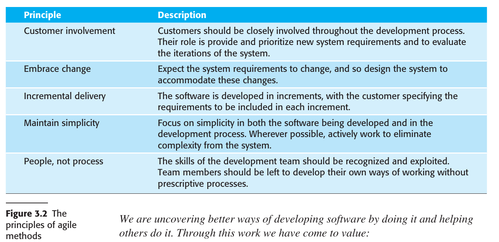

# Chapter 1 Introduction
## 1.1 Professional software development
## 1.2 Software engineering ethics
## 1.3 Case studies

---

### 1.1 Professional software development

#### 1.1.1 Software Engineering

1. **Scope**: Software engineering covers all aspects of software production, from system specification to maintenance.

2. **Engineering Discipline**: Unlike purely theoretical approaches, engineers seek practical solutions within constraints, often making compromises for timely, cost-effective results.

3. **Holistic Approach**: Beyond technical development, software engineering also involves project management, tool development, and theoretical support.

4. **Importance**: As society increasingly relies on software systems, there's a need for reliable, economical, and quick development methods.

5. **Cost-effectiveness**: Employing software engineering methods typically leads to lower long-term costs compared to ad-hoc program development.

6. **Software Process**: This systematic approach usually consists of software specification, development, validation, and evolution.

7. **Flexibility**: Different types of systems necessitate different development processes, making a one-size-fits-all approach impractical.

8. **Relation to Other Fields**: Software engineering is both an extension and a subset of computer science and systems engineering.

9. **Challenges in Heterogeneity**: Software must often work across diverse platforms and integrate with legacy systems, requiring versatile development techniques.

10. **Business and Social Change**: The rapid pace of societal and technological changes demands quicker, more adaptable software engineering methods.

11. **Security and Trust**: As software becomes increasingly integrated into daily life, ensuring its security against malicious attacks becomes vital.

12. **Scale**: Software engineering methods must adapt to projects of varying sizes, from small embedded systems to large cloud-based services.

13. **Innovation Needed**: To tackle existing and upcoming challenges, new tools and techniques, as well as innovative combinations of existing methods, are needed.

These points encapsulate the multi-faceted and evolving nature of software engineering as a discipline.

#### 1.1.2 Software Engineering Diversity

There are many different types of application:
1. **Stand-alone Applications**: Software that runs independently on a PC or mobile device, requiring no network connectivity. Examples include office apps and CAD programs.

2. **Interactive Transaction-based Applications**: Remote server-based applications accessed via web browsers or client apps. Includes e-commerce and cloud services.

3. **Embedded Control Systems**: Software integrated with hardware devices such as mobile phones and car braking systems.

4. **Batch Processing Systems**: Business systems designed to handle large volumes of data in batches, like billing and payroll systems.

5. **Entertainment Systems**: Primarily games, focusing on quality user interaction, often running on specialized hardware.

6. **Systems for Modeling and Simulation**: Computationally intense systems used for scientific modeling, requiring high-performance computing.

7. **Data Collection and Analysis Systems**: Systems that gather environmental data for processing, often in hostile conditions. May involve big data analysis.

8. **Systems of Systems**: Enterprise-level systems comprising multiple integrated software systems, both generic and custom-built.

The following should be considered...  

1. **Systematic Approach**: Software engineering considers cost, schedule, and dependability, along with customer and producer needs.

2. **No Universal Methods**: Techniques and tools depend on the organization, software type, and people involved. No one-size-fits-all methods exist.

3. **SEMAT Initiative**: Proposes a fundamental meta-process to create different kinds of processes, still in early development.

4. **Types of Applications**: Various types such as stand-alone, interactive transaction-based, embedded control systems, batch processing, entertainment, modeling & simulation, data collection & analysis, and systems of systems.

5. **Blurred Boundaries**: Types of applications often overlap, such as batch processing systems used with web-based transaction systems.

6. **Specialized Techniques**: Different systems require different engineering techniques. For example, safety-critical embedded systems require extensive verification.

7. **Universal Fundamentals**: All types of systems should follow basic principles like managed development process, dependability, performance, understanding requirements, and effective use of existing resources.

8. **Language Independence**: These fundamentals apply regardless of the programming language used.

#### 1.1.3 Internet Software Engineering

1. **Initial Web Development**: Initially, the web was mainly an information store with little impact on software systems that operated locally within organizations.

2. **Web Evolution Around 2000**: Around the year 2000, web browsers began to incorporate more functionality, paving the way for web-based systems accessible via browsers.

3. **New System Products**: This led to a wide range of new system products delivering innovative services over the web, often funded by advertising rather than direct user payment.

4. **Evolution in Business Software**: Web browsers that could run small programs revolutionized business and organizational software by moving it from local PCs to web servers, making it easier and cheaper to manage.

5. **Software as a Service**: Proposed early in the 21st century, it has become the standard for delivering web-based products like Google Apps and Microsoft Office 365.

6. **Cloud-based Systems**: Increasingly, software runs on remote clouds instead of local servers and is accessed over the Internet. Payment models include pay-per-use or ad-based free access.

7. **Change in Business Software Organization**: The web led to a shift from monolithic, single programs to highly distributed software that reuses components and programs.

8. **Software Reuse**: Reusing pre-existing software components and systems has become the dominant approach for building web-based systems.

9. **Incremental Development**: It's generally accepted that it's impractical to specify all requirements for web-based systems in advance; they are developed and delivered incrementally.

10. **Service-Oriented Software Engineering**: This approach is increasingly used, where software components are stand-alone web services.

11. **Interface Development Technology**: Technologies like AJAX and HTML5 have emerged to support the creation of rich interfaces within a web browser.

12. **Relevance of Software Engineering Techniques**: As web-based systems grow in scale and complexity, traditional software engineering techniques remain relevant.

These key points provide a comprehensive overview of the major changes and trends in Internet software engineering.

### 1.2 Software Engineering Ethics: Key Points

1. **Social and Legal Framework**: Software engineering is conducted within societal and legal norms that restrict practitioners' freedom.
  
2. **Wider Responsibilities**: Engineers have responsibilities beyond just technical skills, including ethical and moral behavior.
  
3. **Professional Standards**: Normal standards of honesty and integrity should be upheld to maintain the profession's reputation.

4. **Confidentiality**: Engineers should respect the confidentiality of employers and clients, even without formal agreements.

5. **Competence**: Misrepresentation of skill levels should be avoided, and work outside one's competence should not be accepted.

6. **Intellectual Property**: Awareness and respect for laws regarding intellectual property like patents and copyrights are essential.
  
7. **Computer Misuse**: Misusing technical skills for unauthorized activities, from trivial to serious, is discouraged.

8. **Role of Professional Societies**: Organizations like ACM, IEEE, and others have codes of ethics that members agree to follow.

9. **Ethical Dilemmas**: Situations may arise where ethical dilemmas occur, such as disagreeing with senior management or spotting issues in a project.

10. **Consequences of Unethical Behavior**: Ethical lapses can have serious consequences, such as the development of unsafe systems.
  
11. **Complexity of Ethical Decisions**: No absolutes exist; decisions should consider potential damage and who is affected.

12. **Military and Nuclear Systems**: Ethical views on participating in the development of these systems can vary, requiring clear communication between employers and employees.

13. **Evolving Nature of Ethics**: As software becomes pervasive, ethics and professional responsibility grow in importance.

14. **Practical vs. Philosophical Approach**: While some prefer discussing ethics philosophically, a more practical approach focusing on professional codes of conduct is also valuable.

15. **Inclusion in Curriculum**: Ethical considerations should be integrated into software engineering education, rather than being taught as a separate subject.

This summary captures the essence of the extensive section on ethics in software engineering.

### 1.3 Case studies

1. **Embedded System**: Software controls a hardware device, embedded within it. Challenges include size, responsiveness, and power management. Example: Insulin pump control system for diabetes patients.
  
2. **Information System**: Manages and provides access to a database. Concerns include security, usability, privacy, and data integrity. Example: Medical records system.

3. **Sensor-based Data Collection System**: Collects and processes data from sensors. Key requirements are reliability and maintainability, even in hostile conditions. Example: Wilderness weather station.

4. **Support Environment**: An integrated set of software tools used to assist a specific activity. Example: Digital learning environment for students in schools.

### Summary

- Software engineering is an engineering discipline that is concerned with all aspects of software production.  

- Software is not just a program or programs but also includes all electronic documentation that is needed by system users, quality assurance staff, and developers. Essential software product attributes are maintainability, dependability and security, efficiency, and acceptability.  

- The software process includes all of the activities involved in software development. The high-level activities of specification, development, validation, and evolution are part of all software processes.  

- There are many different types of system, and each requires appropriate software engineering tools and techniques for their development. Few, if any, specific design and implementation techniques are applicable to all kinds of system.  

- The fundamental ideas of software engineering are applicable to all types of software system.  

- These fundamentals include managed software processes, software dependability and security, requirements engineering, and software reuse.  

- Software engineers have responsibilities to the engineering profession and society. They should not simply be concerned with technical issues but should be aware of the ethical issues that affect their work.  

- Professional societies publish codes of conduct that embed ethical and professional standards.  

- These set out the standards of behavior expected of their members.  
---