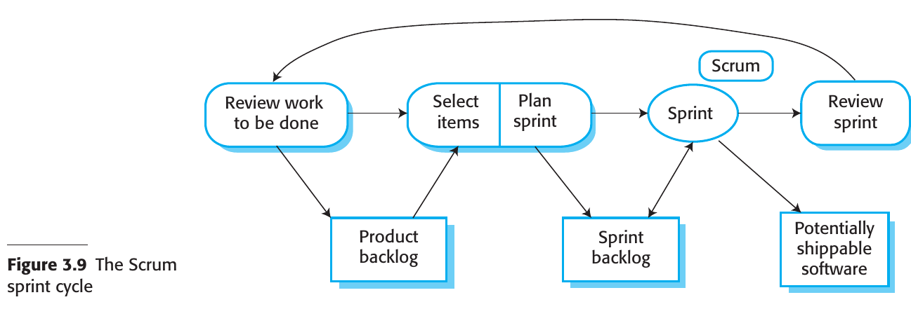
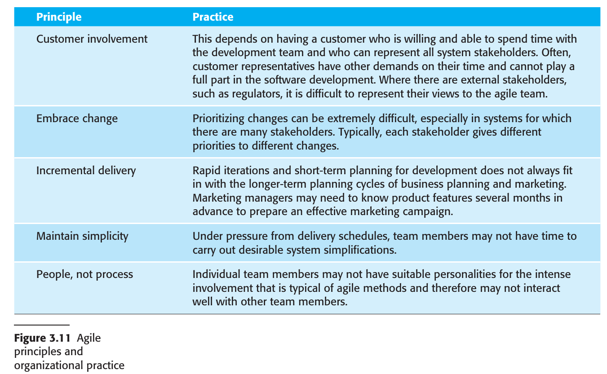

# Chapter 2 Software Processes
## 2.1 Software Process Models
## 2.2 Process Activities
## 2.3 Coping With Change
## 2.4 Process Improvement

---
### 2.1 Software Process Models

### 2.1.1 Waterfall

### 2.1.2 Incremental

### 2.1.3 Integration and Configuration (Reuse)

### 2.2 Process Activities (SDVE)

### 2.2.1 Specification (Requirements Engineering)

#### Overview
- Software specification, or requirements engineering, involves defining the services required from a system and identifying operational constraints.
- Mistakes in this stage can lead to issues in system design and implementation.

#### Preliminary Steps
- Before starting the requirements engineering process, a feasibility or marketing study may be conducted.
- The study informs whether it is technically and financially viable to develop the software.

#### Goal
- The aim is to produce an agreed-upon requirements document that satisfies stakeholder needs.
- Requirements are presented at two levels: high-level statements for end-users and customers, and detailed specifications for system developers.

#### Main Activities in Requirements Engineering
1. **Requirements Elicitation and Analysis**
   - Involves observation, discussions with potential users, and possibly the development of system models and prototypes.
   - Helps in understanding the system to be specified.
  
2. **Requirements Specification**
   - Translates information gathered into a requirements document.
   - Includes both user requirements (abstract) and system requirements (detailed).

3. **Requirements Validation**
   - Checks requirements for realism, consistency, and completeness.
   - Errors discovered must be corrected.

#### Ongoing Analysis
- Requirements analysis is an ongoing activity and new requirements may emerge.
- Analysis, definition, and specification activities are interleaved.

#### Agile Methods
- In agile approaches, requirements specification is part of system development.
- Requirements are informally specified just before each system increment.
- Elicitation of requirements comes from users who work closely with the development team.

### 2.2.2 Design and Implementation

#### Overview
- Implementation involves developing an executable system.
- Agile approach blends design and implementation, while traditional approaches may separate them.

#### Software Design
- Describes structure, data models, interfaces, and sometimes algorithms.
- Design is not a one-off process; it evolves in stages with constant backtracking.

#### Design Process
- Activities in the design process are interleaved and interdependent.
- Rework is inevitable due to new information.

#### Software Platform
- Information about the operating system, database, middleware, etc., is essential for design.
- Designers must integrate the software with its operating environment.

#### Design Activities (Type-dependent)
- Vary based on the type of system being developed (e.g., real-time systems have additional timing design).
  
1. **Architectural Design**
   - Identify overall structure, principal components, and their relationships.

2. **Database Design**
   - Design data structures and database representation.

3. **Interface Design**
   - Define interfaces between components for unambiguous interaction.

4. **Component Selection and Design**
   - Look for reusable components or design new ones.
   - May include detailed design models in UML or simpler component descriptions.

#### Design Outputs
- For critical systems, detailed design documents are produced.
- In agile methods, the design may be represented in code.

#### Program Development
- Often interleaved with design.
- Software tools may generate skeleton code from design.

#### Programming Approach
- Varies among individuals; no general process.
- Some start with well-understood components, while others start with less familiar ones.

#### Debugging and Testing
- Programmers usually perform some level of testing.
- Debugging involves finding and fixing defects.
- Interactive debugging tools are commonly used.

### 2.2.3 Validation (System Testing)

#### Overview
- Software validation aims to ensure a system conforms to its specification and meets customer expectations.
- Primarily focused on program testing but may include inspections and reviews at each development stage.

#### Testing Process
1. **Component Testing**
   - Conducted by the developers.
   - Each component is tested independently.
   - Test automation tools like JUnit are commonly used.

2. **System Testing**
   - Involves integrating components to create a complete system.
   - Detects errors due to unanticipated interactions and interface issues.
   - Confirms that the system meets functional and non-functional requirements.

3. **Customer Testing**
   - Final stage before operational use.
   - Conducted by the customer with real data.
   - May reveal errors in requirements definition or performance issues.

#### Iterative Nature
- The process is iterative; defects discovered may require earlier testing stages to be repeated.

#### Incremental and Test-Driven Development
- Each increment is tested as developed.
- In test-driven development, tests are created along with requirements.

#### Plan-Driven Process
- Driven by test plans developed from system specification and design.
- Performed by an independent team of testers.

#### V-Model of Development
- Links validation activities to each stage of the waterfall process model.

#### Beta Testing
- Used for marketable software products.
- Delivered to potential customers who report issues.
- Helps in exposing the product to real-world use and identifying unanticipated errors.

#### Feedback Loop
- Feedback from beta testing may lead to software modifications and further testing or release.

### 2.2.4 Evolution

#### Flexibility of Software
- Software's flexibility makes it increasingly integral to large, complex systems.
- Software changes are cheaper and more feasible than hardware changes, even during or after development.

#### Historical Perspective
- Traditionally, software development and software maintenance (evolution) were considered separate processes.
- Software development was viewed as creative, while maintenance was seen as dull and uninteresting.

#### Evolutionary View
- The distinction between development and maintenance is increasingly irrelevant.
- Most software systems are not entirely new but evolve from existing systems.

#### Continuum of Software Engineering
- It's more accurate to consider software engineering as an evolutionary process.
- Software is continually modified over its lifetime to adapt to changing requirements and customer needs.

### 2.3 Coping With Change

#### 2.3.1 Prototyping

#### Definition and Importance
- A prototype is an early version of a system to explore design options and clarify requirements.
- Rapid, iterative development is crucial to control costs and allow early stakeholder engagement.

#### Applications in Software Development
1. **Requirements Engineering**: Helps in the elicitation and validation of system requirements.
2. **System Design**: Used to explore software solutions and develop the user interface.

#### User Interaction
- Allows users to assess system utility and may inspire new requirements.
- Can reveal errors and omissions in the existing requirements.

#### Design Experiments
- Prototyping can validate the feasibility of design elements, such as database design for efficient data access.
  
#### User Interface Development
- Rapid prototyping involving end-users is essential for developing dynamic user interfaces.

#### Process Model for Prototype Development
1. **Objective Setting**: Clearly define what the prototype aims to achieve.
2. **Scope Definition**: Decide what to include or exclude to manage costs and delivery time.
3. **Prototype Evaluation**: Includes user training and a plan based on the objectives.

#### Evaluation Challenges
- Users may not interact with the prototype the same way they will with the final system.
- Prototype testers may not be representative of all system users.
- Time constraints during evaluation may limit user training and adaptability.

#### Quality Considerations
- Non-functional requirements like response time and memory usage may be relaxed.
- Error handling and reliability standards may be compromised, depending on the prototype's objectives.

#### 2.3.2 Incremental Delivery

#### Overview
- Incremental delivery is an approach where parts of the system (increments) are developed and delivered to the customer for use.
- Customers prioritize services, and increments are developed based on these priorities.

#### Process Steps
1. **Requirements Definition**: Detailed requirements for the first increment are defined.
2. **Development**: The increment is developed while further requirements analysis for later increments may occur.
3. **Delivery and Integration**: Once an increment is complete, it's delivered and integrated into the customer's working environment.

#### Advantages
1. **Prototyping Benefit**: Early increments act as prototypes, helping customers clarify later requirements.
2. **Early Value**: Customers can immediately use and benefit from the software.
3. **Flexibility**: Easier to incorporate changes into the system.
4. **Focused Testing**: High-priority services are delivered and tested first, reducing the likelihood of failures in critical parts.

#### Limitations
1. **Replacement Difficulty**: Incremental delivery is problematic when replacing an existing system, as users want all functionalities upfront.
2. **Common Facilities**: Difficult to identify common facilities needed by all increments when requirements are not fully defined.
3. **Procurement Conflict**: Conflicts with traditional procurement models requiring a complete system specification upfront.

#### Unsuitability for Certain Systems
- Incremental delivery is not ideal for very large systems, embedded systems depending on hardware development, or critical systems requiring comprehensive requirements analysis.

#### Alternative Approach for Large Systems
- A system prototype may be developed for experimentation, and definitive requirements can be agreed upon based on the experience gained.

### 2.4 Process Improvement

