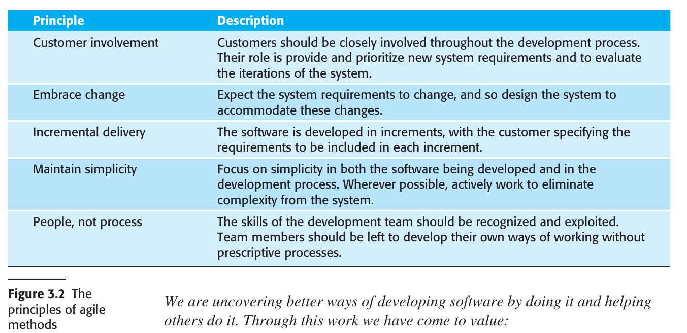
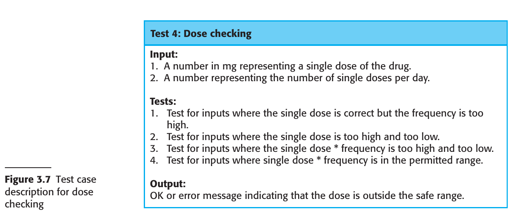

# Chapter 3 Agile
## 3.1 Agile methods
## 3.2 Agile Development techniques
## 3.3 Agile Project Management
## 3.4 Scaling Agile Methods

---

### 3.1 Agile methods

#### Historical Context
- In the 1980s and 1990s, a plan-driven approach was popular, especially for large, complex systems.
- Such heavyweight approaches were found to be inefficient for small and medium-sized projects due to high overheads.

#### Emergence of Agile Methods
- Developed in the late 1990s as a response to dissatisfaction with heavyweight, plan-driven approaches.
- Focus on the software itself, minimizing design and documentation overheads.
- Suited for rapidly changing requirements and aims to deliver working software quickly.

#### Agile Manifesto Principles
1. **Customer Involvement**: Customers should be closely involved to provide and prioritize new system requirements.
2. **Embrace Change**: The system should be designed to accommodate changing requirements.
3. **Incremental Delivery**: Software should be developed and delivered in increments, based on customer-specified requirements.
4. **Maintain Simplicity**: Focus on simplicity in both the software and the development process.
5. **People, not Process**: Exploit the skills of the development team; avoid prescriptive processes.

#### Core Values (from Agile Manifesto)
- **Individuals and Interactions** over processes and tools
- **Working Software** over comprehensive documentation
- **Customer Collaboration** over contract negotiation
- **Responding to Change** over following a plan

#### Ideal Use-Cases for Agile Methods
1. **Product Development**: Particularly effective for small or medium-sized products for sale.
2. **Custom System Development**: Effective when the customer is committed to being involved and when there are few external stakeholders.

#### Communication and Team Structure
- Agile methods work well when there is continuous communication between stakeholders and the development team.
- Best suited for co-located teams where informal communication is effective.

#### Limitations
- Less suited for systems that are tightly integrated with other systems being developed simultaneously.
- Not ideal for situations requiring coordination of parallel development streams.

### 3.2 Agile Development techniques

#### Historical Background
- Extreme Programming (XP), coined by Kent Beck, significantly influenced the agile development culture.
- XP aimed to push recognized good practices like iterative development to "extreme" levels.

#### Core Concepts in XP
1. **Requirements as User Stories**: Requirements are expressed as scenarios or user stories implemented as tasks.
2. **Frequent Releases**: Short time gaps between system releases, focusing on incremental development.
3. **Test-First Approach**: Tests are developed for each task before writing the actual code.
4. **Pair Programming**: Programmers work in pairs to cross-verify and support each other.
  
#### XP Practices Aligned with Agile Manifesto Principles
1. **Incremental Development**: Small, frequent releases based on simple customer stories.
2. **Customer Involvement**: Constant customer engagement, with customer representatives defining acceptance tests.
3. **People Over Process**: Practices like pair programming, collective ownership, and sustainable work hours.
4. **Embracing Change**: Regular releases, test-first development, and continuous integration.
5. **Maintaining Simplicity**: Constant refactoring and using simple designs that are easily adaptable.

#### Extreme Programming Practices
1. **Collective Ownership**: All developers are responsible for all code; anyone can change anything.
2. **Continuous Integration**: Completed tasks are immediately integrated into the whole system, passing all unit tests.
3. **Incremental Planning**: Requirements are recorded on "story cards," prioritized based on time and importance.
4. **On-Site Customer**: A customer representative is part of the development team, responsible for conveying system requirements.
5. **Pair Programming**: Developers work in pairs, mutually verifying and supporting each other.
6. **Refactoring**: Code is continuously improved for simplicity and maintainability.
7. **Simple Design**: Only enough design is carried out to meet the current requirements.
8. **Small Releases**: Frequent and incremental releases that add functionality to the initial release.
9. **Sustainable Pace**: Avoiding excessive overtime to maintain code quality and productivity.
10. **Test-First Development**: An automated unit test framework is used to write tests before implementing functionality.

#### Adaptability and Challenges
- XP as originally proposed is difficult to integrate into the management practices and culture of most businesses.
- Companies often pick and choose XP practices that best suit them, sometimes integrating them into other agile methods like Scrum.
- XP's most significant contribution is likely the set of agile development practices it introduced.

#### 3.2.1 User Stories

#### Overview and Purpose
- User stories are scenarios of use developed to encapsulate customer needs.
- They integrate requirements elicitation with agile development, replacing separate requirements engineering activities.

#### Creation and Usage
1. **Collaborative Development**: The system customer and development team collaborate to develop a "story card" that briefly describes a user story.
2. **Task Breakdown**: Each story card is broken down into tasks, with estimations for effort and resources required.
3. **Customer Prioritization**: The customer prioritizes the stories based on immediate business value.
4. **Short Iterations**: The aim is to implement functionality from prioritized stories in about two weeks, aligning with the next system release.

#### Advantages
- **Dynamic Adaptability**: Unimplemented stories can change or be discarded as requirements evolve.
- **User Engagement**: User stories are more relatable than conventional requirements documents, fostering better user involvement.
  
#### Challenges and Limitations
1. **Completeness**: It's difficult to assess if enough user stories have been developed to cover all essential requirements.
2. **Accuracy**: User stories may not capture all aspects of an activity, especially if experienced users omit details.

#### Application in Requirements Elicitation
- User stories can serve as an initial step in pre-development requirements elicitation, a topic discussed further in future chapters.

#### 3.2.2 Refactoring

#### Concept and Rationale
- Refactoring is the practice of continually improving software code for better structure and readability.
- It deviates from the traditional software engineering principle of "designing for change," arguing that such anticipation often results in wasted effort.

#### Process
1. **Immediate Implementation**: When developers see code that can be improved, they make these improvements immediately, regardless of immediate necessity.
2. **Avoiding Structural Decay**: Refactoring counters the software structure degradation that naturally occurs in incremental development.
  
#### Types of Refactoring
- Examples include reorganizing class hierarchies, renaming attributes and methods, and replacing duplicated code with library methods.

#### Tools and Support
- Development environments often include tools that simplify the process of finding code dependencies and making global modifications.

#### Benefits
- Keeps the software easy to understand and modify, which is particularly useful as new requirements emerge.

#### Challenges and Limitations
1. **Development Pressure**: Sometimes, new feature implementation takes precedence over refactoring, causing a delay in improvements.
2. **Architectural Limitations**: Some new features and changes may require architectural modifications that cannot be addressed solely through code-level refactoring.

#### 3.2.3 Test-first Development (TDD)

#### Overview
- Originated from Extreme Programming (XP), test-first development is an approach where tests are written before the code that needs to be tested.
- It addresses challenges related to testing in incremental development methodologies.

#### Key Features in XP
1. **Test-First Development**: Tests are written before the code.
2. **Incremental Test Development from Scenarios**: Tests are developed based on user stories or scenarios.
3. **User Involvement**: Users are involved in test development and validation.
4. **Automated Testing Frameworks**: Use of frameworks like JUnit for automated testing.

#### Advantages
- Helps in discovering problems during development.
- Defines an interface and a specification of behavior implicitly.
- Helps in understanding specifications thoroughly before implementation.
- Avoids "test-lag" where implementation outpaces testing.

#### Test Development Process
- User stories are broken down into tasks, each generating one or more unit tests.
- Acceptance tests are developed with customer involvement to ensure the system meets real needs.

#### Role of Automation
- Test automation is essential for quickly and easily executing a large set of tests.
- Catches issues immediately when new functionality is added.

#### Challenges and Limitations
1. **Incomplete Tests**: Programmers may skip writing comprehensive tests.
2. **Difficulty in Incremental Testing**: Some elements, like complex user interfaces, are hard to test incrementally.
3. **Test Coverage**: Despite a large set of tests, it is difficult to ensure complete coverage, leaving potential bugs undetected.

#### Generalization
- The philosophy of test-first has evolved into more general test-driven development techniques.

#### 3.2.4 Pair Programming

#### Overview
- Pair programming is an Extreme Programming (XP) practice where two developers work together at the same computer.
- Pairs are created dynamically, allowing all team members to collaborate throughout the development process.

#### Advantages
1. **Collective Ownership and Responsibility**: Promotes the idea that the entire team owns the software and shares responsibility for its issues.
2. **Informal Code Review**: Acts as a less formal but quicker alternative to traditional code inspections and reviews, aiding in error discovery.
3. **Encourages Refactoring**: The practice supports immediate improvements to the software structure, which benefits the team as a whole.

#### Efficiency Considerations
- Contrary to the belief that pair programming would halve productivity, some studies suggest comparable productivity levels to individuals working alone. This is attributed to fewer false starts and less rework.

#### Adoption in Industry
- Companies have mixed views on pair programming; some avoid it, while others use a mix of pair and individual programming, often pairing experienced programmers with less experienced ones.

#### Empirical Studies
- Studies on the effectiveness of pair programming have had mixed results:
  - Some research found comparable productivity and fewer errors (Williams et al. 2000).
  - Other studies found a loss of productivity but some quality benefits (Arisholm et al. 2007).

#### Risk Mitigation
- The knowledge sharing that occurs during pair programming can reduce project risks, especially when team members leave, potentially making the practice worthwhile despite its overhead.

### 3.3 Agile Project Management

#### Overview
- Agile project management diverges from traditional plan-driven approaches, aiming for more flexibility and responsiveness.
- Scrum has emerged as the most popular framework for organizing agile projects, providing a degree of external visibility.

#### Scrum Framework
- Focuses on project organization, not specific development practices like pair programming or test-first development.
- Uses unique terminology like "ScrumMaster" instead of "Project Manager" to distinguish itself from traditional methods.

#### Scrum Process Components
1. **Product Backlog**: A prioritized list of features, requirements, and other tasks for the development team.
2. **Sprint**: A time-boxed development cycle, usually 2-4 weeks long.
3. **Sprint Backlog**: Specific tasks chosen for the current sprint based on priority and previous sprint velocity.
4. **Daily Meetings (Scrums)**: Short meetings to review progress and re-prioritize work.
5. **Sprint Review**: At the end of each sprint, team reviews work and process for improvement.

#### Sprint Planning
- Product Owner prioritizes backlog items.
- Team estimates time required for the highest-priority items based on previous sprints' velocities.
- Unfinished items return to the product backlog.

#### Team Coordination
- Uses Scrum board for daily interactions.
- All team members have visibility into the work being done.

#### Review and Feedback Loop
- End-of-sprint review serves dual purposes: process improvement and product state assessment.
  
#### ScrumMaster Role
- Although not formally a project manager, ScrumMasters often assume this role in organizations with a conventional management structure.

#### Benefits of Using Scrum
1. Manageable and understandable product chunks.
2. Handles unstable requirements effectively.
3. Enhances team communication and morale.
4. Offers customers on-time delivery of increments.
5. Builds trust between customers and developers.

#### Distributed Scrum
- Scrum is adaptable for distributed teams and multi-team environments, accommodating global development needs.

#### Challenges
- Originally designed for co-located teams, adaptations are needed for distributed teams.

### 3.4 Scaling Agile Methods

#### Initial Adoption
- Agile methods were initially designed for small teams working on small to medium-sized projects in the same physical location.
- Small companies with less bureaucracy were the early adopters.

#### Need for Scaling
- The demand for faster, customer-focused software delivery is equally relevant to larger systems and companies.
  
#### Facets of Scaling
1. **Scaling Up**: Adapting agile methods to manage large software projects that cannot be handled by a single small team.
2. **Scaling Out**: Extending the use of agile methods across various departments in a large organization with extensive software development experience.

#### Challenges in Scaling
- Larger organizations often have to deal with scaling up and scaling out simultaneously, especially when they win contracts for large projects.

#### Productivity and Defects
- There are claims of substantial productivity gains and defect reductions through the use of agile methods.
- Scott Ambler suggests that for large systems and organizations, the productivity improvement is likely to be around 15% over 3 years, along with similar reductions in defects.

#### Summary
- Scaling agile methods is a complex but necessary evolution to fit the needs of larger projects and organizations. Expectations of productivity gains should be realistic.

#### 3.4.1 Practical problems with agile methods

#### General Suitability
- Agile methods are highly effective for software products and apps.
- They may not be appropriate for embedded systems, large and complex systems, or ongoing software maintenance.

#### Challenges for Large, External Projects
1. **Contractual Issues**: The informality of agile development clashes with the legal contracts often used in large projects.
2. **Maintenance Costs**: Agile is geared more toward new development, whereas most costs in large companies stem from maintenance.
3. **Global Teams**: Agile is designed for small, co-located teams, but many modern projects involve globally distributed teams.

#### Specific Issues
- **Lack of Definitive Requirements**: Agile's evolving requirements don't fit well into traditional contracts that define specific deliverables.
  
#### Maintenance Issues
1. **Lack of Documentation**: Agile methods often lack formal documentation, making it challenging to assess the impact of proposed system changes.
2. **Customer Involvement**: It's difficult to keep customers engaged during the maintenance phase.
3. **Team Continuity**: Agile methods rely on the team's collective memory and expertise, which can be lost if the team is disbanded or changed.

#### Summary
- While agile methods excel in specific scenarios, they have limitations and challenges when applied to large projects, maintenance, or distributed teams. These include contractual complexities, the focus on new development over maintenance, and issues related to documentation and team continuity.
- 
#### 3.4.2 Agile and plan-driven methods

#### Introduction
- Integration of agile and plan-driven methods is essential for scaling agile in larger companies.
- Early agile enthusiasts resisted plan-driven approaches, but adaptations are necessary for various organizational and technical contexts.

#### Deciding Between Agile and Plan-Driven
- A balanced approach often combines elements of both plan-driven and agile methods.
- Factors influencing the balance include system attributes, development team characteristics, and organizational context.

#### System-Related Issues
1. **System Size**: Agile is most effective for small, co-located teams. Larger systems may require a plan-driven approach.
2. **System Type**: Systems requiring extensive pre-implementation analysis (e.g., real-time systems) may be better suited for a plan-driven approach.
3. **System Lifetime**: Long-lasting systems may require more documentation for long-term maintenance.
4. **External Regulation**: Systems subject to regulatory approval may require detailed documentation.

#### Team-Related Issues
1. **Skill Levels**: Agile may require higher skill levels. In less skilled teams, a separation of design and implementation roles may be needed.
2. **Team Organization**: Distributed or outsourced teams may require more design documentation.
3. **Technological Support**: The availability of adequate development tools can influence the need for documentation.

#### Organizational Issues
1. **Contractual Requirements**: A detailed specification may be necessary for contractual reasons, favoring a plan-driven approach for requirements engineering.
2. **Incremental Delivery**: Feasibility depends on customer availability and willingness to participate.
3. **Cultural Factors**: Traditional engineering organizations may be more comfortable with plan-driven methods due to their extensive design documentation.

#### Conclusion
- The label of "agile" or "plan-driven" is less important than choosing the methods that are most effective for the specific type of system being developed.

#### 3.4.3 Agile methods for large systems

#### 3.4.4 Agile methods across organizations

### Summary

- Agile methods are iterative development methods that focus on reducing process overheads and documentation and on incremental software delivery. They involve customer representatives directly in the development process.

- The decision on whether to use an agile or a plan-driven approach to development should depend on the type of software being developed, the capabilities of the development team, and the culture of the company developing the system. In practice, a mix of agile and plan-based techniques may be used.

- Agile development practices include requirements expressed as user stories, pair programming, refactoring, continuous integration, and test-first development.

- Scrum is an agile method that provides a framework for organizing agile projects. It is centered around a set of sprints, which are fixed time periods when a system increment is developed. Planning is based on prioritizing a backlog of work and selecting the highest priority tasks for a sprint.

- To scale agile methods, some plan-based practices have to be integrated with agile practice.

- These include up-front requirements, multiple customer representatives, more documentation, common tooling across project teams, and the alignment of releases across teams.
