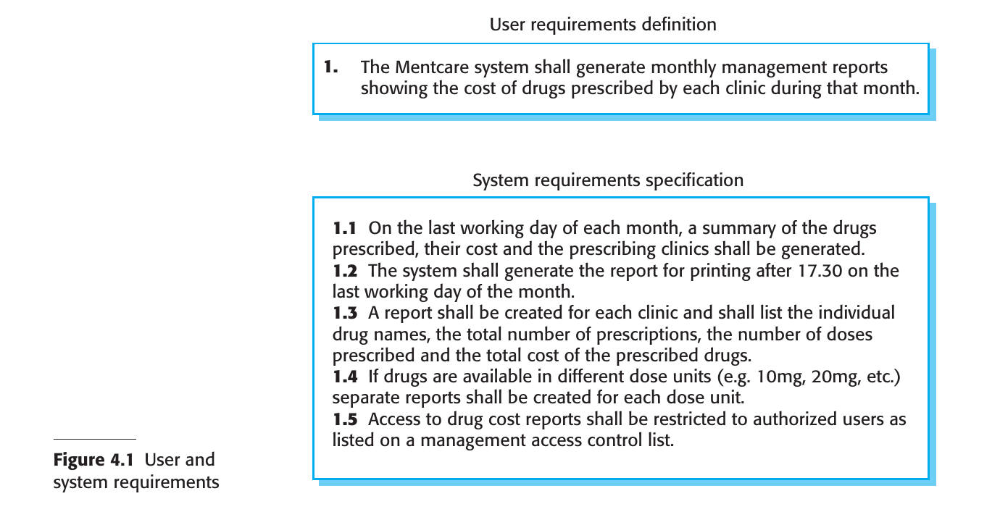

# Chapter 4 Requirements Engineering

## 4.1 Functional and non-functional requirements
## 4.2 Requirements engineering processes
## 4.3 Requirements Elicitation
## 4.4 Requirements specification
## 4.5 Requirements validation 
## 4.6 Requirements change

---

### Requirements Engineering

#### Definition and Importance of Requirements Engineering (RE)
- Requirements are descriptions of services and constraints that a system should adhere to.
- The process of identifying, analyzing, documenting, and validating these is called Requirements Engineering.

#### Variability in Requirement Definitions
- Requirements can range from high-level abstract statements to detailed, formal definitions.
- Different documents may serve as the "requirements document" depending on the phase of the project.

#### Types of Requirements
1. **User Requirements**: High-level, often in natural language, describing what the system is expected to provide.
2. **System Requirements**: Detailed descriptions of the system’s functions, services, and constraints.

#### Audience for Requirements
- User requirements are generally for managers and others not concerned with implementation.
- System requirements are for those involved in system implementation and support.

#### System Stakeholders
Examples include:
1. Patients and relatives
2. Doctors
3. Nurses
4. Medical receptionists
5. IT staff
6. Medical ethics manager
7. Health care managers
8. Medical records staff

#### Phases in RE
- Early-stage RE can lead to a feasibility study assessing the system's technical and financial viability.
- A traditional RE phase typically precedes system implementation, resulting in a requirements document.

#### Agile vs. Traditional RE
- In agile processes, requirements may be concurrently elicited as the system is developed.
- For many large systems, a separate RE phase is still common.
- 

### 4.1 Functional and non-functional requirements

### 4.2 Requirements engineering processes

### 4.3 Requirements Elicitation

### 4.4 Requirements specification

### 4.5 Requirements validation 

### 4.6 Requirements change

### Summary

- Requirements for a software system set out what the system should do and define constraints on its operation and implementation.

- Functional requirements are statements of the services that the system must provide or are descriptions of how some computations must be carried out.

- Non-functional requirements often constrain the system being developed and the development process being used. These might be product requirements, organizational requirements, or external requirements. They often relate to the emergent properties of the system and therefore apply to the system as a whole.

- The requirements engineering process includes requirements elicitation, requirements specification, requirements validation, and requirements management.

- Requirements elicitation is an iterative process that can be represented as a spiral of activities— requirements discovery, requirements classification and organization, requirements negotiation, and requirements documentation.

- Requirements specification is the process of formally documenting the user and system requirements and creating a software requirements document.

- The software requirements document is an agreed statement of the system requirements. It should be organized so that both system customers and software developers can use it.

- Requirements validation is the process of checking the requirements for validity, consistency, completeness, realism, and verifiability.

- Business, organizational, and technical changes inevitably lead to changes to the requirements for a software system. Requirements management is the process of managing and controlling these changes.

---