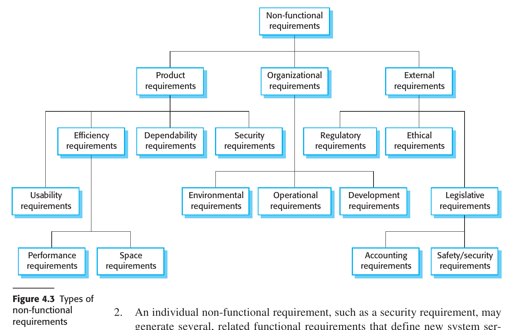

# Chapter 4 Requirements Engineering

## 4.1 Functional and non-functional requirements
## 4.2 Requirements engineering processes
## 4.3 Requirements Elicitation
## 4.4 Requirements specification
## 4.5 Requirements validation 
## 4.6 Requirements change

---

### Requirements Engineering

#### Definition and Importance of Requirements Engineering (RE)
- Requirements are descriptions of services and constraints that a system should adhere to.
- The process of identifying, analyzing, documenting, and validating these is called Requirements Engineering.

#### Variability in Requirement Definitions
- Requirements can range from high-level abstract statements to detailed, formal definitions.
- Different documents may serve as the "requirements document" depending on the phase of the project.

#### Types of Requirements
1. **User Requirements**: High-level, often in natural language, describing what the system is expected to provide.
2. **System Requirements**: Detailed descriptions of the system’s functions, services, and constraints.

#### Audience for Requirements
- User requirements are generally for managers and others not concerned with implementation.
- System requirements are for those involved in system implementation and support.

#### System Stakeholders
Examples include:
1. Patients and relatives
2. Doctors
3. Nurses
4. Medical receptionists
5. IT staff
6. Medical ethics manager
7. Health care managers
8. Medical records staff

#### Phases in RE
- Early-stage RE can lead to a feasibility study assessing the system's technical and financial viability.
- A traditional RE phase typically precedes system implementation, resulting in a requirements document.

#### Agile vs. Traditional RE
- In agile processes, requirements may be concurrently elicited as the system is developed.
- For many large systems, a separate RE phase is still common.
- 

### 4.1 Functional and non-functional requirements

#### Types of Software System Requirements
1. **Functional Requirements**: Statements detailing what services the system should provide, how it should respond to inputs, and its behavior under specific conditions.
   - May also state what the system should not do.
  
2. **Non-Functional Requirements**: Constraints on the services or functions, including timing, development process, and standards.
   - Generally apply to the system as a whole, not to individual features.

#### Ambiguity and Interdependence in Requirements
- The distinction between functional and non-functional requirements is not always clear-cut.
- One requirement often generates or constrains other requirements.

#### Overall System Requirements
- System requirements specify not just the services or features but also the necessary functionality to ensure effective delivery.

#### 4.1.1 Functional requirements

#### Definition and Levels of Functional Requirements
1. **User-Level Functional Requirements**: Written in natural language for system users and managers to understand.
2. **System-Level Functional Requirements**: Detailed descriptions for developers, specifying system functions, inputs, outputs, and exceptions.
3. **Variability in Detail**: Requirements can range from general to very specific, depending on organizational needs and existing systems.

#### Off-the-Shelf Software and Information Requirements
- In cases where off-the-shelf software suffices, the focus shifts from functional specifications to information requirements.
- Information requirements specify needed data, its organization, and delivery method.

#### Imprecision and Its Consequences
- Ambiguous requirements can lead to misunderstandings between customers and developers, causing delays and increased costs.
  
#### Ideal Characteristics of Functional Requirements
1. **Completeness**: All services and information required by the user should be defined.
2. **Consistency**: Requirements should not be contradictory.

#### Practical Limitations
- Achieving completeness and consistency is often only possible for very small systems.
- Large systems have multiple stakeholders with varying, and often inconsistent, needs.
- Mistakes and omissions are common in specifications for large, complex systems.
- Inconsistencies may only become apparent after deeper analysis or during development.

#### 4.1.2 Non-functional requirements

### Key Points Summary

#### Definition of Non-Functional Requirements
- Non-functional requirements are not directly related to specific services but specify or constrain system characteristics such as reliability, response time, and memory use.

#### Importance and Critical Nature
- Often more critical than functional requirements, as failure to meet them can make the whole system unusable.

#### Implementation Challenges
1. **Architectural Impact**: Non-functional requirements may affect the overall system architecture.
2. **Related Functional Requirements**: A single non-functional requirement might generate multiple related functional requirements and constraints.

#### Sources of Non-Functional Requirements
1. **Product Requirements**: Specify runtime behavior such as performance, reliability, and usability.
2. **Organizational Requirements**: Derive from customer and developer policies, specifying operational and development process constraints.
3. **External Requirements**: Imposed by external factors like regulations, legislation, or ethical considerations.

#### Problems with Non-Functional Requirements
- Often stated as general goals, leaving scope for interpretation and disputes.
- Difficult to translate into measurable requirements.
  
#### Quantitative Specification
- Whenever possible, non-functional requirements should be stated quantitatively for objective testing.

#### Conflicts and Interactions
- Non-functional requirements often conflict or interact with other functional or non-functional requirements, complicating implementation.

#### Documentation Challenges
- Difficult to separate functional and non-functional requirements in documentation while maintaining clarity on their interrelationships.

#### Importance in Critical Systems
- Reliability, safety, and confidentiality are especially important for systems where failure could have severe consequences.

### 4.2 Requirements engineering processes

### 4.3 Requirements Elicitation

### 4.4 Requirements specification

### 4.5 Requirements validation 

### 4.6 Requirements change

### Summary

- Requirements for a software system set out what the system should do and define constraints on its operation and implementation.

- Functional requirements are statements of the services that the system must provide or are descriptions of how some computations must be carried out.

- Non-functional requirements often constrain the system being developed and the development process being used. These might be product requirements, organizational requirements, or external requirements. They often relate to the emergent properties of the system and therefore apply to the system as a whole.

- The requirements engineering process includes requirements elicitation, requirements specification, requirements validation, and requirements management.

- Requirements elicitation is an iterative process that can be represented as a spiral of activities— requirements discovery, requirements classification and organization, requirements negotiation, and requirements documentation.

- Requirements specification is the process of formally documenting the user and system requirements and creating a software requirements document.

- The software requirements document is an agreed statement of the system requirements. It should be organized so that both system customers and software developers can use it.

- Requirements validation is the process of checking the requirements for validity, consistency, completeness, realism, and verifiability.

- Business, organizational, and technical changes inevitably lead to changes to the requirements for a software system. Requirements management is the process of managing and controlling these changes.

---