# Chapter 5 System Modelling

## 5.1 Context models
## 5.2 Interactions model
## 5.3 Structural models
## 5.4 Behavioral models
## 5.5 Model-driven architecture

---

#### Five UML Diagram Types

1. **Activity Diagrams**: 
    - Depict the activities involved in a process or in data processing.
  
2. **Use Case Diagrams**: 
    - Illustrate the interactions between a system and its environment.
  
3. **Sequence Diagrams**: 
    - Demonstrate interactions between actors and the system as well as between system components.

4. **Class Diagrams**: 
    - Display the object classes in the system and the associations between these classes.

5. **State Diagrams**: 
    - Reveal how the system reacts to internal and external events.

Each type of UML diagram serves a specific purpose and offers different insights into the system's design, functionality, or interaction.

### 5.1 Context models

#### Context Models in System Specification

1. **Defining System Boundaries**:
    - Early in the specification process, decide what is and isn't part of the system.
    - Work with stakeholders to determine what functionalities should be included.
    - Make decisions early to limit costs and time.

2. **System vs. Environment Boundaries**:
    - Sometimes the boundary is clear, especially if replacing an existing system.
    - Flexibility exists in determining what constitutes the boundary.

3. **Example: Mentcare System**:
    - Must decide if the system will only collect consultation info or also collect personal patient info.
    - Consider advantages and disadvantages, such as data duplication and system speed.

4. **User Base Diversity**:
    - Diverse user bases may require configurable systems that can adapt to varying needs.

5. **Non-Technical Factors**:
    - Boundaries may be influenced by social and organizational concerns, such as avoiding a difficult manager or increasing system costs for departmental expansion.

6. **Context Definition and Dependencies**:
    - After deciding on boundaries, define the system's context and its dependencies on its environment.
    - Architectural models often serve as the first step.

7. **Relation with Other Systems**:
    - Context models show that the environment often includes several other automated systems but do not detail the types of relationships.
    - Other models, like business process models, can be used in conjunction.

8. **UML Activity Diagrams**:
    - Can be used to show business processes where systems are used.
    - Detail the flow of control from one activity to another.
  
9. **Critical Functions Example**:
    - The Mentcare system must implement legal safeguards for involuntary detention of patients.

10. **Flow and Coordination in Activity Diagrams**:
    - Arrows indicate the flow of work; solid bars indicate activity coordination.
    - Activities can be concurrent or sequential based on the diagram.

This summary captures the intricacies of defining system boundaries, making considerations for diverse user bases, and employing various models, like UML activity diagrams, to better understand the system's context and dependencies.

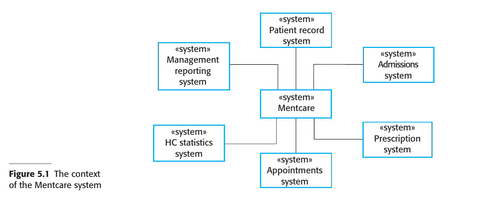

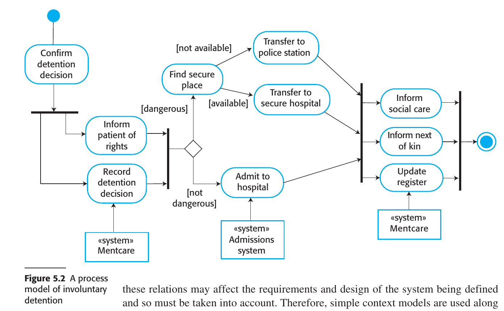

### 5.2 Interactions model

#### Interaction Models in Software Systems

1. **Types of Interactions**:
    - User interaction (user inputs and outputs)
    - System-to-system interaction
    - Component-to-component interaction within a software system

2. **Importance of Interaction Modeling**:
    - Helps identify user requirements
    - Highlights potential communication problems
    - Aids in understanding system performance and dependability

3. **Approaches to Interaction Modeling**:
    1. **Use Case Modeling**:
        - Primarily used for interactions between a system and external agents (either human users or other systems)
    2. **Sequence Diagrams**:
        - Used to model interactions between system components
        - External agents may also be included

4. **Complementary Use**:
    - Use case models and sequence diagrams can be used together to present interactions at different levels of detail
    - High-level use case interactions can be further detailed using sequence diagrams

5. **UML Communication Diagrams**:
    - Another tool for modeling interactions
    - Not discussed in detail as they are considered an alternative representation of sequence diagrams

These key points outline the types of interactions that can occur in a system, the importance of modeling these interactions, and the methodologies used for this purpose.

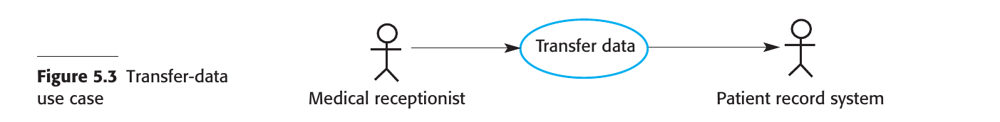

#### 5.2.1 use case modelling

1. **Origins and Utility**:
    - Developed by Ivar Jacobsen in the 1990s.
    - Part of the Unified Modeling Language (UML).
    - More useful in early stages of system design than in requirements engineering.

2. **Basic Components**:
    1. **Use Case**: Represents a discrete task involving external interaction with a system.
    2. **Actors**: External entities interacting with the use case, represented as stick figures.
    3. **Ellipse**: A simple graphical representation of a use case.
  
3. **Actors and Directionality**:
    - Actors can be human or other systems.
    - UML formally uses lines without arrows to show interactions.
    - Arrows can be used informally to indicate the initiator of the transaction.
  
4. **Detailing a Use Case**:
    - Use case diagrams provide a simple overview.
    - Additional detail can be added through:
        1. Textual description
        2. Structured description in a table
        3. Sequence diagrams
    - The format depends on the level of detail required.

5. **Composite Use Case Diagrams**:
    - Show multiple use cases together.
    - Can be categorized by actor or functionality.
    - May require several diagrams for complex systems.

6. **Advanced UML Constructs**:
    - UML allows for sharing parts of a use case in other diagrams.
    - Often found to be confusing by end-users, so not universally recommended.

The summary outlines the components, utility, and methods of detailing use case models as part of the Unified Modeling Language (UML). It also touches upon the intricacies and limitations of using advanced UML constructs for use cases.

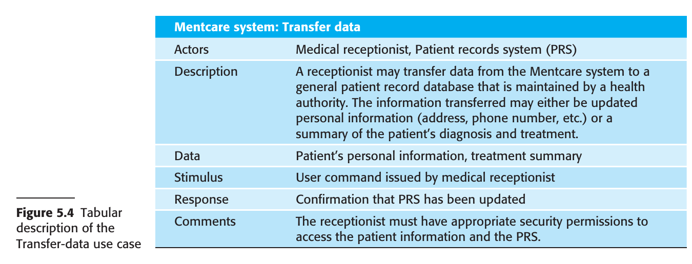

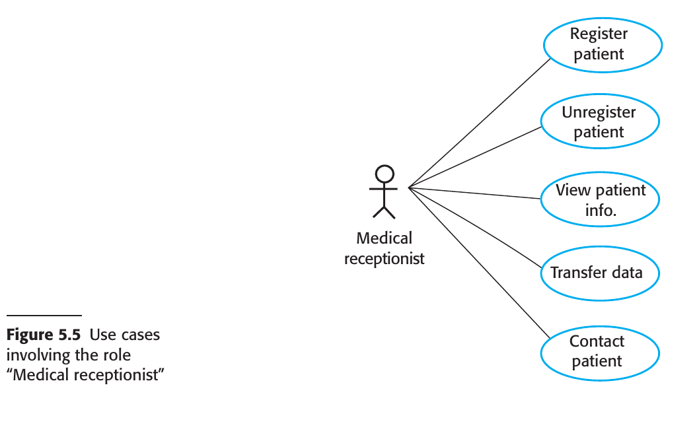

#### 5.2.1 Sequence Diagrams

1. **Purpose and Scope**:
    - Used to model interactions between actors and objects, and among objects themselves.
    - Rich syntax but focus here is on basics.
  
2. **Core Elements**:
    1. **Objects and Actors**: Listed along the top of the diagram.
    2. **Dotted Line**: Represents the lifeline of an object or actor, indicating involvement over time.
    3. **Annotated Arrows**: Show interactions between objects and actors.
    4. **Rectangle on Dotted Lines**: Indicates the lifeline or time an object instance is involved.
  
3. **Reading Sequence**:
    - Interactions are read from top to bottom.
    - Annotations on arrows indicate calls, parameters, and return values.

4. **Alternatives and Conditions**:
    - "Alt" box used to indicate alternative interactions.
    - Conditions for alternatives are shown in square brackets.
  
5. **Example Scenarios**:
    1. **View Patient Information**: 
        - Triggered by a medical receptionist.
        - Involves security checks and conditional display of information.
    2. **Transfer to Patient Record System (PRS)**:
        - Receptionist logs onto PRS.
        - Two options for data transfer, both requiring authorization checks.
        - PRS issues a status message upon completion.

6. **Level of Detail**:
    - Not necessary to include every interaction, especially for early-stage modeling.
    - Some interactions might depend on later implementation decisions.

Sequence diagrams in UML serve as a valuable tool for modeling interactions within a system. They feature a range of elements that detail object lifetimes, interactions, and conditions for alternative pathways. The level of detail can be adjusted according to the stage of development, making these diagrams versatile for different uses.

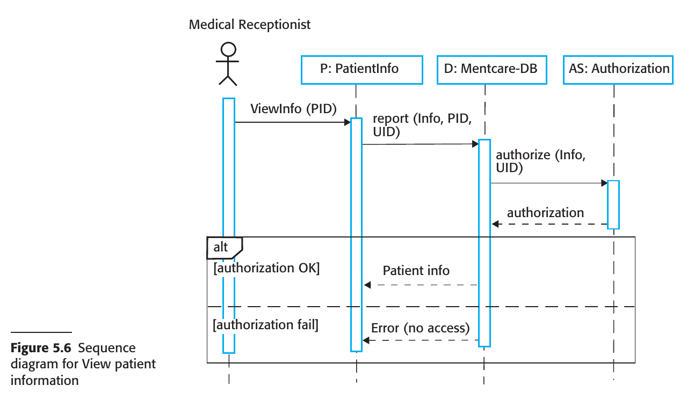

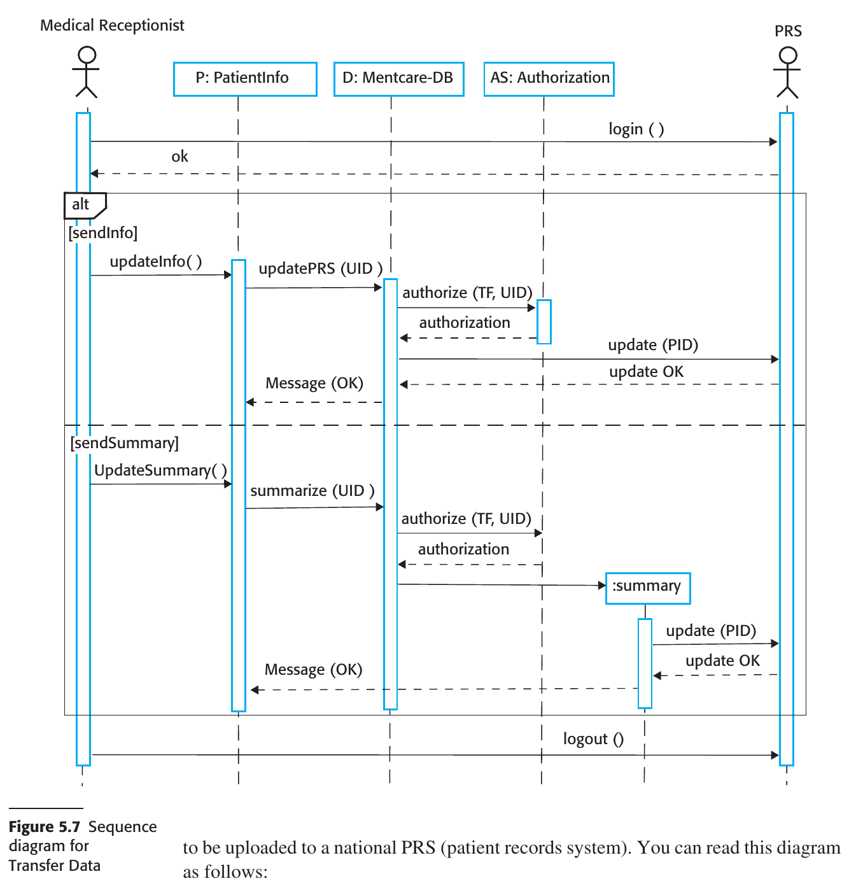

### 5.3 Structural models

#### 5.3.1 Class Diagrams

1. **Purpose and Utility**:
    - Used in object-oriented system modeling to depict classes and their associations.
    - Early stages focus on real-world objects like patients, prescriptions, etc.
    - Can be used at different levels of detail.

2. **Basic Elements**:
    1. **Object Class**: Represents a kind of system object. Shown as a box with the class name.
    2. **Association**: Links between classes, indicating a relationship. Represented by a line between class boxes.

3. **Levels of Detail**:
    - Initial modeling identifies essential real-world objects as classes.
    - Simple class diagrams may not specify the nature of associations between classes.
    - More detailed diagrams can name the associations.

4. **Multiplicity in Associations**:
    - Indicates how many objects are involved in an association.
    - Examples: 1:1, 1:*, 1..4, etc.
  
5. **Similarity to Semantic Data Models**:
    - Resemble semantic data models used in database design.
    - Entities in a semantic data model can be thought of as simplified object classes.
  
6. **Attributes and Operations**:
    - To add more detail, include attributes (characteristics) and operations (functions) of the classes.
    - Shown by extending the rectangle that represents a class.
        1. Class name in the top section.
        2. Attributes in the middle section.
        3. Operations in the lower section.

Class diagrams in UML serve as a foundational tool in object-oriented system modeling, allowing for different levels of detail depending on the development stage. They can show simple to complex relationships between classes, include multiplicities to indicate the number of objects in an association, and can be extended to include attributes and operations for each class.

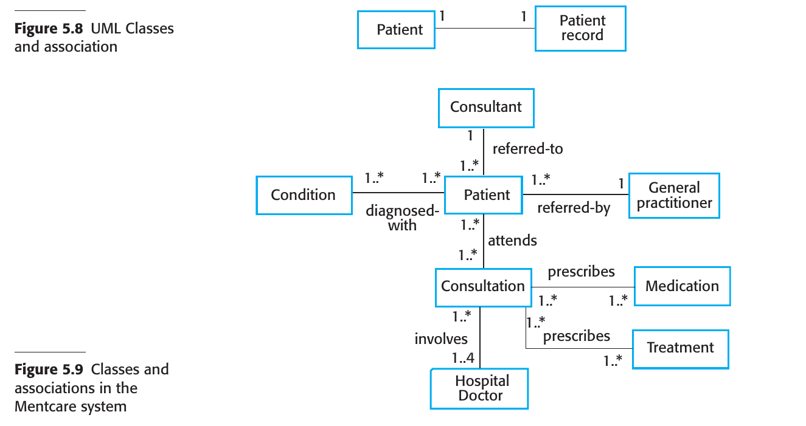

#### 5.3.2 generalization

1. **Concept of Generalization**:
    - A technique to manage complexity by focusing on general classes and their characteristics.
    - Example: Squirrels and rats are generalized as "rodents," sharing common characteristics like teeth for gnawing.

2. **Importance in System Design**:
    - Allows for centralized maintenance of common information.
    - Facilitates easier updates and changes, as you only need to modify the general class.

3. **Implementation in Object-Oriented Languages**:
    - In languages like Java, generalization is implemented through class inheritance mechanisms.

4. **UML Representation**:
    - UML uses a specific type of association to denote generalization.
    - Represented by an arrowhead pointing to the more general class.
  
5. **Inheritance and Attributes**:
    - Subclasses inherit attributes and operations from their superclasses.
    - Subclasses can add more specific attributes and operations.
  
6. **Examples**:
    - General practitioners and hospital doctors can be generalized as doctors.
    - Hospital doctors may have attributes like staff number and pager, which general practitioners do not.
    - Lower-level classes like "Trainee Doctor," "Registered Doctor," and "Consultant" fall under "Hospital Doctor" and add their own specific attributes and operations.

Generalization is a key concept in both everyday reasoning and system modeling, helping to manage complexity by focusing on shared characteristics. In system design, it simplifies maintenance and updates. It is implemented in object-oriented languages through inheritance, and its relationships are explicitly depicted in UML diagrams.

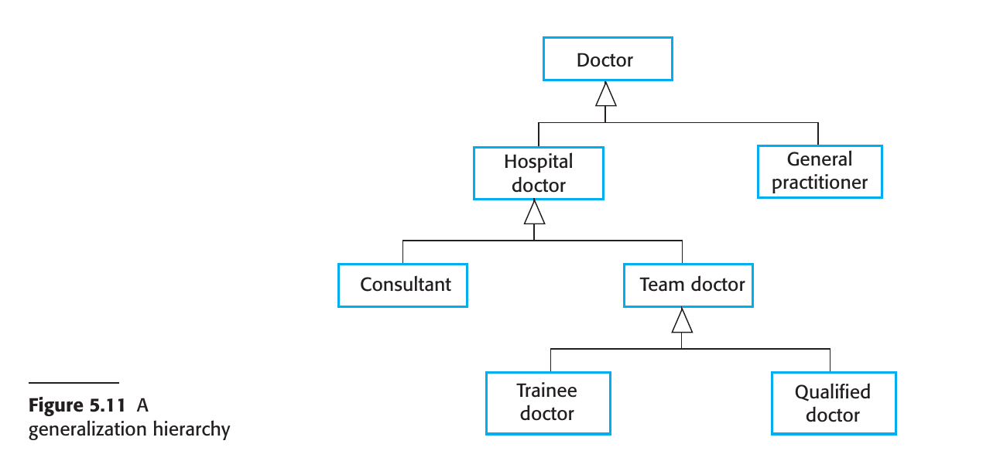

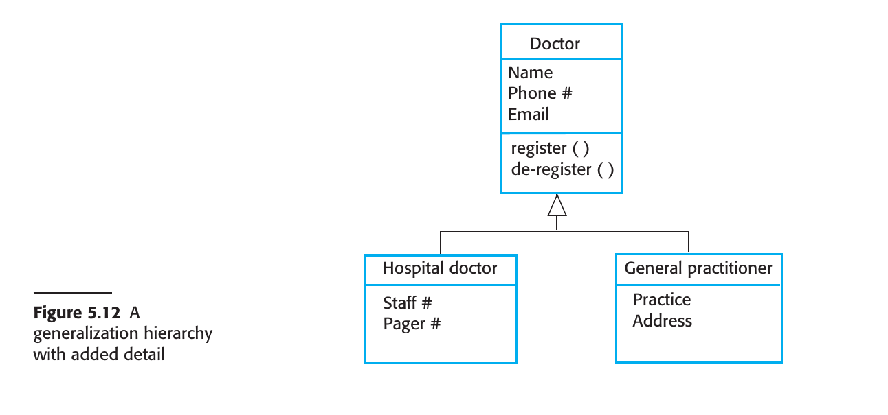

#### 5.3.3 Aggregation

1. **Concept of Aggregation**:
    - Represents the part-whole relationship between objects.
    - Useful for depicting how one object is composed of several other objects.
  
2. **Real-world Example**:
    - A study pack for a course could include components like a book, PowerPoint slides, quizzes, and further reading recommendations.

3. **UML Representation**:
    - In UML, aggregation is a special type of association between classes.
    - A diamond shape is added next to the class that represents the "whole" to indicate aggregation.
  
4. **Specific Example in System Modeling**:
    - A patient record could be an aggregate of the "Patient" class and an indefinite number of "Consultations."
    - This means the patient record maintains both personal patient information and individual records for each consultation with a doctor.

Aggregation is a concept in system modeling used to represent part-whole relationships between objects. It is visually represented in UML diagrams using a diamond shape next to the class that serves as the "whole." The concept is useful for showing how complex objects are composed of simpler parts.

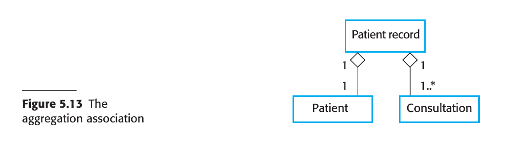

### 5.4 Behavioral models

### 5.5 Model-driven architecture

---

### Summary

- A model is an abstract view of a system that deliberately ignores some system details. Complementary system models can be developed to show the system’s context, interactions, structure, and behavior.

- Context models show how a system that is being modeled is positioned in an environment with other systems and processes. They help define the boundaries of the system to be developed.

- Use case diagrams and sequence diagrams are used to describe the interactions between users and systems in the system being designed. Use cases describe interactions between a system and external actors; sequence diagrams add more information to these by showing interactions between system objects.

- Structural models show the organization and architecture of a system. Class diagrams are used to define the static structure of classes in a system and their associations.

- Behavioral models are used to describe the dynamic behavior of an executing system. This behavior can be modeled from the perspective of the data processed by the system or by the events that stimulate responses from a system.

- Activity diagrams may be used to model the processing of data, where each activity represents one process step.

- State diagrams are used to model a system’s behavior in response to internal or external events.

- Model-driven engineering is an approach to software development in which a system is represented as a set of models that can be automatically transformed to executable code.

---