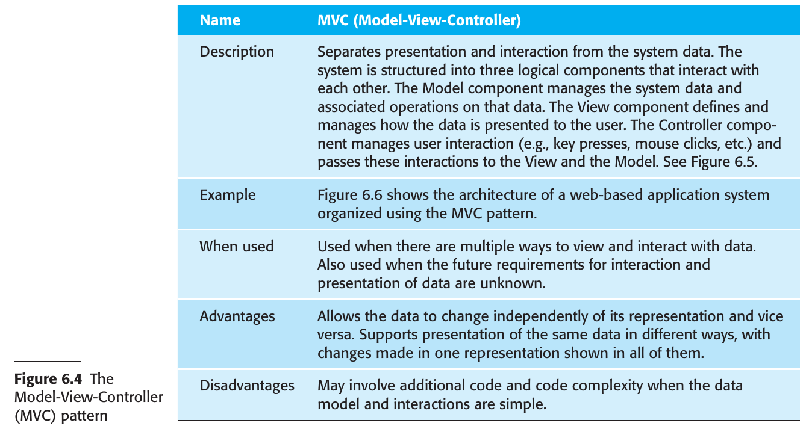

# Chapter 6 Architectural Design

## 6.1 Architecture Design Decisions
## 6.2 Architectural Views
## 6.3 Architectural patterns
## 6.4 Application Architectural

---

### Architectural Design

1. **Definition and Role**: 
    - Architectural design is about designing the overall structure of a software system.
    - It links requirements engineering to design by identifying main structural components and their relationships.
    - The output is an architectural model that shows how the system's components communicate.

2. **In Agile Processes**: 
    - Early stages focus on architectural design.
    - Incremental development of architecture is not effective; refactoring architecture is expensive.

3. **Overlap with Requirements Engineering**: 
    - In practice, architectural design often overlaps with requirements engineering.
    - Main components may be identified during the requirements phase to facilitate discussions with stakeholders.

4. **Levels of Abstraction**: 
    - Architecture in the Small: Focuses on individual programs and their decomposition.
    - Architecture in the Large: Concerned with complex enterprise systems and their interconnections.

5. **Importance and Impact**: 
    - Affects performance, robustness, distributability, and maintainability.
    - Non-functional requirements significantly influence the architecture.

6. **Advantages of Explicit Architecture**: 
    1. Facilitates stakeholder communication.
    2. Aids in early-stage system analysis.
    3. Supports large-scale reuse through product-line architectures.

7. **Modeling Techniques**: 
    - Block diagrams are commonly used but are criticized for their lack of detail.
    - More rigorous architectural description languages exist but are not widely used due to their complexity and cost.

8. **Contradictions in Practice**: 
    - Architectural models serve two purposes:
        1. Encouraging discussions about system design for stakeholder communication and project planning.
        2. Documenting a fully fleshed-out architecture to facilitate system understanding and evolution.

Architectural design is a critical phase in the software development process, serving as the bridge between requirements and implementation. While it plays a significant role in influencing various system attributes, the ways in which architectural models are created and used can vary, often depending on project-specific needs and constraints.

### 6.1 Architecture Design Decisions

1. **Nature of Architectural Design**: 
    - Not a formulaic process; depends on the system, the architect's experience, and specific requirements.
    - Considered a series of decisions rather than a sequence of activities.

2. **Structural Decisions**: 
    - Architects make key structural decisions that impact both the system and its development.
    - These decisions often depend on the architect's knowledge, experience, and the domain of the application.

3. **Reuse and Domain Similarities**: 
    - Systems in the same domain often share architectural similarities.
    - Architects should identify what can be reused from existing architectures within the same or broader application classes.

4. **Distributed vs. Localized Systems**: 
    - The choice between a distributed and a localized architecture is crucial, especially for large systems.
    - This choice affects performance and reliability.

5. **Architectural Patterns and Styles**: 
    - Based on well-known patterns like client–server or layered architectures.
    - Patterns capture the essence of architectures used in different systems.

6. **Non-Functional Requirements and Architecture**: 
    - Architecture style should depend on non-functional requirements such as:
        1. Performance: Localize critical operations to reduce component communications.
        2. Security: Use layered structures with higher validation for innermost layers.
        3. Safety: Co-locate safety-related operations to simplify validation and provide fail-safes.
        4. Availability: Include redundant components for higher availability.
        5. Maintainability: Use fine-grained, self-contained components for easier changes.

7. **Potential Conflicts**: 
    - Trade-offs may be necessary when multiple non-functional requirements are important.
    - Different architectural patterns may be used for different parts of the system to balance conflicting requirements.

8. **Evaluation of Architectural Design**: 
    - Difficult to evaluate definitively, as the true test comes when the system is in use.
    - Comparing against reference architectures or generic patterns can provide some level of evaluation.

Architectural design is a complex and creative process that involves a series of crucial decisions. These decisions are influenced by various factors including the type of system, the architect's background, and specific functional and non-functional requirements. The chosen architecture profoundly affects the system's performance, security, and other attributes, necessitating careful consideration and sometimes trade-offs among conflicting requirements.

### 6.2 Architectural Views

1. **Purpose of Architectural Models**: 
    - Used for discussing software requirements or design.
    - Serve as documentation for detailed design and implementation.

2. **Multiple Views for Complexity**: 
    - A single diagram cannot capture all aspects of a system's architecture.
    - Multiple views are often needed for both design and documentation.

3. **Krutchen’s 4+1 View Model**: 
    - Krutchen suggests four fundamental architectural views linked through use cases:
        1. **Logical View**: Shows key abstractions as objects or object classes.
        2. **Process View**: Shows runtime composition of interacting processes.
        3. **Development View**: Shows software decomposition for development.
        4. **Physical View**: Shows distribution of software components across hardware.

4. **Hofmeister's Conceptual View**: 
    - Hofmeister et al. add a "Conceptual View" that serves as an abstract representation of the system.
    - Useful for decomposing high-level requirements and informing architectural decisions.

5. **Informality vs Formality in Notations**: 
    - UML often used informally for architecture description.
    - Some argue for more specialized Architectural Description Languages (ADLs), but these are less accessible to non-specialists.

6. **Agile Perspective on Documentation**: 
    - Detailed design documentation is often seen as unnecessary in agile methods.
    - Focus is on developing views useful for communication rather than complete documentation.

In summary, architectural views serve to capture different aspects of a system's design and are crucial for both discussion and documentation. While there are formal methods and notations, such as UML and ADLs, the industry often leans towards more informal, accessible representations, especially in agile environments. Different architects and methodologies propose various sets of views, but the emphasis is on capturing what is most useful for the project's specific needs.

### 6.3 Architectural patterns

1. **Introduction and Origin**: 
    - Patterns are stylized, reusable solutions in software engineering.
    - The concept gained traction with a book on object-oriented design patterns (Gamma et al. 1995).

2. **Other Types of Patterns**: 
    - Exist in organizational design, usability, cooperative interaction, and configuration management.

3. **Architectural Patterns vs Styles**: 
    - Initially proposed as "architectural styles" in the 1990s.
    - Detailed handbooks published on pattern-oriented software architecture.

4. **Definition and Utility**: 
    - Architectural patterns are abstract descriptions of tried and tested good practices.
    - They include information on when to use them and their strengths and weaknesses.

5. **Model-View-Controller (MVC) as an Example**: 
    - Commonly used for interaction management in web-based systems.
    - Descriptions often include pattern name, brief description, graphical model, and example usage.

6. **Graphical Representations**: 
    - Patterns can be illustrated from different views, like conceptual and runtime system architectures.

7. **Scope and Limitations**: 
    - Not all generic patterns can be described due to space limitations, but selected examples provide insights into good architectural design principles.

In summary, architectural patterns offer a formalized way to introduce tried and tested system organizations into new projects. These patterns can vary in type and application but generally include guidelines on when and how to use them. They are often visually represented to give both conceptual and practical insights into their structure and utility.

#### 6.3.1 Layered Architecture

1. **Fundamental Concepts**: 
    - Separation and independence are key to architectural design.
    - Allows for changes to be localized within the system.

2. **Layered Architecture Purpose**: 
    - Achieves separation and independence by organizing system functionality into separate layers.
    - Each layer relies only on the layer immediately beneath it.

3. **Advantages**:
    - **Incremental Development**: Allows for the incremental release of services as layers are developed.
    - **Changeability and Portability**: A new layer can replace an existing one without affecting the rest of the system, provided the interface remains the same.
    - **Localizing Dependencies**: Makes it easier to adapt to different operating systems or databases, as only machine-dependent layers need to be changed.

4. **Example Structure**: 
    - Four-layer example consists of:
        1. System support software layer (e.g., database and OS support).
        2. Application layer with application functionality and utility components.
        3. User interface management, authentication, and authorization layer.
        4. Top layer focused on user interface facilities.
    - The number of layers is arbitrary and can be adjusted as needed.

5. **Real-world Examples**: 
    - iLearn digital learning system and Mentcare system both employ a four-layer architecture following this pattern.

In summary, the Layered Architecture pattern organizes a system into separate, interdependent layers to achieve modularity, ease of development, and change resilience. This architecture is flexible, allowing for incremental development and adaptability to different technological platforms.

#### 6.3.2 Repository Architecture

1. **Core Concept**:
    - Focuses on how a set of interacting components can share data through a centralized database or repository.

2. **Applicability**: 
    - Suited for systems where data is generated by one component and used by another.
    - Examples include command and control systems, management information systems, CAD systems, and software development environments.

3. **Advantages**:
    - **Efficient Data Sharing**: Eliminates the need to transmit data explicitly between components.
    - **Version Control**: Can include features like versioning and rollback.

4. **Challenges**:
    - **Data Model Compromise**: All components must agree on a repository data model, which could be a limiting factor for integrating new components.
    - **Distribution Difficulty**: Logically centralized repositories can be technically challenging to distribute over multiple machines due to consistency and data duplication issues.

5. **Variations**:
    - **Passive Repository**: Control is managed by the components using the repository.
    - **Blackboard Model**: An alternative used in AI systems where the repository triggers components based on the availability of certain data.
  
In summary, the Repository Architecture pattern is useful for systems that require efficient sharing of large amounts of data between components. It comes with its own sets of advantages and challenges, including efficient data sharing but also potential difficulties with data model agreement and distribution. Various models like the passive repository and blackboard model offer different approaches to control and data availability.

#### 6.3.3 Client-Server Architecture

1. **Core Concept**:
    - Focuses on runtime organization, particularly for distributed systems.
    - Organized as a set of services offered by servers and accessed by clients.

2. **Major Components**:
    1. Servers: Offer services like printing, file management, or programming language compilation.
    2. Clients: Access the services offered by servers.
    3. Network: Allows clients to access servers, usually implemented as distributed systems using Internet protocols.

3. **Applicability**:
    - Common in distributed systems but can also be implemented on a single computer.
    - Examples include multiuser, web-based systems for media management.

4. **Advantages**:
    - **Separation and Independence**: Services and servers can be changed without affecting other parts of the system.
    - **Scalability**: Easy to add new servers or upgrade existing ones.
    - **Effective Use of Networked Systems**: Allows for distribution across multiple processors.

5. **Communication Protocol**:
    - Typically uses a request–reply protocol like HTTP for remote procedure calls.
    - Clients need to know the names of servers and services but servers don’t need to know client identities.

6. **Example Use-case**:
    - A multiuser web-based system for a film and photograph library, with separate servers for different media types and functionalities.

In summary, the Client–Server Architecture pattern is well-suited for distributed systems requiring runtime organization. It offers advantages like separation, independence, and scalability, usually using a request–reply protocol for client-server communication. The architecture can also be adapted to single-computer implementations.

#### 6.3.4 Pipe and Filter Architecture

1. **Core Concept**:
    - Focuses on runtime organization where functional transformations process inputs and produce outputs.
    - Data flows sequentially or in parallel through transforms.

2. **Terminology**:
    - "Pipe" refers to the mechanism for passing data from one process to another.
    - "Filter" refers to the transformation that processes the data.

3. **Variants**:
    - When transformations are sequential and data is processed in batches, it becomes a batch sequential model.
    - Can also be used in embedded systems as a process pipeline.

4. **Applicability**:
    - Suited for batch processing systems and embedded systems.
    - Not well-suited for interactive systems with complex I/O formats.

5. **Example Use-case**:
    - In a batch processing application, an organization issues invoices and then reconciles payments once a week. Receipts and reminders are generated based on payment status.

6. **Challenges**:
    - Difficult to implement in systems requiring interactive, event-based user interfaces.

In summary, the Pipe and Filter Architecture pattern is primarily used for batch processing and embedded systems. It's based on functional transformations that can be executed either sequentially or in parallel. While effective for certain types of systems, it's not well-suited for interactive systems with complex user interactions.

### 6.4 Application Architectural

1. **Core Concept**: 
    - Application architectures encapsulate the essential characteristics of a class of systems, providing a common structural basis for quick development.

2. **Types of Common Application Systems**:
    1. **Transaction Processing Applications**: 
        - Centered around databases, maintaining data integrity.
        - Includes interactive banking, e-commerce, booking systems.
    2. **Language Processing Systems**: 
        - Interpret formal languages like programming languages.
        - Includes compilers and database command interpreters.

3. **Reuse and Adaptability**: 
    - Application architectures can be reused and adapted for specific needs.
    - Often found in Enterprise Resource Planning (ERP) systems and other configurable off-the-shelf systems.

4. **Roles in Software Development**:
    1. **Design Starting Point**: 
        - Useful for initial architectural designs, especially when unfamiliar with the application type.
    2. **Design Checklist**: 
        - Can be used to compare and validate your architectural design against a generic model.
    3. **Team Organization**: 
        - Helps in assigning work based on stable structural features that can often be developed in parallel.
    4. **Component Reuse Assessment**: 
        - Facilitates evaluation of existing components for their reusability.
    5. **Vocabulary for Discussion**: 
        - Provides a common language for discussing and comparing different applications.

5. **Commonality Across Domains**:
    - Superficially different applications often share abstract application architectures, offering avenues for reuse and standardization.

In summary, application architectures serve as blueprints for software systems, offering a starting point for design, a standard for validation, and a basis for team organization and component reuse. They are especially useful in commonly encountered types like transaction processing and language processing systems.

#### 6.4.1 Transactional Processing Systems

1. **Definition and Objective**: 
    - Transaction processing systems handle user requests for database information or updates. 
    - The primary objective is to maintain data integrity during operations.

2. **Technical vs User Transactions**: 
    - A technical database transaction is an atomic unit consisting of a sequence of operations. 
    - A user transaction could be a coherent sequence of operations like querying flight times, which may not always require a technical transaction.

3. **Example**: 
    - Withdrawing money from an ATM involves multiple steps, from checking account balance to dispensing cash, all treated as a single transaction.

4. **Interactive Nature**: 
    - These are typically interactive systems where users make asynchronous service requests.
  
5. **Conceptual Architecture**:
    - User initiates a request via an I/O component.
    - Application-specific logic processes the request.
    - A transaction manager, usually within the DBMS, ensures transaction completion.

6. **Pipe and Filter Organization**: 
    - Transaction processing systems may be organized following the "pipe and filter" pattern.
    - Components are responsible for input, processing, and output.
  
7. **Example Architecture**:
    - In a banking system with ATMs, the ATM software handles input and output, while the bank's database server handles processing.

In summary, transaction processing systems are designed to handle database queries and updates in an interactive and atomic manner, ensuring data integrity. The architecture often involves I/O components, application-specific logic, and a transaction manager. They can also be designed following the "pipe and filter" architectural pattern.

#### 6.4.2 Information Systems

1. **Definition and Scope**:
    - Information systems allow controlled access to large databases like library catalogs, flight timetables, or medical records.
    - Often considered as transaction-based systems.
    - Typically web-based, with user interfaces in web browsers.

2. **General Architecture**:
    - Modeled using a layered approach.
    - Top layer for user interface, bottom layer for the database.
    - User communications layer handles I/O.
    - Information retrieval layer contains application-specific logic.
  
3. **Example: Mentcare System**:
    - Four layers identified:
        1. Browser-based user interface.
        2. User interface functionality, including login and data validation.
        3. System functionality like security, data creation/updating, and report generation.
        4. Commercial database for transaction management and persistent storage.

4. **Relation to Transaction Processing Systems**:
    - Information systems can sometimes also be transaction processing systems.
    - E-commerce systems are an example where the application-specific layer includes additional functionality like a shopping cart.

5. **Multi-tier Client-Server Architecture**:
    - Often implemented as distributed systems.
    - Layers map to different servers:
        1. Web server for user communications.
        2. Application server for application-specific logic and information retrieval.
        3. Database server for transaction management and data storage.
  
6. **Scalability**:
    - Using multiple servers allows for high throughput.
    - Scalable to handle thousands of transactions per minute.

In summary, information systems are often web-based, layered architectures that provide controlled access to large databases. They can also function as transaction processing systems, as seen in e-commerce platforms. The architecture often maps to multi-tier client-server setups, allowing for scalability and high throughput.

#### 6.4.3 Language Processing Systems

1. **Purpose and Types**:
    - Translate languages into alternative representations.
    - May include compilers, XML translators, and natural language processing systems.
    - Can translate programming languages into machine code or other languages like XML into database queries.

2. **Basic Architecture**:
    - Source language instructions are converted into instructions for an abstract machine.
    - Another component interprets these instructions, potentially using data from the environment.

3. **Components in a Programming Environment**:
    - Lexical Analyzer: Converts input language tokens into internal form.
    - Symbol Table: Holds information about names of entities used in the text.
    - Syntax Analyzer: Checks the syntax and builds a syntax tree.
    - Syntax Tree: Internal structure representing the program.
    - Semantic Analyzer: Checks semantic correctness using the syntax tree and symbol table.
    - Code Generator: Generates abstract machine code based on the syntax tree.

4. **Additional Components**:
    - In natural language translators, a dictionary may be included.
    - Efficiency and redundancy analyzers can also be included.

5. **Integrated Programming Support Tools**:
    - Symbol table and syntax tree can act as central repositories for tool communication.
    - Syntax-directed editors, program formatters, and other tools can interact through this repository.

6. **Architectural Patterns**:
    - Pipe and Filter Model: Effective for batch environments, organizes phases of analysis sequentially.
    - Repository Model: Better for integrated language processing tools where immediate reflection of changes is needed.

In summary, language processing systems serve to translate different types of languages and can have various architectures depending on their use-cases. In programming environments, they often include a series of analyzers and generators. The architecture may vary based on whether the system is designed for batch processing or needs to be integrated with other tools.

---

### Summary

- A software architecture is a description of how a software system is organized. Properties of a system such as performance, security, and availability are influenced by the architecture used.

- Architectural design decisions include decisions on the type of application, the distribution of the system, the architectural styles to be used, and the ways in which the architecture should be documented and evaluated.

- Architectures may be documented from several different perspectives or views. Possible views include a conceptual view, a logical view, a process view, a development view, and a physical view.

- Architectural patterns are a means of reusing knowledge about generic system architectures.

- They describe the architecture, explain when it may be used, and point out its advantages and disadvantages.

- Commonly used Architectural patterns include model-view-controller, layered architecture, repository, client–server, and pipe and filter.

- Generic models of application systems architectures help us understand the operation of applications, compare applications of the same type, validate application system designs, and assess large-scale components for reuse.

- Transaction processing systems are interactive systems that allow information in a database to be remotely accessed and modified by a number of users. Information systems and resource management systems are examples of transaction processing systems.

- Language processing systems are used to translate texts from one language into another and to carry out the instructions specified in the input language. They include a translator and an abstract machine that executes the generated language.

---