# Chapter 7 Design and implementation
## 7.1 Object oriented design using UML
## 7.2 Design patterns
## 7.3 Implementation issues
## 7.4 Open source development

---

### 7.1 Object oriented design using UML

#### Overview
- Object-oriented systems consist of interacting objects that have private local states and provide operations to manipulate these states.
- Object-oriented design focuses on creating object classes and defining the relationships between them.
- Objects encompass both data and methods to operate on that data, functioning as standalone entities.
- Objects often map directly to real-world entities, making the system easier to understand and maintain.

#### Design Process
To develop an object-oriented system design, the following steps are generally followed:
1. Define context and external interactions of the system.
2. Design the system architecture.
3. Identify principal objects in the system.
4. Develop design models.
5. Specify interfaces.

#### Creative Nature of Design
- Design is a non-linear, iterative process involving idea generation, solution proposal, and refinement.
- The design process may require backtracking and option exploration.
- Notations like UML can be used both formally to clarify design aspects and informally to stimulate discussions.

#### Case Study: Wilderness Weather Station
- The design principles are illustrated through the example of embedded software for wilderness weather stations.
- These stations are deployed in remote areas and record local weather data.
- The data is periodically transferred to a central weather information system via satellite link.

#### 7.1.1 System context and interactions

#### Understanding System Context
- The first step in software design is to understand the relationship between the software and its external environment.
- Understanding the context helps set system boundaries, deciding what features are within the system and what are in associated systems.

#### Types of Models for Context and Interactions
1. **System Context Model**: A structural model showing other systems in the environment.
2. **Interaction Model**: A dynamic model displaying how the system interacts with its environment.

#### Representation Techniques
- Associations in the context model show relationships between entities.
- Block diagrams can be used to document the environment, showing entities and their associations.
- Use case models provide an abstract view of system interactions, each use case representing a specific interaction.

#### Case Study: Weather Station
- Systems in the environment include a weather information system, an onboard satellite system, and a control system.
- Use case models show that the weather station reports data to the weather information system and receives commands from the control system.

#### Detailing Use Cases
- Use cases are described in structured natural language, specifying information exchange, how interactions are initiated, etc.
- This helps in identifying objects in the system and understanding the system's intended functions.

#### Embedded Systems
- Embedded systems are often modeled by describing their response to internal or external stimuli.
- Stimuli and responses should be listed in the use case descriptions.

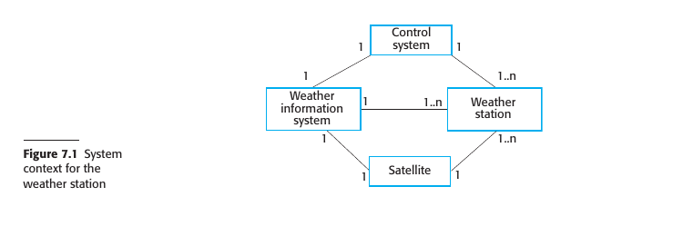

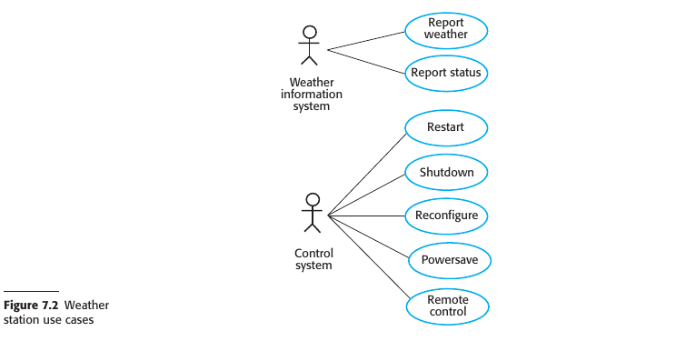

#### 7.1.2 Architectural design

#### Basis for Architectural Design
- After defining interactions with the environment, this information is used to design the system architecture.
- This combines general architectural principles and domain-specific knowledge to identify major system components and their interactions.

#### Architectural Patterns
- System organization can be designed using architectural patterns like layered or client–server models.

#### Case Study: Weather Station
- The weather station uses a "listener model," where subsystems communicate via broadcasting messages on a common infrastructure.
- Subsystems pick up messages intended for them, allowing easy support for different configurations.
  
#### Benefits of Listener Model
- The architecture is flexible as the sender doesn't need to address a message to a specific subsystem.
- For example, when a "shutdown" command is broadcast, each subsystem picks it up and shuts down appropriately.

#### Data Collection Subsystem
- Includes Transmitter and Receiver objects for managing communications.
- Features a WeatherData object that gathers and transmits data.
- Follows the producer–consumer pattern for its organizational structure.

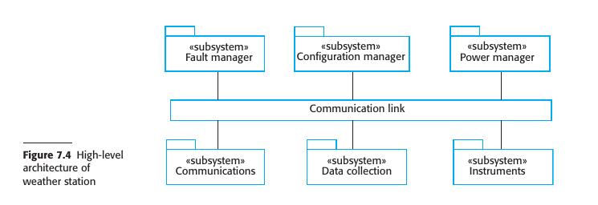

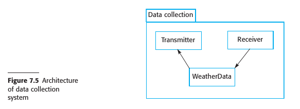

#### 7.1.3 Object class identification

#### Stage in Design Process
- At this stage, essential system objects should be identified, and use case descriptions assist in this.

#### Traditional Methods for Object Identification
1. **Grammatical Analysis**: Nouns become objects and attributes, verbs become operations.
2. **Domain Entities**: Use tangible entities like roles, events, or organizational units to identify objects.
3. **Scenario-Based Analysis**: Analyze various use cases to identify required objects, attributes, and operations.

#### Multiple Sources for Object Identification
- Different knowledge sources like domain knowledge and scenario analysis refine initial object classes identified from informal system descriptions.
- Implementation objects may also be needed for general services like searching and validity checking.

#### Case Study: Wilderness Weather Station
1. **WeatherStation Object**: Serves as the basic interface, encapsulating all system interactions.
2. **WeatherData Object**: Processes the report weather command and sends summarized data.
3. **Instrument Objects**: Ground thermometer, Anemometer, and Barometer are hardware-related objects that operate autonomously to collect and store data.

#### Additional Object Attributes and Services
1. Instrument failures should be automatically reported, requiring additional attributes and operations.
2. Each weather station should have a unique identifier for communications.
3. Instruments should also be uniquely identified, and a database of instrument information should be maintained.

#### Focus and Further Refinement
- Initial focus should be on object identification without worrying about implementation.
- Once objects are identified, the design is refined to look for common features and design inheritance hierarchies (e.g., an Instrument superclass with common features).

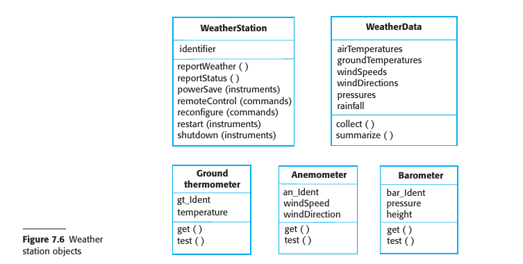

#### 7.1.4 Design models

#### Purpose of Design Models
- Serve as a bridge between system requirements and implementation.
- Must balance abstraction and detail to facilitate implementation without obscuring relationships.

#### Dependency on Development Process
- In agile or close-knit teams, abstract models may suffice.
- In plan-based or distributed teams, more detailed models are needed for clear communication.

#### Types of Design Models in UML
1. **Structural Models**: Describe the static structure using object classes and relationships like inheritance, composition, and usage.
2. **Dynamic Models**: Describe runtime interactions, including sequence of service requests and state changes.

#### Useful UML Models for Detailing
1. **Subsystem Models**: Structural models showing logical groupings of objects.
2. **Sequence Models**: Dynamic models detailing the sequence of interactions among objects.
3. **State Machine Models**: Dynamic models showing how objects change states in response to events.

#### Case Study: Sequence and State Diagrams
- Sequence diagrams are used to detail the interactions for significant use cases.
- State diagrams show how the system responds to various services or messages.

#### When to Use State Diagrams
- Not all objects need a state diagram; they are most useful for complex objects where understanding state changes is critical.

#### Guidelines for Model Detailing
1. Avoid over-modeling; focus on essential details.
2. Models should facilitate understanding and implementation, not become an end in themselves.

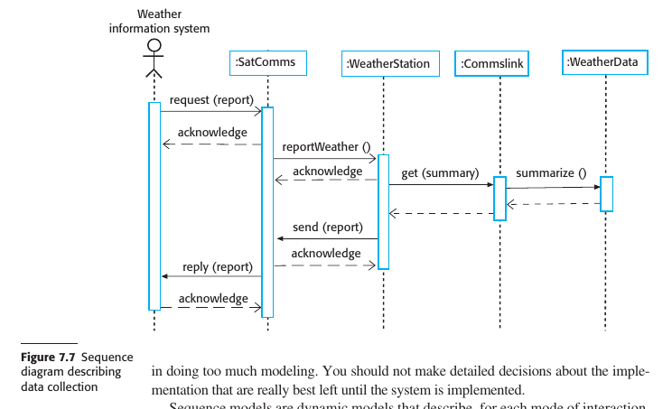

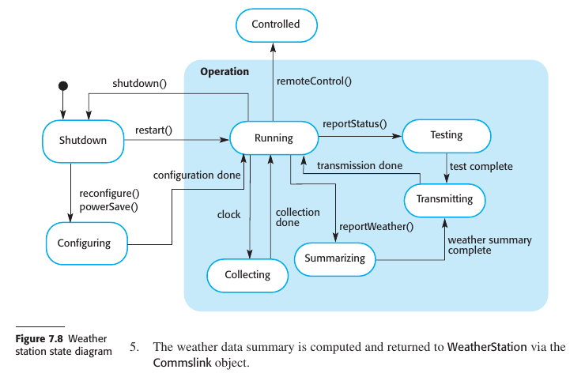

#### 7.1.5 Interface specification

#### Importance of Interface Specification
- Crucial for parallel development of objects and subsystems.
- Once specified, interfaces are assumed to be implemented by developers.

#### What Interface Design Entails
- Specifies the detail of the interface to an object or a group of objects.
- Defines the signatures and semantics of services provided.

#### UML Notation for Interfaces
- Similar to class diagrams but without an attribute section.
- Uses the UML stereotype «interface».
- Semantics can be defined using the Object Constraint Language (OCL).

#### Exclusions in Interface Design
- Data representation details are not included.
- Operations for data access and update are included.

#### Maintainability Benefits
- Data representation is hidden, allowing easy changes without affecting other objects.

#### Object-Interface Relationship
- Not a 1:1 relationship; an object can have multiple interfaces.
- A group of objects can be accessed through a single interface.

#### Case Study: Weather Station Interfaces
- Two interfaces: a reporting interface for generating reports and a remote control interface for various operations.
- Operations in interfaces map to methods in the WeatherStation object.

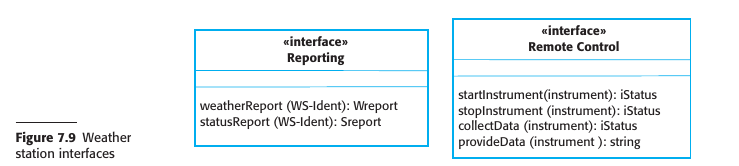

---

### 7.2 Design patterns

#### Origin and Purpose
- Derived from architectural design principles proposed by Christopher Alexander.
- A way to encapsulate and reuse design wisdom and experience.
- Serve as a vocabulary for discussing designs.

#### Impact and Domain
- Huge impact on object-oriented software design.
- Also applicable to any kind of software design, like configuration patterns.

#### Four Essential Elements of a Design Pattern
1. **Name**: A meaningful reference for easy communication.
2. **Problem Description**: Explains when the pattern is applicable.
3. **Solution Description**: A template of the design solution, often expressed graphically.
4. **Consequences**: Results and trade-offs of applying the pattern.

#### Pattern Description Breakdown
- Problem description further divided into motivation and applicability.
- Solution description may cover pattern structure, participants, collaborations, and implementation.

#### Examples from Gang of Four’s Book
1. **Observer Pattern**: Notify multiple objects of state changes in another object.
2. **Façade Pattern**: Tidy up the interfaces of related, incrementally developed objects.
3. **Iterator Pattern**: Standard way to access elements in a collection.
4. **Decorator Pattern**: Extend the functionality of an existing class at runtime.

#### Pattern Usage in Design Process
- Design patterns often recognized and applied when a design problem is experienced.
- Hundreds of patterns available, but experience is needed to recognize when to use one.

#### Flexibility of Patterns
- Allow adaptation of implementation to suit specific system needs.

#### Observer Pattern Example
- **Name**: Observer
- **Description**: Allows multiple displays of an object’s state without the object knowing about the displays.
- **Problem**: Need for multiple, possibly unknown, display formats that update automatically.
- **Solution**: Involves abstract objects (Subject, Observer) and concrete objects (ConcreteSubject, ConcreteObserver) that inherit attributes and operations.
- **Consequences**: Minimizes coupling but may limit optimization and cause unnecessary updates.

#### Final Note
- Effective use of design patterns requires experience; not straightforward for inexperienced programmers.

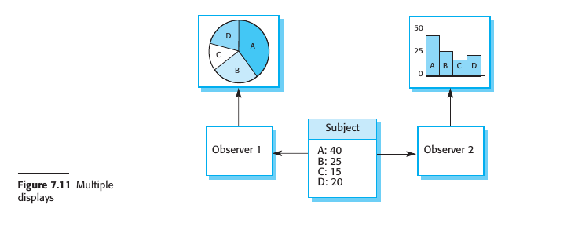

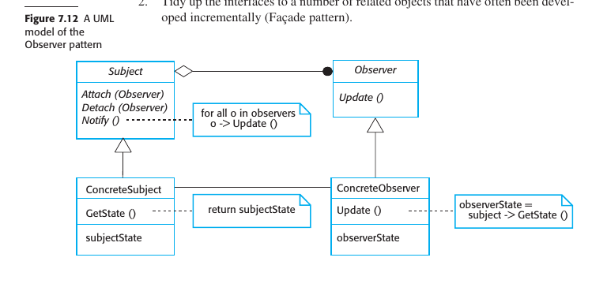

---

### 7.3 Implementation issues

#### Overview
- Software engineering encompasses activities from initial requirements to maintenance and management.
- System implementation is a critical stage involving creating an executable version of the software.
- Implementation can use high- or low-level programming languages, or adapt off-the-shelf systems.

#### Key Aspects in Software Engineering Implementation
1. **Reuse**: Utilization of existing components or systems is common in modern software development. Aim to maximize the use of existing code.
2. **Configuration Management**: Different versions of each software component are created during development. Tracking these versions in a configuration management system is essential to avoid errors.
3. **Host-Target Development**: Software is usually developed on one computer (the host) and executed on a different computer (the target). These systems can be of the same or different types.

### 7.3.1 Reuse

#### Historical Context
- Before the 1990s, new software was generally developed from scratch.
- Due to costs and schedule pressures, the trend shifted towards reuse-based development, especially in commercial, web-based, and embedded systems.

#### Levels of Software Reuse
1. **Abstraction Level**: Reuse of design patterns and architectural patterns, representing abstract knowledge.
2. **Object Level**: Direct reuse of objects from libraries, such as using JavaMail library for email processing in Java.
3. **Component Level**: Reuse of collections of objects and classes that provide related functions, often requiring some adaptation. For instance, using a UI framework.
4. **System Level**: Reuse of entire application systems, typically involving configuration or even integration of multiple systems.

#### Benefits of Reuse
- Faster development.
- Lower costs.
- Lower development risks.
- Increased reliability due to tested components.

#### Costs Associated with Reuse
1. Time spent searching for and assessing reusable software.
2. Purchasing costs of off-the-shelf software.
3. Costs of adapting and configuring the reusable components.
4. Costs of integrating reusable components from different sources, which can be complex and expensive.

#### Reuse in Software Development Process
- Reuse considerations should be the first step when starting a new software project.
- Adapt the design and requirements based on available reusable elements.
- Several chapters in the book are devoted to the topic due to its importance in modern software engineering.

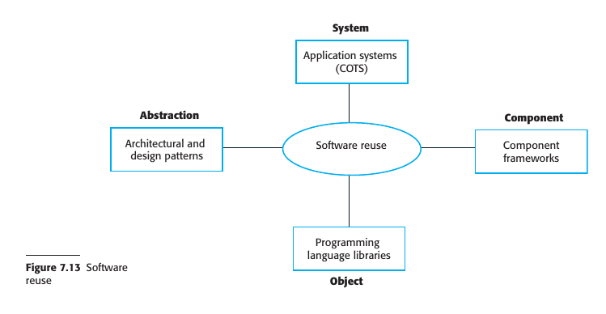

### 7.3.2 Configuration management

#### Importance and Purpose
- Configuration management is essential in managing a changing software system.
- Aims to support system integration and enable controlled access to project code and documents.

#### Fundamental Activities
1. **Version Management**: 
   - Keeps track of different versions of software components.
   - Coordinates development to prevent one developer from overwriting another's work.
  
2. **System Integration**: 
   - Defines what versions of components create each system version.
   - Enables automatic system building by compiling and linking required components.

3. **Problem Tracking**: 
   - Allows users to report bugs and other issues.
   - Lets developers see who is working on issues and their status.

4. **Release Management**: 
   - Concerned with releasing new versions to customers.
   - Plans the functionality of new releases and organizes software for distribution.

#### Tools and Support
- Configuration management tools are often part of integrated development environments (e.g., Eclipse).
- Version management systems like Subversion or Git support multi-site, multi-team development.
- System integration may use language-specific support or separate toolsets like the GNU build system.
- Bug tracking systems like Bugzilla are used for problem tracking.

#### Additional Notes
- Detailed discussion on change and configuration management is covered in Chapter 25 of the source material.

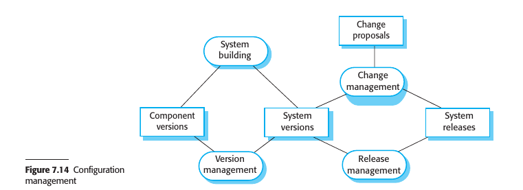

### 7.3.3 Host-target development

#### Basic Concept
- Software is developed on one platform (the host) but is executed on a separate platform (the target).
- Both host and target platforms consist of hardware, operating system, and other supporting software.

#### Scenarios
- Sometimes, host and target platforms are identical, enabling development and testing on the same machine.
- For embedded and mobile systems, host and target are usually different, necessitating either software transfer for testing or the use of simulators.

#### Simulators
- Commonly used in embedded systems development.
- Simulate hardware devices and environmental events.
- Speed up development but can be expensive to create.

#### Software and Licensing
- If target system uses specific middleware or software, it may require testing on the target platform due to licensing restrictions.

#### Development Tools
1. Integrated compiler and syntax-directed editing system.
2. Language debugging system.
3. Graphical editing tools, e.g., for UML models.
4. Testing tools like JUnit.
5. Tools for refactoring and program visualization.
6. Configuration management tools.

#### Integrated Development Environments (IDEs)
- Standard tools are often part of an IDE.
- IDEs can be specialized for different languages or domains, e.g., Eclipse with plug-ins.

#### Deployment Considerations
1. **Hardware and Software Requirements**: Ensure the target platform meets them.
2. **Availability Requirements**: High-availability systems may require multi-platform deployment.
3. **Component Communications**: Components that communicate frequently should be close to minimize latency.

#### Documentation and Further Topics
- Deployment decisions can be documented using UML deployment diagrams.
- Embedded systems have additional considerations like physical size, power capabilities, and real-time responses, covered in Chapter 21.

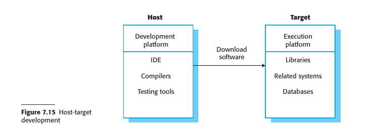

---

### 7.4 Open source development

#### General Concept
- Open-source development involves publishing the source code and inviting volunteers to participate.
- Rooted in the Free Software Foundation's philosophy that source code should be available for public scrutiny and modification.

#### Core Developers and Community
- Generally controlled and developed by a small core group of developers.
- The Internet allows for a larger population of volunteer developers, many of whom are also users.

#### Importance and Examples
- Forms the backbone of Internet and software engineering.
- Examples include Linux, Apache, Java, Eclipse IDE, mySQL, and Android.
- Supported by major industry players like IBM and Oracle.

#### Benefits
- Usually cheap or free to acquire.
- Widely used open-source systems are very reliable.
- Bugs are discovered and fixed rapidly due to community involvement.

#### Company Considerations
1. **Use of Open-Source Components**: Time-to-market and cost reductions can make using open-source components beneficial.
2. **Adopting Open-Source Model**: This approach can offer faster, cheaper development and create a user community. The model is especially useful for specialized systems where support, rather than the software itself, is the product.

#### Limitations and Risks
- May not be suitable for specific organizational requirements or for integration with incompatible existing systems.
- Concerns about revealing confidential business knowledge.

#### Community Involvement
- Simply open-sourcing a project does not guarantee community involvement.
- Most successful open-source projects are platform products rather than specialized application systems.
- Open-sourcing can reassure users about the future availability of the software.
- 
### 7.4.1 Open source licensing

#### Ownership and Restrictions
- Developers own the code legally and can impose conditions through open-source software licenses.
- Some developers require that derivative works must also be open-source, while others don't.

#### Types of Licenses
1. **GNU General Public License (GPL)**: A reciprocal license requiring any software using GPL-licensed components to be open-source.
2. **GNU Lesser General Public License (LGPL)**: Allows linking to open-source code without needing to make the linked components open-source. If you modify the LGPL component, it must be published as open-source.
3. **Berkley Standard Distribution (BSD) and MIT Licenses**: Nonreciprocal licenses allowing integration into proprietary systems. Acknowledgment of the original creator is required.

#### Implications for Software Products
- Using GPL-licensed software may require making your product open-source, affecting your ability to keep the software proprietary.

#### Management Guidelines
1. **Maintain License Information**: Keep track of licenses for each used component. Licenses may change over time.
2. **Understand License Types**: Know the license type before using a component, as it affects its applicability to various systems.
3. **Monitor Component Evolution**: Be aware of how open-source components might change in the future.
4. **Educate About Open Source**: Make sure developers understand open-source and its licensing.
5. **Implement Auditing Systems**: Use software to detect and prevent license violations.
6. **Community Participation**: Engage in the open-source community if relying on open-source products.

#### Business Model
- Open-source is becoming an important business model where companies offer add-on services, cloud-based software, or specialized versions along with the open-source software.

### Summary

- Software design and implementation are interleaved activities. The level of detail in the design depends on the type of system being developed and whether you are using a plan-driven or agile approach.

- The process of object-oriented design includes activities to design the system architecture, identify objects in the system, describe the design using different object models, and document the component interfaces.

- A range of different models may be produced during an object-oriented design process. These include static models (class models, generalization models, association models) and dynamic models (sequence models, state machine models).

- Component interfaces must be defined precisely so that other objects can use them. A UML interface stereotype may be used to define interfaces.

- When developing software, you should always consider the possibility of reusing existing software, either as components, services, or complete systems.

- Configuration management is the process of managing changes to an evolving software system.

- It is essential when a team of people is cooperating to develop software.

- Most software development is host-target development. You use an IDE on a host machine to develop the software, which is transferred to a target machine for execution.

- Open-source development involves making the source code of a system publicly available. This means that many people can propose changes and improvements to the software.

---