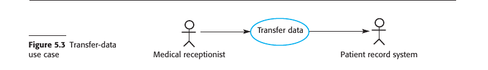
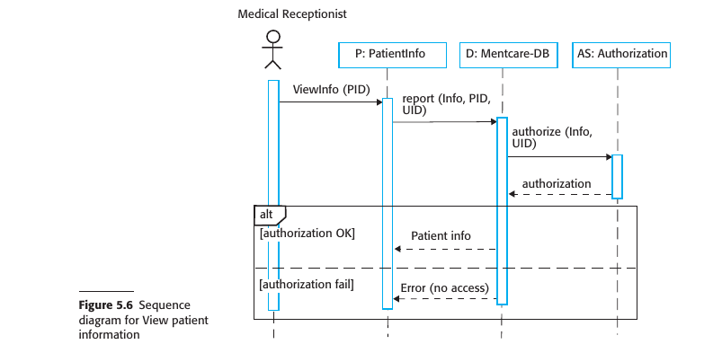
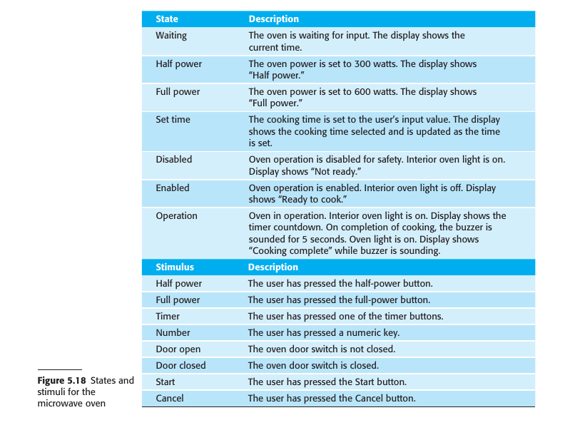

# Chapter 4 Requirements Engineering

## 4.1 Functional and non-functional requirements
## 4.2 Requirements engineering processes
## 4.3 Requirements Elicitation
## 4.4 Requirements specification
## 4.5 Requirements validation 
## 4.6 Requirements change

---

### Requirements Engineering

#### Definition and Importance of Requirements Engineering (RE)
- Requirements are descriptions of services and constraints that a system should adhere to.
- The process of identifying, analyzing, documenting, and validating these is called Requirements Engineering.

#### Variability in Requirement Definitions
- Requirements can range from high-level abstract statements to detailed, formal definitions.
- Different documents may serve as the "requirements document" depending on the phase of the project.

#### Types of Requirements
1. **User Requirements**: High-level, often in natural language, describing what the system is expected to provide.
2. **System Requirements**: Detailed descriptions of the system’s functions, services, and constraints.

#### Audience for Requirements
- User requirements are generally for managers and others not concerned with implementation.
- System requirements are for those involved in system implementation and support.

#### System Stakeholders
Examples include:
1. Patients and relatives
2. Doctors
3. Nurses
4. Medical receptionists
5. IT staff
6. Medical ethics manager
7. Health care managers
8. Medical records staff

#### Phases in RE
- Early-stage RE can lead to a feasibility study assessing the system's technical and financial viability.
- A traditional RE phase typically precedes system implementation, resulting in a requirements document.

#### Agile vs. Traditional RE
- In agile processes, requirements may be concurrently elicited as the system is developed.
- For many large systems, a separate RE phase is still common.
- 

### 4.1 Functional and non-functional requirements

#### Types of Software System Requirements
1. **Functional Requirements**: Statements detailing what services the system should provide, how it should respond to inputs, and its behavior under specific conditions.
   - May also state what the system should not do.
  
2. **Non-Functional Requirements**: Constraints on the services or functions, including timing, development process, and standards.
   - Generally apply to the system as a whole, not to individual features.

#### Ambiguity and Interdependence in Requirements
- The distinction between functional and non-functional requirements is not always clear-cut.
- One requirement often generates or constrains other requirements.

#### Overall System Requirements
- System requirements specify not just the services or features but also the necessary functionality to ensure effective delivery.

#### 4.1.1 Functional requirements

#### Definition and Levels of Functional Requirements
1. **User-Level Functional Requirements**: Written in natural language for system users and managers to understand.
2. **System-Level Functional Requirements**: Detailed descriptions for developers, specifying system functions, inputs, outputs, and exceptions.
3. **Variability in Detail**: Requirements can range from general to very specific, depending on organizational needs and existing systems.

#### Off-the-Shelf Software and Information Requirements
- In cases where off-the-shelf software suffices, the focus shifts from functional specifications to information requirements.
- Information requirements specify needed data, its organization, and delivery method.

#### Imprecision and Its Consequences
- Ambiguous requirements can lead to misunderstandings between customers and developers, causing delays and increased costs.
  
#### Ideal Characteristics of Functional Requirements
1. **Completeness**: All services and information required by the user should be defined.
2. **Consistency**: Requirements should not be contradictory.

#### Practical Limitations
- Achieving completeness and consistency is often only possible for very small systems.
- Large systems have multiple stakeholders with varying, and often inconsistent, needs.
- Mistakes and omissions are common in specifications for large, complex systems.
- Inconsistencies may only become apparent after deeper analysis or during development.

#### 4.1.2 Non-functional requirements

### Key Points Summary

#### Definition of Non-Functional Requirements
- Non-functional requirements are not directly related to specific services but specify or constrain system characteristics such as reliability, response time, and memory use.

#### Importance and Critical Nature
- Often more critical than functional requirements, as failure to meet them can make the whole system unusable.

#### Implementation Challenges
1. **Architectural Impact**: Non-functional requirements may affect the overall system architecture.
2. **Related Functional Requirements**: A single non-functional requirement might generate multiple related functional requirements and constraints.

#### Sources of Non-Functional Requirements
1. **Product Requirements**: Specify runtime behavior such as performance, reliability, and usability.
2. **Organizational Requirements**: Derive from customer and developer policies, specifying operational and development process constraints.
3. **External Requirements**: Imposed by external factors like regulations, legislation, or ethical considerations.

#### Problems with Non-Functional Requirements
- Often stated as general goals, leaving scope for interpretation and disputes.
- Difficult to translate into measurable requirements.
  
#### Quantitative Specification
- Whenever possible, non-functional requirements should be stated quantitatively for objective testing.

#### Conflicts and Interactions
- Non-functional requirements often conflict or interact with other functional or non-functional requirements, complicating implementation.

#### Documentation Challenges
- Difficult to separate functional and non-functional requirements in documentation while maintaining clarity on their interrelationships.

#### Importance in Critical Systems
- Reliability, safety, and confidentiality are especially important for systems where failure could have severe consequences.

### 4.2 Requirements engineering processes

#### Core Activities in Requirements Engineering (RE)
1. **Elicitation and Analysis**: Discovering requirements by interacting with stakeholders.
2. **Specification**: Converting discovered requirements into a standard form.
3. **Validation**: Ensuring the requirements define the system that the customer wants.

#### Iterative Nature of RE
- RE is an iterative process where activities are interleaved.
- The output is a system requirements document.

#### Effort Allocation in the Spiral Model
- Early stages focus on high-level business and non-functional requirements.
- Later stages focus on detailed non-functional and system requirements.

#### Flexibility in the Spiral Model
- The number of iterations can vary.
- Agile development can be used to develop requirements and implementation concurrently.

#### Requirements Change Management
- Requirements often change due to better understanding, organizational shifts, or system modifications.
- Changes must be managed to understand their impact on other requirements and the overall system.

### 4.3 Requirements Elicitation

#### Aims of Requirements Elicitation
- To understand stakeholders' work and how a new system could support it.
- To gather information on the application domain, services, features, performance, hardware constraints, etc.

#### Challenges in Requirements Elicitation
1. **Unclear Expectations**: Stakeholders often have general or unrealistic expectations.
2. **Domain-Specific Language**: Stakeholders may express requirements in terms specific to their domain, which engineers might not understand.
3. **Diverse Stakeholders**: Different stakeholders may express conflicting requirements.
4. **Political Factors**: Internal politics may influence system requirements.
5. **Dynamic Environment**: Economic and business conditions may change, affecting requirements priorities.

#### Process Activities
1. **Requirements Discovery and Understanding**: Interact with stakeholders to discover their requirements.
2. **Requirements Classification and Organization**: Group and organize the unstructured collection of requirements.
3. **Requirements Prioritization and Negotiation**: Resolve conflicting requirements through prioritization and negotiation.
4. **Requirements Documentation**: Document the requirements for the next iteration or for the final requirements document.

#### Iterative Nature of the Process
- Elicitation and analysis is an iterative process with continual feedback.
- The process cycle starts with discovery and ends with documentation.

#### Stakeholder Engagement
- Regular stakeholder meetings are crucial for resolving conflicts and achieving compromises.
  
#### Requirements Documentation
- Use simple language and diagrams.
- Use shared documents or wikis for better stakeholder engagement.

#### 4.3.1 Requirements Elicitation Techniques

#### Fundamental Approaches to Requirements Elicitation
1. **Interviewing**: Talking to people about what they do.
2. **Observation or Ethnography**: Watching people do their job to understand their tasks and tools.

#### Interviewing
- **Types of Interviews**:
  1. **Closed Interviews**: Predefined set of questions for stakeholders.
  2. **Open Interviews**: No predefined agenda, more exploratory.
- **Challenges in Interviewing**:
  1. **Domain Jargon**: Stakeholders use domain-specific terminology that may be misunderstood.
  2. **Implicit Knowledge**: Stakeholders may omit mentioning basic domain knowledge, assuming it's understood.
- **Effectiveness**:
  - Good for general understanding but not for specific, detailed requirements.
  - Not effective for organizational constraints due to subtle power dynamics.
- **Best Practices**:
  1. Be open-minded and willing to listen.
  2. Use springboard questions or prototypes to prompt discussions.

#### Ethnography
- **Importance**: Helps understand social and organizational factors that impact practical system operation.
- **Benefits**:
  1. Discovers implicit system requirements.
  2. Observes actual tasks and work relationships.
- **Types of Requirements Derived**:
  1. Requirements based on how people actually work.
  2. Requirements based on cooperation and awareness among workers.
- **Limitations**:
  - Not effective for broader organizational or domain requirements.
  - May not aid in innovation.
  
#### Combining Techniques
- Information from interviews is often combined with ethnography and other sources.
- Both interviewing and ethnography have limitations and should be used in conjunction with other techniques.

#### 4.3.2 Stories and Scenarios

#### Stories and Scenarios: An Introduction
- Both stories and scenarios capture real-life examples to describe how a system can be used for specific tasks.
- Stories provide high-level, narrative text descriptions for system use.
- Scenarios are structured and provide specific details like inputs and outputs.

#### Differences Between Stories and Scenarios
1. **Structure**: Stories are less structured than scenarios.
2. **Detail Level**: Stories provide a high-level overview, while scenarios delve into specifics.
3. **Purpose**: Stories are effective for setting out the "big picture," whereas scenarios are used for more specific user interactions.

#### Advantages of Using Stories
- Easily relatable and understood by stakeholders.
- Facilitates discussion and acts as a starting point for eliciting requirements.
- Useful for gathering information from a broader community by sharing them on platforms like wikis.

#### Developing Scenarios from Stories
- High-level stories can be broken down into more specific scenarios.
- Scenarios provide detailed descriptions of user interaction sessions.
  
#### Components of a Scenario
1. **Initial Expectations**: What the system and users expect when the scenario starts.
2. **Normal Flow of Events**: The usual sequence of actions in the scenario.
3. **Exception Handling**: What can go wrong and how the resulting problems are handled.
4. **Concurrent Activities**: Other activities that might be happening simultaneously.
5. **Ending State**: The system state when the scenario concludes.

#### Use in Agile Methods
- In agile methods like Extreme Programming, "user stories" are more like narrative scenarios designed to help elicit requirements.

#### Facilitation with Stakeholders
- Both stories and scenarios can be used to engage stakeholders in discussions, especially when there are different ways to achieve the same result.

By using stories and scenarios, you can capture both the high-level view and the detailed requirements, thereby providing a comprehensive understanding of what the system is expected to do.

### 4.4 Requirements specification

#### Requirements Specification: An Overview
- The process involves writing down both user and system requirements.
- The ideal attributes for these requirements are clarity, unambiguity, easy comprehension, completeness, and consistency.
- In reality, these attributes are hard to achieve due to different interpretations and inherent conflicts among stakeholders.

#### User Requirements
1. **Language**: Primarily written in natural language, supported by diagrams and tables.
2. **Scope**: Should focus on the external behavior of the system, not on how it is designed or implemented.
3. **Audience**: Intended to be understandable by users without detailed technical knowledge.
4. **Notation**: Should avoid software jargon and formal notations.

#### System Requirements
- These are expanded versions of user requirements and serve as the base for system design.
- Should be complete and detailed specifications of the whole system.
- While ideally focusing on external behavior and operational constraints, they may include some design details for practical reasons.

#### Reasons for Including Design Details in System Requirements
1. **Initial Architecture**: Helps to structure the requirements specification. For example, the requirements for the iLearn system were organized based on an initial architecture.
2. **Interoperability**: New systems often have to work with existing systems, imposing certain design constraints.
3. **Non-Functional Requirements**: Specific architectures might be necessary to satisfy non-functional requirements like reliability.

By adhering to these guidelines and considerations, the requirements specification will serve as a strong foundation for the subsequent phases of the software development process.

#### 4.4.1 Natural language specification

#### Natural Language Specification: Overview
- Natural language is expressive, intuitive, but potentially vague and ambiguous.
- Despite alternatives, it remains the most widely used way of specifying system and software requirements.

#### Guidelines for Writing Requirements in Natural Language
1. **Standard Format**: Create a standard format and make sure all requirements adhere to it. Ideally, use one or two sentences of natural language for each requirement.
2. **Consistency in Language**: Distinguish between mandatory ("shall") and desirable ("should") requirements for clarity.
3. **Text Highlighting**: Use bold, italic, or color to emphasize key parts of the requirement.
4. **Avoid Technical Jargon**: Do not assume that all readers understand software engineering terms. Avoid jargon, abbreviations, and acronyms.
5. **Requirement Rationale**: Include a rationale for each user requirement, specifying why it was included and who proposed it. This helps in future consultation or changes.

By adhering to these guidelines, you can make the natural language specifications clearer, more consistent, and easier to understand. This can be particularly helpful in minimizing misunderstandings among stakeholders.

#### 4.4.2 Structured specifications

#### Structured Specifications: Overview
- Structured natural language aims for uniformity while retaining the expressiveness and understandability of natural language.
- Standard templates or structured forms are used to specify requirements.
  
#### Features of Structured Specifications
- May use programming constructs for alternatives and iteration.
- Key elements can be highlighted using shading or different fonts.
  
#### Card-Based Approach (VOLERE)
- User requirements are initially written on cards, one per card.
- Fields on the card may include rationale, dependencies, source, and supporting materials.
  
#### Structured Specification Components
1. **Function/Entity Description**: Briefly describes the function or entity being specified.
2. **Inputs**: Describes the inputs and their origins.
3. **Outputs**: Describes the outputs and their destinations.
4. **Requirements**: Information about other entities required for computation.
5. **Action Description**: Description of the action to be taken.
6. **Preconditions and Postconditions**: Conditions before and after the function is called.
7. **Side Effects**: Description of any side effects of the operation.

#### Advantages and Challenges
- Addresses some problems of natural language by reducing variability and improving organization.
- Still can be difficult to specify complex computations clearly.

#### Extending Natural Language Specifications
- Tables or graphical models can be used to add extra information.
- Especially useful for alternative situations or complex computations (e.g., calculating insulin doses based on rate of blood sugar change).

By utilizing structured specifications, you can balance the natural language's flexibility with the precision needed for complex requirements, providing a more consistent and organized approach.

#### 4.4.3 Use cases

#### Use Cases: Overview
- Use cases describe interactions between users and a system via graphical models and structured text.
- They originated from the Objectory method and are now a fundamental part of Unified Modeling Language (UML).

#### Components of Use Cases
1. **Actors**: Represented as stick figures, these can be human users or other systems.
2. **Type of Interaction**: Represented as a named ellipse, each class of interaction is distinct.
3. **Linking Lines**: Lines connect actors with the interaction. Optionally, arrowheads may indicate who initiates the interaction.

#### Documentation
- Use cases are documented using high-level use case diagrams.
- Each use case should have a textual description that can be further elaborated using other UML models.

#### Application & Limitations
- Use cases are commonly used in object-oriented modeling.
- They are considered by some as too fine-grained for initial requirements elicitation and are often more useful in system design.

#### Interpretation of Use Cases
- Some consider each use case as a single, low-level interaction scenario.
- Others, like Stevens and Pooley, argue that a use case can include a set of related, low-level scenarios.
  - This set would include a normal interaction scenario plus scenarios for each possible exception.

In summary, use cases offer a structured way to document system-user interactions but may be too detailed for early stages of requirements engineering. They can be adapted to represent either single interactions or sets of related interactions.

#### 4.4.4 The software requirements document

#### The Software Requirements Document (SRS)
- Serves as an official statement specifying what developers should implement.
- May include both user and system requirements.
- Essential for outsourced systems, complex multi-team developments, and where detailed analysis is mandatory.

#### Agile Methods vs Traditional Approaches
1. **Agile Methods**: 
  - Argue that requirements change rapidly, making a static document outdated quickly.
  - Use incremental collection of user requirements through short user stories prioritized by users.
2. **Traditional Approaches**: 
  - Often require detailed documents, especially for business and dependability requirements.
  - More suitable for stable or critical systems where safety and security are paramount.

#### Target Audience
- The document caters to a diverse set of users, from senior management to software engineers.
- Due to the diversity of users, the document must be a compromise, providing both general overviews and detailed specifications.

#### Level of Detail
- Varies based on the type of system and the development process.
- Outsourced or critical systems require more detailed specifications.
- In-house, iterative developments may opt for less detailed initial requirements, refining them as the project progresses.

#### Structure and Content
- Often follows standards like IEEE 1998, which can be adapted to specific uses.
- Should include information about future system evolution to guide designers and maintainers.
- Comprehensive table of contents and document index are essential for complex systems.

#### Variability
- The content and structure are influenced by the type of software being developed and the development approach.
- For in-house software products, focus is mainly on user requirements and high-level, nonfunctional system requirements.

In summary, the Software Requirements Document is a versatile tool that varies in structure and detail depending on the project's needs. It balances between being comprehensive for developers and testers, and being understandable for stakeholders.

### 4.5 Requirements validation 

#### Requirements Validation: Overview
- A critical process aimed at ensuring the requirements define the system the customer truly wants.
- Errors in the requirements document can lead to extensive rework and associated costs.

#### Importance of Validation
- Cost of fixing requirements errors is usually much higher than fixing design or coding errors.
- Changes to requirements often necessitate changes in design, implementation, and retesting.

#### Types of Checks
1. **Validity Checks**: Ensure requirements reflect real needs of users, considering possible changes since initial elicitation.
2. **Consistency Checks**: Ensure there are no conflicting or contradictory requirements in the document.
3. **Completeness Checks**: Verify that all functions and constraints intended by the user are defined.
4. **Realism Checks**: Validate that requirements can be implemented within budget and schedule constraints.
5. **Verifiability**: Make sure requirements are written in a way that allows them to be verified through testing.

#### Validation Techniques
1. **Requirements Reviews**: Systematic analysis by a review team to check for errors and inconsistencies.
2. **Prototyping**: Creation and use of an executable model to gather feedback from end-users and customers.
3. **Test-case Generation**: Developing tests based on requirements to identify issues; integral to test-driven development.

#### Challenges and Limitations
- Difficult to guarantee that requirements fully meet users' needs.
- Users may struggle to visualize the system and how it fits into their work.
- Not all requirements problems are usually found during validation; further changes are often needed later.

In summary, requirements validation is a complex but critical process that uses various checks and techniques to ensure that the system being developed aligns with what the customer actually wants. Despite its challenges, it is a vital step to minimize future rework and associated costs.

### 4.6 Requirements change

#### Requirements Change: Overview
- Requirements for large systems are subject to constant change, often due to the complexity of "wicked" problems that cannot be fully defined.

#### Reasons for Change
1. **Business and Technical Environment**: Post-installation changes in hardware, interfacing with other systems, business priorities, and new regulations may necessitate adjustments.
2. **Diverse Stakeholders**: Requirements may be imposed by system customers for organizational and budgetary reasons, which may conflict with end-user needs. Post-delivery adjustments may be necessary.
3. **Stakeholder Priorities**: Large systems usually have diverse stakeholders with potentially conflicting requirements. Experience may reveal the need to re-prioritize support for different stakeholders.

#### Managing Requirements Change
- Formal process needed for making change proposals and linking these to existing requirements, known as "requirements management."
- Should start as soon as a draft version of the requirements document is available.

#### Agile Development and Requirements Change
- Agile processes are designed to cope with changing requirements.
- Users prioritize changes, and high-priority changes can replace planned features for the next iteration.
- However, this approach can be problematic as users may not be the best to decide cost-effectiveness.

#### Independent Authority
- An independent authority is often better suited to balance the needs of all stakeholders and decide on the changes to be accepted.

In summary, requirements change is an inevitable aspect of software development, especially for complex systems. Various factors contribute to this, including changes in the business environment, conflicting stakeholder priorities, and the inherent nature of complex problems. Effective management of these changing requirements is crucial, and different approaches like Agile have their own pros and cons. An independent authority can often offer a balanced perspective on what changes should be accepted.

#### 4.6.1 Requirements management planning

#### Requirements Management Planning: Overview
- The focus is on establishing how an evolving set of requirements will be managed.

#### Planning Stage Decisions
1. **Requirements Identification**: Each requirement needs a unique identifier for cross-referencing and traceability.
2. **Change Management Process**: A set of activities to assess the impact and cost of changes.
3. **Traceability Policies**: Define the relationships between each requirement and between the requirements and system design, along with how these records are maintained.
4. **Tool Support**: Tools range from specialist requirements management systems to spreadsheets and simple databases.

#### Tool Support Needs
1. **Requirements Storage**: A secure, managed data store accessible to all stakeholders.
2. **Change Management**: Tools can simplify the change management process by tracking suggested changes and responses.
3. **Traceability Management**: Tools can help discover related requirements, some even using natural language processing techniques for this purpose.

#### Scale of the System and Tooling
- For small systems, simple tools like shared web documents, spreadsheets, and databases may suffice.
- For larger systems, specialized tools like DOORS are more appropriate for managing a large number of changing requirements.

In summary, requirements management planning involves key decisions on identifying requirements, managing changes, establishing traceability policies, and selecting appropriate tools. The scale of the system often dictates the complexity of the tools needed, with specialized software being more suited for larger, more complex projects.

#### 4.6.1 Requirements change management

#### Requirements Change Management: Overview
- Change management is crucial after the requirements document has been approved to weigh the benefits and costs of implementing new requirements. 
- A formal process ensures consistent treatment of all change proposals and controlled changes to the requirements document.

#### Principal Stages of Change Management
1. **Problem Analysis and Change Specification**: 
    - Begins with an identified requirements problem or a specific change proposal.
    - Validate the problem or change proposal and get feedback from the requestor for further clarification or withdrawal.
  
2. **Change Analysis and Costing**:
    - Evaluate the impact of the proposed change using traceability information and general system knowledge.
    - Estimate the cost of the change in terms of modifications to the requirements document and possibly to the system design and implementation.
    - Decide whether or not to proceed with the requirements change.

3. **Change Implementation**:
    - Modify the requirements document and, if necessary, the system design and implementation.
    - Aim for a changeable document structure to allow for easy modifications without extensive rewriting.

#### Emergency Changes
- In cases of urgent new requirements, the temptation to change the system first and update the document later should be resisted.
- Failure to immediately update the requirements document can lead to inconsistencies between the document and the actual system.

In summary, requirements change management is a structured process comprising problem analysis, change analysis and costing, and change implementation. It aims to control and document changes to the system requirements in an organized and consistent manner. Emergency changes are a special case where immediate action may be necessary, but these should be documented as soon as possible to maintain consistency.

### Summary

- Requirements for a software system set out what the system should do and define constraints on its operation and implementation.

- Functional requirements are statements of the services that the system must provide or are descriptions of how some computations must be carried out.

- Non-functional requirements often constrain the system being developed and the development process being used. These might be product requirements, organizational requirements, or external requirements. They often relate to the emergent properties of the system and therefore apply to the system as a whole.

- The requirements engineering process includes requirements elicitation, requirements specification, requirements validation, and requirements management.

- Requirements elicitation is an iterative process that can be represented as a spiral of activities— requirements discovery, requirements classification and organization, requirements negotiation, and requirements documentation.

- Requirements specification is the process of formally documenting the user and system requirements and creating a software requirements document.

- The software requirements document is an agreed statement of the system requirements. It should be organized so that both system customers and software developers can use it.

- Requirements validation is the process of checking the requirements for validity, consistency, completeness, realism, and verifiability.

- Business, organizational, and technical changes inevitably lead to changes to the requirements for a software system. Requirements management is the process of managing and controlling these changes.

---