# Chapter 1 Introduction
## 1.1 Professional software development
## 1.2 Software engineering ethics
## 1.3 Case studies

---

### 1.1 Professional software development  

#### 1.1.1 Software Engineering:  

1. **Scope**: Software engineering covers all aspects of software production, from system specification to maintenance.

2. **Engineering Discipline**: Unlike purely theoretical approaches, engineers seek practical solutions within constraints, often making compromises for timely, cost-effective results.

3. **Holistic Approach**: Beyond technical development, software engineering also involves project management, tool development, and theoretical support.

4. **Importance**: As society increasingly relies on software systems, there's a need for reliable, economical, and quick development methods.

5. **Cost-effectiveness**: Employing software engineering methods typically leads to lower long-term costs compared to ad-hoc program development.

6. **Software Process**: This systematic approach usually consists of software specification, development, validation, and evolution.

7. **Flexibility**: Different types of systems necessitate different development processes, making a one-size-fits-all approach impractical.

8. **Relation to Other Fields**: Software engineering is both an extension and a subset of computer science and systems engineering.

9. **Challenges in Heterogeneity**: Software must often work across diverse platforms and integrate with legacy systems, requiring versatile development techniques.

10. **Business and Social Change**: The rapid pace of societal and technological changes demands quicker, more adaptable software engineering methods.

11. **Security and Trust**: As software becomes increasingly integrated into daily life, ensuring its security against malicious attacks becomes vital.

12. **Scale**: Software engineering methods must adapt to projects of varying sizes, from small embedded systems to large cloud-based services.

13. **Innovation Needed**: To tackle existing and upcoming challenges, new tools and techniques, as well as innovative combinations of existing methods, are needed.

These points encapsulate the multi-faceted and evolving nature of software engineering as a discipline.

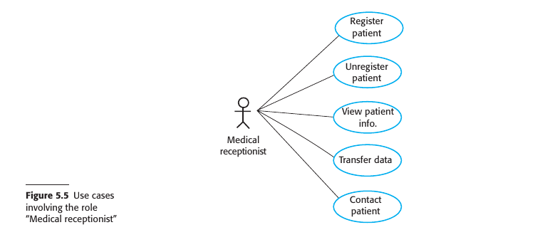

#### 1.1.2 Software Engineering Diversity:  

There are many different types of application:
1. **Stand-alone Applications**: Software that runs independently on a PC or mobile device, requiring no network connectivity. Examples include office apps and CAD programs.

2. **Interactive Transaction-based Applications**: Remote server-based applications accessed via web browsers or client apps. Includes e-commerce and cloud services.

3. **Embedded Control Systems**: Software integrated with hardware devices such as mobile phones and car braking systems.

4. **Batch Processing Systems**: Business systems designed to handle large volumes of data in batches, like billing and payroll systems.

5. **Entertainment Systems**: Primarily games, focusing on quality user interaction, often running on specialized hardware.

6. **Systems for Modeling and Simulation**: Computationally intense systems used for scientific modeling, requiring high-performance computing.

7. **Data Collection and Analysis Systems**: Systems that gather environmental data for processing, often in hostile conditions. May involve big data analysis.

8. **Systems of Systems**: Enterprise-level systems comprising multiple integrated software systems, both generic and custom-built.

The following should be considered...  

1. **Systematic Approach**: Software engineering considers cost, schedule, and dependability, along with customer and producer needs.

2. **No Universal Methods**: Techniques and tools depend on the organization, software type, and people involved. No one-size-fits-all methods exist.

3. **SEMAT Initiative**: Proposes a fundamental meta-process to create different kinds of processes, still in early development.

4. **Types of Applications**: Various types such as stand-alone, interactive transaction-based, embedded control systems, batch processing, entertainment, modeling & simulation, data collection & analysis, and systems of systems.

5. **Blurred Boundaries**: Types of applications often overlap, such as batch processing systems used with web-based transaction systems.

6. **Specialized Techniques**: Different systems require different engineering techniques. For example, safety-critical embedded systems require extensive verification.

7. **Universal Fundamentals**: All types of systems should follow basic principles like managed development process, dependability, performance, understanding requirements, and effective use of existing resources.

8. **Language Independence**: These fundamentals apply regardless of the programming language used.

#### 1.1.3 Internet Software Engineering:  

1. **Initial Web Development**: Initially, the web was mainly an information store with little impact on software systems that operated locally within organizations.

2. **Web Evolution Around 2000**: Around the year 2000, web browsers began to incorporate more functionality, paving the way for web-based systems accessible via browsers.

3. **New System Products**: This led to a wide range of new system products delivering innovative services over the web, often funded by advertising rather than direct user payment.

4. **Evolution in Business Software**: Web browsers that could run small programs revolutionized business and organizational software by moving it from local PCs to web servers, making it easier and cheaper to manage.

5. **Software as a Service**: Proposed early in the 21st century, it has become the standard for delivering web-based products like Google Apps and Microsoft Office 365.

6. **Cloud-based Systems**: Increasingly, software runs on remote clouds instead of local servers and is accessed over the Internet. Payment models include pay-per-use or ad-based free access.

7. **Change in Business Software Organization**: The web led to a shift from monolithic, single programs to highly distributed software that reuses components and programs.

8. **Software Reuse**: Reusing pre-existing software components and systems has become the dominant approach for building web-based systems.

9. **Incremental Development**: It's generally accepted that it's impractical to specify all requirements for web-based systems in advance; they are developed and delivered incrementally.

10. **Service-Oriented Software Engineering**: This approach is increasingly used, where software components are stand-alone web services.

11. **Interface Development Technology**: Technologies like AJAX and HTML5 have emerged to support the creation of rich interfaces within a web browser.

12. **Relevance of Software Engineering Techniques**: As web-based systems grow in scale and complexity, traditional software engineering techniques remain relevant.

These key points provide a comprehensive overview of the major changes and trends in Internet software engineering.

### 1.2 Software Engineering Ethics: Key Points:  

1. **Social and Legal Framework**: Software engineering is conducted within societal and legal norms that restrict practitioners' freedom.
  
2. **Wider Responsibilities**: Engineers have responsibilities beyond just technical skills, including ethical and moral behavior.
  
3. **Professional Standards**: Normal standards of honesty and integrity should be upheld to maintain the profession's reputation.

4. **Confidentiality**: Engineers should respect the confidentiality of employers and clients, even without formal agreements.

5. **Competence**: Misrepresentation of skill levels should be avoided, and work outside one's competence should not be accepted.

6. **Intellectual Property**: Awareness and respect for laws regarding intellectual property like patents and copyrights are essential.
  
7. **Computer Misuse**: Misusing technical skills for unauthorized activities, from trivial to serious, is discouraged.

8. **Role of Professional Societies**: Organizations like ACM, IEEE, and others have codes of ethics that members agree to follow.

9. **Ethical Dilemmas**: Situations may arise where ethical dilemmas occur, such as disagreeing with senior management or spotting issues in a project.

10. **Consequences of Unethical Behavior**: Ethical lapses can have serious consequences, such as the development of unsafe systems.
  
11. **Complexity of Ethical Decisions**: No absolutes exist; decisions should consider potential damage and who is affected.

12. **Military and Nuclear Systems**: Ethical views on participating in the development of these systems can vary, requiring clear communication between employers and employees.

13. **Evolving Nature of Ethics**: As software becomes pervasive, ethics and professional responsibility grow in importance.

14. **Practical vs. Philosophical Approach**: While some prefer discussing ethics philosophically, a more practical approach focusing on professional codes of conduct is also valuable.

15. **Inclusion in Curriculum**: Ethical considerations should be integrated into software engineering education, rather than being taught as a separate subject.

#### Software Engineering Code of Ethics and Professional Practice:

##### ACM/IEEE-CS Joint Task Force on Software Engineering Ethics and Professional Practices
1. **PUBLIC** — Software engineers shall act consistently with the public interest.
2. **CLIENT AND EMPLOYER** — Software engineers shall act in a manner that is in the
best interests of their client and employer consistent with the public interest.
3. **PRODUCT** — Software engineers shall ensure that their products and related
modifications meet the highest professional standards possible.
4. **JUDGMENT** — Software engineers shall maintain integrity and independence in their
professional judgment.
5. **MANAGEMENT** — Software engineering managers and leaders shall subscribe to and
promote an ethical approach to the management of software development and
maintenance.
6. **PROFESSION** — Software engineers shall advance the integrity and reputation of
the profession consistent with the public interest.
7. **COLLEAGUES** — Software engineers shall be fair to and supportive of their
colleagues.
8. **SELF** — Software engineers shall participate in lifelong learning regarding
the practice of their profession and shall promote an ethical approach to the
practice of the profession.

### 1.3 Case studies:  

1. **Embedded System**: Software controls a hardware device, embedded within it. Challenges include size, responsiveness, and power management. Example: Insulin pump control system for diabetes patients.
  
2. **Information System**: Manages and provides access to a database. Concerns include security, usability, privacy, and data integrity. Example: Medical records system.

3. **Sensor-based Data Collection System**: Collects and processes data from sensors. Key requirements are reliability and maintainability, even in hostile conditions. Example: Wilderness weather station.

4. **Support Environment**: An integrated set of software tools used to assist a specific activity. Example: Digital learning environment for students in schools.

### Summary:  

- Software engineering is an engineering discipline that is concerned with all aspects of software production.  

- Software is not just a program or programs but also includes all electronic documentation that is needed by system users, quality assurance staff, and developers. Essential software product attributes are maintainability, dependability and security, efficiency, and acceptability.  

- The software process includes all of the activities involved in software development. The high-level activities of specification, development, validation, and evolution are part of all software processes.  

- There are many different types of system, and each requires appropriate software engineering tools and techniques for their development. Few, if any, specific design and implementation techniques are applicable to all kinds of system.  

- The fundamental ideas of software engineering are applicable to all types of software system.  

- These fundamentals include managed software processes, software dependability and security, requirements engineering, and software reuse.  

- Software engineers have responsibilities to the engineering profession and society. They should not simply be concerned with technical issues but should be aware of the ethical issues that affect their work.  

- Professional societies publish codes of conduct that embed ethical and professional standards.  

- These set out the standards of behavior expected of their members.  

---
---
# Chapter 2 Software Processes
## 2.1 Software Process Models
## 2.2 Process Activities
## 2.3 Coping With Change
## 2.4 Process Improvement

---
### 2.1 Software Process Models

### 2.1.1 Waterfall

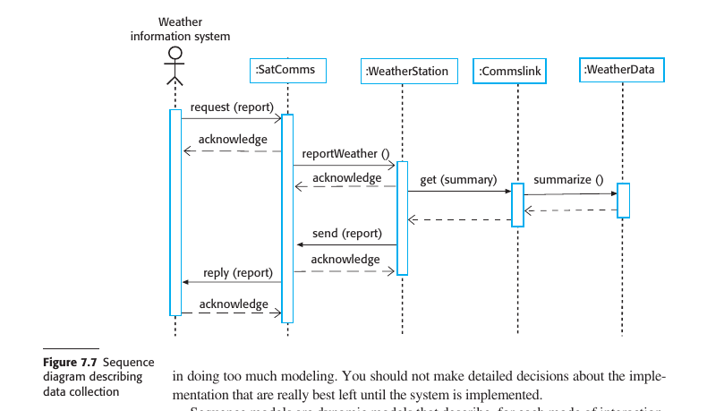

### 2.1.2 Incremental

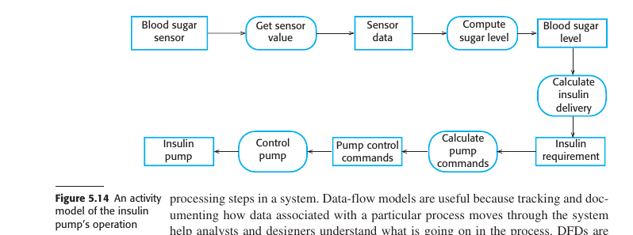

### 2.1.3 Integration and Configuration (Reuse)

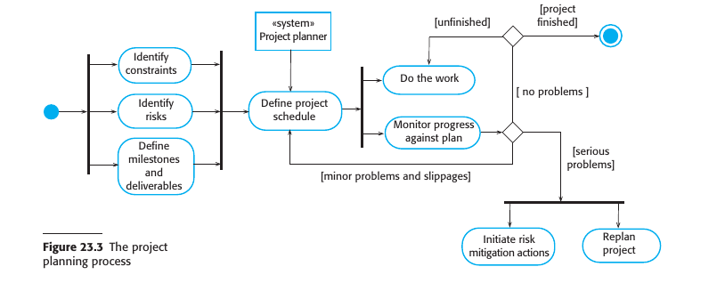

### 2.2 Process Activities (SDVE)

### 2.2.1 Specification (Requirements Engineering)

#### Overview
- Software specification, or requirements engineering, involves defining the services required from a system and identifying operational constraints.
- Mistakes in this stage can lead to issues in system design and implementation.

#### Preliminary Steps
- Before starting the requirements engineering process, a feasibility or marketing study may be conducted.
- The study informs whether it is technically and financially viable to develop the software.

#### Goal
- The aim is to produce an agreed-upon requirements document that satisfies stakeholder needs.
- Requirements are presented at two levels: high-level statements for end-users and customers, and detailed specifications for system developers.

#### Main Activities in Requirements Engineering
1. **Requirements Elicitation and Analysis**
   - Involves observation, discussions with potential users, and possibly the development of system models and prototypes.
   - Helps in understanding the system to be specified.
  
2. **Requirements Specification**
   - Translates information gathered into a requirements document.
   - Includes both user requirements (abstract) and system requirements (detailed).

3. **Requirements Validation**
   - Checks requirements for realism, consistency, and completeness.
   - Errors discovered must be corrected.

#### Ongoing Analysis
- Requirements analysis is an ongoing activity and new requirements may emerge.
- Analysis, definition, and specification activities are interleaved.

#### Agile Methods
- In agile approaches, requirements specification is part of system development.
- Requirements are informally specified just before each system increment.
- Elicitation of requirements comes from users who work closely with the development team.

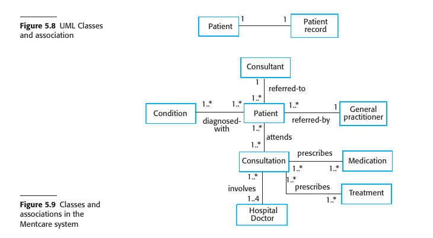

### 2.2.2 Design and Implementation

#### Overview
- Implementation involves developing an executable system.
- Agile approach blends design and implementation, while traditional approaches may separate them.

#### Software Design
- Describes structure, data models, interfaces, and sometimes algorithms.
- Design is not a one-off process; it evolves in stages with constant backtracking.

#### Design Process
- Activities in the design process are interleaved and interdependent.
- Rework is inevitable due to new information.

#### Software Platform
- Information about the operating system, database, middleware, etc., is essential for design.
- Designers must integrate the software with its operating environment.

#### Design Activities (Type-dependent)
- Vary based on the type of system being developed (e.g., real-time systems have additional timing design).
  
1. **Architectural Design**
   - Identify overall structure, principal components, and their relationships.

2. **Database Design**
   - Design data structures and database representation.

3. **Interface Design**
   - Define interfaces between components for unambiguous interaction.

4. **Component Selection and Design**
   - Look for reusable components or design new ones.
   - May include detailed design models in UML or simpler component descriptions.

#### Design Outputs
- For critical systems, detailed design documents are produced.
- In agile methods, the design may be represented in code.

#### Program Development
- Often interleaved with design.
- Software tools may generate skeleton code from design.

#### Programming Approach
- Varies among individuals; no general process.
- Some start with well-understood components, while others start with less familiar ones.

#### Debugging and Testing
- Programmers usually perform some level of testing.
- Debugging involves finding and fixing defects.
- Interactive debugging tools are commonly used.

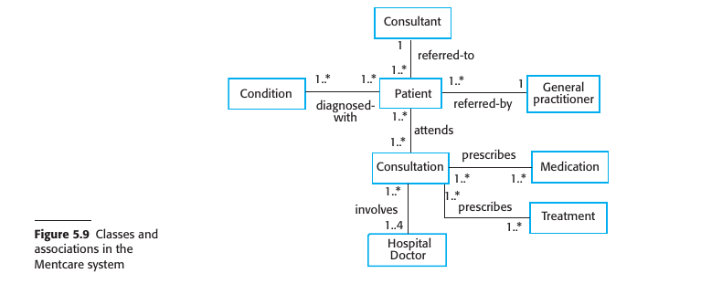

### 2.2.3 Validation (System Testing)

#### Overview
- Software validation aims to ensure a system conforms to its specification and meets customer expectations.
- Primarily focused on program testing but may include inspections and reviews at each development stage.

#### Testing Process
1. **Component Testing**
   - Conducted by the developers.
   - Each component is tested independently.
   - Test automation tools like JUnit are commonly used.

2. **System Testing**
   - Involves integrating components to create a complete system.
   - Detects errors due to unanticipated interactions and interface issues.
   - Confirms that the system meets functional and non-functional requirements.

3. **Customer Testing**
   - Final stage before operational use.
   - Conducted by the customer with real data.
   - May reveal errors in requirements definition or performance issues.

#### Iterative Nature
- The process is iterative; defects discovered may require earlier testing stages to be repeated.

#### Incremental and Test-Driven Development
- Each increment is tested as developed.
- In test-driven development, tests are created along with requirements.

#### Plan-Driven Process
- Driven by test plans developed from system specification and design.
- Performed by an independent team of testers.

#### V-Model of Development
- Links validation activities to each stage of the waterfall process model.

#### Beta Testing
- Used for marketable software products.
- Delivered to potential customers who report issues.
- Helps in exposing the product to real-world use and identifying unanticipated errors.

#### Feedback Loop
- Feedback from beta testing may lead to software modifications and further testing or release.

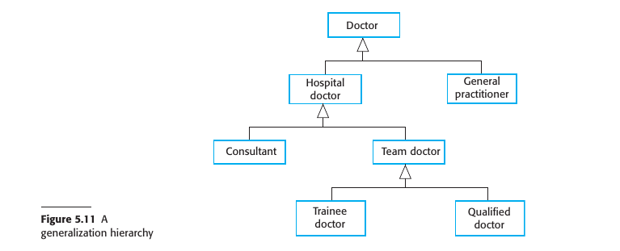

### 2.2.4 Evolution

#### Flexibility of Software
- Software's flexibility makes it increasingly integral to large, complex systems.
- Software changes are cheaper and more feasible than hardware changes, even during or after development.

#### Historical Perspective
- Traditionally, software development and software maintenance (evolution) were considered separate processes.
- Software development was viewed as creative, while maintenance was seen as dull and uninteresting.

#### Evolutionary View
- The distinction between development and maintenance is increasingly irrelevant.
- Most software systems are not entirely new but evolve from existing systems.

#### Continuum of Software Engineering
- It's more accurate to consider software engineering as an evolutionary process.
- Software is continually modified over its lifetime to adapt to changing requirements and customer needs.

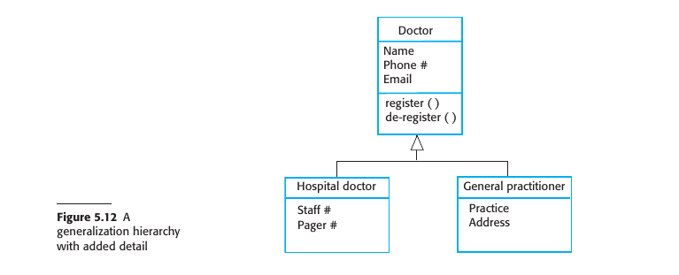

### 2.3 Coping With Change

#### 2.3.1 Prototyping

#### Definition and Importance
- A prototype is an early version of a system to explore design options and clarify requirements.
- Rapid, iterative development is crucial to control costs and allow early stakeholder engagement.

#### Applications in Software Development
1. **Requirements Engineering**: Helps in the elicitation and validation of system requirements.
2. **System Design**: Used to explore software solutions and develop the user interface.

#### User Interaction
- Allows users to assess system utility and may inspire new requirements.
- Can reveal errors and omissions in the existing requirements.

#### Design Experiments
- Prototyping can validate the feasibility of design elements, such as database design for efficient data access.
  
#### User Interface Development
- Rapid prototyping involving end-users is essential for developing dynamic user interfaces.

#### Process Model for Prototype Development
1. **Objective Setting**: Clearly define what the prototype aims to achieve.
2. **Scope Definition**: Decide what to include or exclude to manage costs and delivery time.
3. **Prototype Evaluation**: Includes user training and a plan based on the objectives.

#### Evaluation Challenges
- Users may not interact with the prototype the same way they will with the final system.
- Prototype testers may not be representative of all system users.
- Time constraints during evaluation may limit user training and adaptability.

#### Quality Considerations
- Non-functional requirements like response time and memory usage may be relaxed.
- Error handling and reliability standards may be compromised, depending on the prototype's objectives.

#### 2.3.2 Incremental Delivery

#### Overview
- Incremental delivery is an approach where parts of the system (increments) are developed and delivered to the customer for use.
- Customers prioritize services, and increments are developed based on these priorities.

#### Process Steps
1. **Requirements Definition**: Detailed requirements for the first increment are defined.
2. **Development**: The increment is developed while further requirements analysis for later increments may occur.
3. **Delivery and Integration**: Once an increment is complete, it's delivered and integrated into the customer's working environment.

#### Advantages
1. **Prototyping Benefit**: Early increments act as prototypes, helping customers clarify later requirements.
2. **Early Value**: Customers can immediately use and benefit from the software.
3. **Flexibility**: Easier to incorporate changes into the system.
4. **Focused Testing**: High-priority services are delivered and tested first, reducing the likelihood of failures in critical parts.

#### Limitations
1. **Replacement Difficulty**: Incremental delivery is problematic when replacing an existing system, as users want all functionalities upfront.
2. **Common Facilities**: Difficult to identify common facilities needed by all increments when requirements are not fully defined.
3. **Procurement Conflict**: Conflicts with traditional procurement models requiring a complete system specification upfront.

#### Unsuitability for Certain Systems
- Incremental delivery is not ideal for very large systems, embedded systems depending on hardware development, or critical systems requiring comprehensive requirements analysis.

#### Alternative Approach for Large Systems
- A system prototype may be developed for experimentation, and definitive requirements can be agreed upon based on the experience gained.

### 2.4 Process Improvement

#### Context and Importance
- Industry demands cheaper, better, and faster software.
- Process improvement aims to enhance software quality, reduce costs, and accelerate development.

#### Two Main Approaches
1. **Process Maturity Approach**: Focuses on improving process and project management. Aims for better product quality and predictability.
2. **Agile Approach**: Emphasizes iterative development and reduced overheads. Aims for rapid delivery and adaptability to changing requirements.

#### Skepticism Between Approaches
- Proponents of each approach are generally skeptical of the benefits of the other.
- Process maturity adds overhead activities, while Agile minimizes formality and documentation.

#### General Process Improvement Cycle
1. **Process Measurement**: Baseline measurements are collected for attributes of the software process or product.
2. **Process Analysis**: The current process is assessed to identify weaknesses and bottlenecks.
3. **Process Change**: Changes are proposed and implemented to address weaknesses.

#### Data Importance
- Concrete data is essential for evaluating the effectiveness of process changes.

#### Long-Term and Continuous Activity
- Process improvement is both a long-term and a continuous activity, adapting to changes in the business environment.

#### Process Maturity Levels
1. **Initial**: Basic goals are set and communicated.
2. **Managed**: Goals met with organizational policies and documented plans.
3. **Defined**: Organizational standardization; collected metrics used for improvements.
4. **Quantitatively Managed**: Use of statistical methods for process control.
5. **Optimizing**: Continuous improvement driven by metrics and changing business needs.

#### Limitations and Challenges
- Too much overhead for small companies.
- Difficult to estimate maturity with agile processes.
- Mainly used by large software companies due to these limitations.

### Summary

- Software processes are the activities involved in producing a software system. Software process models are abstract representations of these processes.

- General process models describe the organization of software processes. Examples of these general models include the waterfall model, incremental development, and reusable component configuration and integration.

- Requirements engineering is the process of developing a software specification. Specifications are intended to communicate the system needs of the customer to the system developers.

- Design and implementation processes are concerned with transforming a requirements specification into an executable software system.

- Software validation is the process of checking that the system conforms to its specification and that it meets the real needs of the users of the system.

- Software evolution takes place when you change existing software systems to meet new requirements. Changes are continuous, and the software must evolve to remain useful.

- Processes should include activities to cope with change. This may involve a prototyping phase that helps avoid poor decisions on requirements and design. Processes may be structured for iterative development and delivery so that changes may be made without disrupting the system as a whole.

- Process improvement is the process of improving existing software processes to improve software quality, lower development costs, or reduce development time. It is a cyclic process involving process measurement, analysis, and change.

---

---
---
# Chapter 3 Agile
## 3.1 Agile methods
## 3.2 Agile Development techniques
## 3.3 Agile Project Management
## 3.4 Scaling Agile Methods

---

### 3.1 Agile methods

#### Historical Context
- In the 1980s and 1990s, a plan-driven approach was popular, especially for large, complex systems.
- Such heavyweight approaches were found to be inefficient for small and medium-sized projects due to high overheads.

#### Emergence of Agile Methods
- Developed in the late 1990s as a response to dissatisfaction with heavyweight, plan-driven approaches.
- Focus on the software itself, minimizing design and documentation overheads.
- Suited for rapidly changing requirements and aims to deliver working software quickly.

#### Agile Manifesto Principles
1. **Customer Involvement**: Customers should be closely involved to provide and prioritize new system requirements.
2. **Embrace Change**: The system should be designed to accommodate changing requirements.
3. **Incremental Delivery**: Software should be developed and delivered in increments, based on customer-specified requirements.
4. **Maintain Simplicity**: Focus on simplicity in both the software and the development process.
5. **People, not Process**: Exploit the skills of the development team; avoid prescriptive processes.

#### Core Values (from Agile Manifesto)
- **Individuals and Interactions** over processes and tools
- **Working Software** over comprehensive documentation
- **Customer Collaboration** over contract negotiation
- **Responding to Change** over following a plan

#### Ideal Use-Cases for Agile Methods
1. **Product Development**: Particularly effective for small or medium-sized products for sale.
2. **Custom System Development**: Effective when the customer is committed to being involved and when there are few external stakeholders.

#### Communication and Team Structure
- Agile methods work well when there is continuous communication between stakeholders and the development team.
- Best suited for co-located teams where informal communication is effective.

#### Limitations
- Less suited for systems that are tightly integrated with other systems being developed simultaneously.
- Not ideal for situations requiring coordination of parallel development streams.

### 3.2 Agile Development techniques

#### Historical Background
- Extreme Programming (XP), coined by Kent Beck, significantly influenced the agile development culture.
- XP aimed to push recognized good practices like iterative development to "extreme" levels.

#### Core Concepts in XP
1. **Requirements as User Stories**: Requirements are expressed as scenarios or user stories implemented as tasks.
2. **Frequent Releases**: Short time gaps between system releases, focusing on incremental development.
3. **Test-First Approach**: Tests are developed for each task before writing the actual code.
4. **Pair Programming**: Programmers work in pairs to cross-verify and support each other.
  
#### XP Practices Aligned with Agile Manifesto Principles
1. **Incremental Development**: Small, frequent releases based on simple customer stories.
2. **Customer Involvement**: Constant customer engagement, with customer representatives defining acceptance tests.
3. **People Over Process**: Practices like pair programming, collective ownership, and sustainable work hours.
4. **Embracing Change**: Regular releases, test-first development, and continuous integration.
5. **Maintaining Simplicity**: Constant refactoring and using simple designs that are easily adaptable.

#### Extreme Programming Practices
1. **Collective Ownership**: All developers are responsible for all code; anyone can change anything.
2. **Continuous Integration**: Completed tasks are immediately integrated into the whole system, passing all unit tests.
3. **Incremental Planning**: Requirements are recorded on "story cards," prioritized based on time and importance.
4. **On-Site Customer**: A customer representative is part of the development team, responsible for conveying system requirements.
5. **Pair Programming**: Developers work in pairs, mutually verifying and supporting each other.
6. **Refactoring**: Code is continuously improved for simplicity and maintainability.
7. **Simple Design**: Only enough design is carried out to meet the current requirements.
8. **Small Releases**: Frequent and incremental releases that add functionality to the initial release.
9. **Sustainable Pace**: Avoiding excessive overtime to maintain code quality and productivity.
10. **Test-First Development**: An automated unit test framework is used to write tests before implementing functionality.

#### Adaptability and Challenges
- XP as originally proposed is difficult to integrate into the management practices and culture of most businesses.
- Companies often pick and choose XP practices that best suit them, sometimes integrating them into other agile methods like Scrum.
- XP's most significant contribution is likely the set of agile development practices it introduced.

#### 3.2.1 User Stories

#### Overview and Purpose
- User stories are scenarios of use developed to encapsulate customer needs.
- They integrate requirements elicitation with agile development, replacing separate requirements engineering activities.

#### Creation and Usage
1. **Collaborative Development**: The system customer and development team collaborate to develop a "story card" that briefly describes a user story.
2. **Task Breakdown**: Each story card is broken down into tasks, with estimations for effort and resources required.
3. **Customer Prioritization**: The customer prioritizes the stories based on immediate business value.
4. **Short Iterations**: The aim is to implement functionality from prioritized stories in about two weeks, aligning with the next system release.

#### Advantages
- **Dynamic Adaptability**: Unimplemented stories can change or be discarded as requirements evolve.
- **User Engagement**: User stories are more relatable than conventional requirements documents, fostering better user involvement.
  
#### Challenges and Limitations
1. **Completeness**: It's difficult to assess if enough user stories have been developed to cover all essential requirements.
2. **Accuracy**: User stories may not capture all aspects of an activity, especially if experienced users omit details.

#### Application in Requirements Elicitation
- User stories can serve as an initial step in pre-development requirements elicitation, a topic discussed further in future chapters.

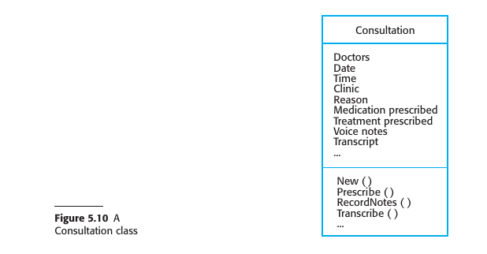

#### 3.2.2 Refactoring

#### Concept and Rationale
- Refactoring is the practice of continually improving software code for better structure and readability.
- It deviates from the traditional software engineering principle of "designing for change," arguing that such anticipation often results in wasted effort.

#### Process
1. **Immediate Implementation**: When developers see code that can be improved, they make these improvements immediately, regardless of immediate necessity.
2. **Avoiding Structural Decay**: Refactoring counters the software structure degradation that naturally occurs in incremental development.
  
#### Types of Refactoring
- Examples include reorganizing class hierarchies, renaming attributes and methods, and replacing duplicated code with library methods.

#### Tools and Support
- Development environments often include tools that simplify the process of finding code dependencies and making global modifications.

#### Benefits
- Keeps the software easy to understand and modify, which is particularly useful as new requirements emerge.

#### Challenges and Limitations
1. **Development Pressure**: Sometimes, new feature implementation takes precedence over refactoring, causing a delay in improvements.
2. **Architectural Limitations**: Some new features and changes may require architectural modifications that cannot be addressed solely through code-level refactoring.

#### 3.2.3 Test-first Development (TDD)

#### Overview
- Originated from Extreme Programming (XP), test-first development is an approach where tests are written before the code that needs to be tested.
- It addresses challenges related to testing in incremental development methodologies.

#### Key Features in XP
1. **Test-First Development**: Tests are written before the code.
2. **Incremental Test Development from Scenarios**: Tests are developed based on user stories or scenarios.
3. **User Involvement**: Users are involved in test development and validation.
4. **Automated Testing Frameworks**: Use of frameworks like JUnit for automated testing.

#### Advantages
- Helps in discovering problems during development.
- Defines an interface and a specification of behavior implicitly.
- Helps in understanding specifications thoroughly before implementation.
- Avoids "test-lag" where implementation outpaces testing.

#### Test Development Process
- User stories are broken down into tasks, each generating one or more unit tests.
- Acceptance tests are developed with customer involvement to ensure the system meets real needs.

#### Role of Automation
- Test automation is essential for quickly and easily executing a large set of tests.
- Catches issues immediately when new functionality is added.

#### Challenges and Limitations
1. **Incomplete Tests**: Programmers may skip writing comprehensive tests.
2. **Difficulty in Incremental Testing**: Some elements, like complex user interfaces, are hard to test incrementally.
3. **Test Coverage**: Despite a large set of tests, it is difficult to ensure complete coverage, leaving potential bugs undetected.

#### Generalization
- The philosophy of test-first has evolved into more general test-driven development techniques.

#### 3.2.4 Pair Programming

#### Overview
- Pair programming is an Extreme Programming (XP) practice where two developers work together at the same computer.
- Pairs are created dynamically, allowing all team members to collaborate throughout the development process.

#### Advantages
1. **Collective Ownership and Responsibility**: Promotes the idea that the entire team owns the software and shares responsibility for its issues.
2. **Informal Code Review**: Acts as a less formal but quicker alternative to traditional code inspections and reviews, aiding in error discovery.
3. **Encourages Refactoring**: The practice supports immediate improvements to the software structure, which benefits the team as a whole.

#### Efficiency Considerations
- Contrary to the belief that pair programming would halve productivity, some studies suggest comparable productivity levels to individuals working alone. This is attributed to fewer false starts and less rework.

#### Adoption in Industry
- Companies have mixed views on pair programming; some avoid it, while others use a mix of pair and individual programming, often pairing experienced programmers with less experienced ones.

#### Empirical Studies
- Studies on the effectiveness of pair programming have had mixed results:
  - Some research found comparable productivity and fewer errors (Williams et al. 2000).
  - Other studies found a loss of productivity but some quality benefits (Arisholm et al. 2007).

#### Risk Mitigation
- The knowledge sharing that occurs during pair programming can reduce project risks, especially when team members leave, potentially making the practice worthwhile despite its overhead.

### 3.3 Agile Project Management

#### Overview
- Agile project management diverges from traditional plan-driven approaches, aiming for more flexibility and responsiveness.
- Scrum has emerged as the most popular framework for organizing agile projects, providing a degree of external visibility.

#### Scrum Framework
- Focuses on project organization, not specific development practices like pair programming or test-first development.
- Uses unique terminology like "ScrumMaster" instead of "Project Manager" to distinguish itself from traditional methods.

#### Scrum Process Components
1. **Product Backlog**: A prioritized list of features, requirements, and other tasks for the development team.
2. **Sprint**: A time-boxed development cycle, usually 2-4 weeks long.
3. **Sprint Backlog**: Specific tasks chosen for the current sprint based on priority and previous sprint velocity.
4. **Daily Meetings (Scrums)**: Short meetings to review progress and re-prioritize work.
5. **Sprint Review**: At the end of each sprint, team reviews work and process for improvement.

#### Sprint Planning
- Product Owner prioritizes backlog items.
- Team estimates time required for the highest-priority items based on previous sprints' velocities.
- Unfinished items return to the product backlog.

#### Team Coordination
- Uses Scrum board for daily interactions.
- All team members have visibility into the work being done.

#### Review and Feedback Loop
- End-of-sprint review serves dual purposes: process improvement and product state assessment.
  
#### ScrumMaster Role
- Although not formally a project manager, ScrumMasters often assume this role in organizations with a conventional management structure.

#### Benefits of Using Scrum
1. Manageable and understandable product chunks.
2. Handles unstable requirements effectively.
3. Enhances team communication and morale.
4. Offers customers on-time delivery of increments.
5. Builds trust between customers and developers.

#### Distributed Scrum
- Scrum is adaptable for distributed teams and multi-team environments, accommodating global development needs.

#### Challenges
- Originally designed for co-located teams, adaptations are needed for distributed teams.

### 3.4 Scaling Agile Methods

#### Initial Adoption
- Agile methods were initially designed for small teams working on small to medium-sized projects in the same physical location.
- Small companies with less bureaucracy were the early adopters.

#### Need for Scaling
- The demand for faster, customer-focused software delivery is equally relevant to larger systems and companies.
  
#### Facets of Scaling
1. **Scaling Up**: Adapting agile methods to manage large software projects that cannot be handled by a single small team.
2. **Scaling Out**: Extending the use of agile methods across various departments in a large organization with extensive software development experience.

#### Challenges in Scaling
- Larger organizations often have to deal with scaling up and scaling out simultaneously, especially when they win contracts for large projects.

#### Productivity and Defects
- There are claims of substantial productivity gains and defect reductions through the use of agile methods.
- Scott Ambler suggests that for large systems and organizations, the productivity improvement is likely to be around 15% over 3 years, along with similar reductions in defects.

#### Summary
- Scaling agile methods is a complex but necessary evolution to fit the needs of larger projects and organizations. Expectations of productivity gains should be realistic.

#### 3.4.1 Practical problems with agile methods

#### General Suitability
- Agile methods are highly effective for software products and apps.
- They may not be appropriate for embedded systems, large and complex systems, or ongoing software maintenance.

#### Challenges for Large, External Projects
1. **Contractual Issues**: The informality of agile development clashes with the legal contracts often used in large projects.
2. **Maintenance Costs**: Agile is geared more toward new development, whereas most costs in large companies stem from maintenance.
3. **Global Teams**: Agile is designed for small, co-located teams, but many modern projects involve globally distributed teams.

#### Specific Issues
- **Lack of Definitive Requirements**: Agile's evolving requirements don't fit well into traditional contracts that define specific deliverables.
  
#### Maintenance Issues
1. **Lack of Documentation**: Agile methods often lack formal documentation, making it challenging to assess the impact of proposed system changes.
2. **Customer Involvement**: It's difficult to keep customers engaged during the maintenance phase.
3. **Team Continuity**: Agile methods rely on the team's collective memory and expertise, which can be lost if the team is disbanded or changed.

#### Summary
- While agile methods excel in specific scenarios, they have limitations and challenges when applied to large projects, maintenance, or distributed teams. These include contractual complexities, the focus on new development over maintenance, and issues related to documentation and team continuity.
- 
#### 3.4.2 Agile and plan-driven methods

#### Introduction
- Integration of agile and plan-driven methods is essential for scaling agile in larger companies.
- Early agile enthusiasts resisted plan-driven approaches, but adaptations are necessary for various organizational and technical contexts.

#### Deciding Between Agile and Plan-Driven
- A balanced approach often combines elements of both plan-driven and agile methods.
- Factors influencing the balance include system attributes, development team characteristics, and organizational context.

#### System-Related Issues
1. **System Size**: Agile is most effective for small, co-located teams. Larger systems may require a plan-driven approach.
2. **System Type**: Systems requiring extensive pre-implementation analysis (e.g., real-time systems) may be better suited for a plan-driven approach.
3. **System Lifetime**: Long-lasting systems may require more documentation for long-term maintenance.
4. **External Regulation**: Systems subject to regulatory approval may require detailed documentation.

#### Team-Related Issues
1. **Skill Levels**: Agile may require higher skill levels. In less skilled teams, a separation of design and implementation roles may be needed.
2. **Team Organization**: Distributed or outsourced teams may require more design documentation.
3. **Technological Support**: The availability of adequate development tools can influence the need for documentation.

#### Organizational Issues
1. **Contractual Requirements**: A detailed specification may be necessary for contractual reasons, favoring a plan-driven approach for requirements engineering.
2. **Incremental Delivery**: Feasibility depends on customer availability and willingness to participate.
3. **Cultural Factors**: Traditional engineering organizations may be more comfortable with plan-driven methods due to their extensive design documentation.

#### Conclusion
- The label of "agile" or "plan-driven" is less important than choosing the methods that are most effective for the specific type of system being developed.

#### 3.4.3 Agile methods for large systems

#### Complexity Factors in Large Systems
1. **Systems of Systems**: Different teams in different locations work on sub-systems, lacking a holistic view.
2. **Brownfield Systems**: Large systems often interact with existing systems, requiring complex negotiations and less flexibility.
3. **Configuration Over Coding**: A significant portion of development is related to system configuration.
4. **External Constraints**: Rules and regulations often dictate the development processes and documentation.
5. **Long Development Time**: Maintaining a coherent team over an extended period is challenging.
6. **Diverse Stakeholders**: Involving all types of stakeholders in the development process is difficult.

#### Scaling Agile Frameworks
- **Scaled Agile Framework (SAFe)**: Developed to support large-scale, multi-team software development.
- **Agile Scaling Model (ASM)**: Involves stages like Disciplined Agile Delivery and Agility at Scale to adapt to organizational settings and large project complexities.

#### Common Features in Scaling Agile
1. **Initial Requirements**: Some early work on initial software requirements is essential but should be general.
2. **Multiple Product Owners**: Different parts of the system require different representatives who must communicate continuously.
3. **More Design and Documentation**: Up-front design and critical system documentation are necessary.
4. **Cross-Team Communication**: Various communication channels and regular meetings are vital for syncing progress across teams.
5. **Configuration Management**: Tools that support multi-team software development are essential.

#### Multi-Team Scrum Characteristics
1. **Role Replication**: Each team has its own Product Owner and ScrumMaster, with chief roles overseeing the entire project.
2. **Product Architects**: Each team selects an architect who collaborates on the overall system architecture.
3. **Release Alignment**: Product release dates are synchronized across teams.
4. **Scrum of Scrums**: A higher-level Scrum meeting occurs daily to discuss progress, identify problems, and plan the day's work.

#### Final Thoughts
- No single model suits all large-scale agile products; customization is often required.
- Agile methods need to evolve and integrate plan-based practices to tackle the complexities of large systems.

#### 3.4.4 Agile methods across organizations

#### Agile Methods in Small vs. Large Companies
- Small software companies easily adopt agile methods due to lack of organizational bureaucracy.
- Larger companies find it challenging to scale out agile methods across the organization.

#### Challenges in Introducing Agile to Large Companies
1. **Reluctance from Project Managers**: Lack of experience in agile makes them hesitant to take the risk.
2. **Organizational Procedures**: Existing quality procedures and tools may conflict with agile principles.
3. **Team Skill Levels**: Agile is most effective with high-skill team members, which may not always be the case in large organizations.
4. **Cultural Resistance**: Organizations with a history of conventional systems engineering may resist agile methods.

#### Incompatibility with Company Procedures
- **Change Management**: Agile's flexibility in refactoring conflicts with the controlled nature of change management.
- **Testing Procedures**: External testing teams may conflict with agile's test-first approaches.

#### Implementing Agile in Large Organizations
- Requires a cultural change, often necessitating a change in management.
- Best introduced gradually, starting with an enthusiastic group of developers.
- Successful agile projects can serve as a starting point for broader organizational adoption.

### Summary

- Agile methods are iterative development methods that focus on reducing process overheads and documentation and on incremental software delivery. They involve customer representatives directly in the development process.

- The decision on whether to use an agile or a plan-driven approach to development should depend on the type of software being developed, the capabilities of the development team, and the culture of the company developing the system. In practice, a mix of agile and plan-based techniques may be used.

- Agile development practices include requirements expressed as user stories, pair programming, refactoring, continuous integration, and test-first development.

- Scrum is an agile method that provides a framework for organizing agile projects. It is centered around a set of sprints, which are fixed time periods when a system increment is developed. Planning is based on prioritizing a backlog of work and selecting the highest priority tasks for a sprint.

- To scale agile methods, some plan-based practices have to be integrated with agile practice.

- These include up-front requirements, multiple customer representatives, more documentation, common tooling across project teams, and the alignment of releases across teams.

---
---
# Chapter 4 Requirements Engineering

## 4.1 Functional and non-functional requirements
## 4.2 Requirements engineering processes
## 4.3 Requirements Elicitation
## 4.4 Requirements specification
## 4.5 Requirements validation 
## 4.6 Requirements change

---

### Requirements Engineering

#### Definition and Importance of Requirements Engineering (RE)
- Requirements are descriptions of services and constraints that a system should adhere to.
- The process of identifying, analyzing, documenting, and validating these is called Requirements Engineering.

#### Variability in Requirement Definitions
- Requirements can range from high-level abstract statements to detailed, formal definitions.
- Different documents may serve as the "requirements document" depending on the phase of the project.

#### Types of Requirements
1. **User Requirements**: High-level, often in natural language, describing what the system is expected to provide.
2. **System Requirements**: Detailed descriptions of the system’s functions, services, and constraints.

#### Audience for Requirements
- User requirements are generally for managers and others not concerned with implementation.
- System requirements are for those involved in system implementation and support.

#### System Stakeholders
Examples include:
1. Patients and relatives
2. Doctors
3. Nurses
4. Medical receptionists
5. IT staff
6. Medical ethics manager
7. Health care managers
8. Medical records staff

#### Phases in RE
- Early-stage RE can lead to a feasibility study assessing the system's technical and financial viability.
- A traditional RE phase typically precedes system implementation, resulting in a requirements document.

#### Agile vs. Traditional RE
- In agile processes, requirements may be concurrently elicited as the system is developed.
- For many large systems, a separate RE phase is still common.
- 
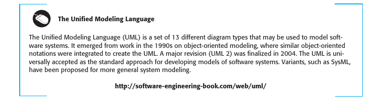

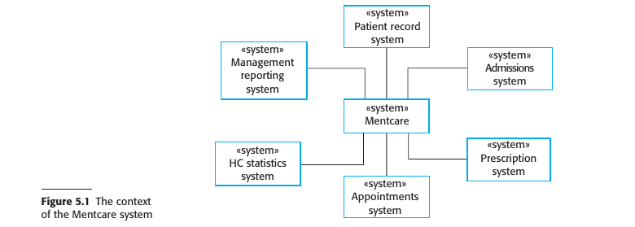

### 4.1 Functional and non-functional requirements

#### Types of Software System Requirements
1. **Functional Requirements**: Statements detailing what services the system should provide, how it should respond to inputs, and its behavior under specific conditions.
   - May also state what the system should not do.
  
2. **Non-Functional Requirements**: Constraints on the services or functions, including timing, development process, and standards.
   - Generally apply to the system as a whole, not to individual features.

#### Ambiguity and Interdependence in Requirements
- The distinction between functional and non-functional requirements is not always clear-cut.
- One requirement often generates or constrains other requirements.

#### Overall System Requirements
- System requirements specify not just the services or features but also the necessary functionality to ensure effective delivery.

#### 4.1.1 Functional requirements

#### Definition and Levels of Functional Requirements
1. **User-Level Functional Requirements**: Written in natural language for system users and managers to understand.
2. **System-Level Functional Requirements**: Detailed descriptions for developers, specifying system functions, inputs, outputs, and exceptions.
3. **Variability in Detail**: Requirements can range from general to very specific, depending on organizational needs and existing systems.

#### Off-the-Shelf Software and Information Requirements
- In cases where off-the-shelf software suffices, the focus shifts from functional specifications to information requirements.
- Information requirements specify needed data, its organization, and delivery method.

#### Imprecision and Its Consequences
- Ambiguous requirements can lead to misunderstandings between customers and developers, causing delays and increased costs.
  
#### Ideal Characteristics of Functional Requirements
1. **Completeness**: All services and information required by the user should be defined.
2. **Consistency**: Requirements should not be contradictory.

#### Practical Limitations
- Achieving completeness and consistency is often only possible for very small systems.
- Large systems have multiple stakeholders with varying, and often inconsistent, needs.
- Mistakes and omissions are common in specifications for large, complex systems.
- Inconsistencies may only become apparent after deeper analysis or during development.

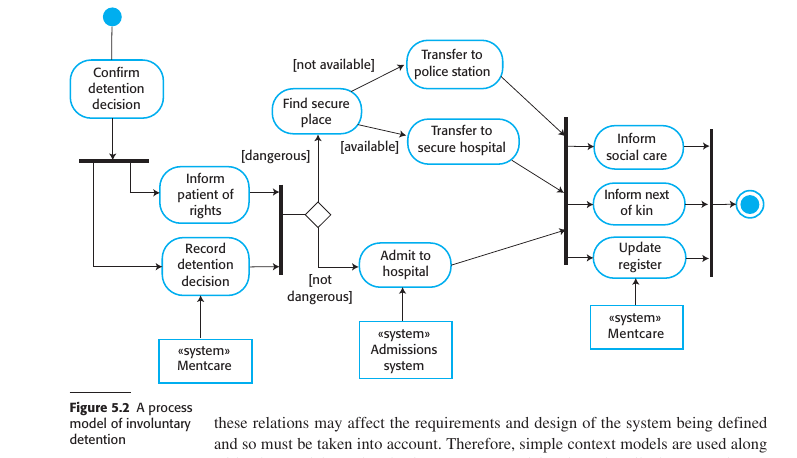

#### 4.1.2 Non-functional requirements

### Key Points Summary

#### Definition of Non-Functional Requirements
- Non-functional requirements are not directly related to specific services but specify or constrain system characteristics such as reliability, response time, and memory use.

#### Importance and Critical Nature
- Often more critical than functional requirements, as failure to meet them can make the whole system unusable.

#### Implementation Challenges
1. **Architectural Impact**: Non-functional requirements may affect the overall system architecture.
2. **Related Functional Requirements**: A single non-functional requirement might generate multiple related functional requirements and constraints.

#### Sources of Non-Functional Requirements
1. **Product Requirements**: Specify runtime behavior such as performance, reliability, and usability.
2. **Organizational Requirements**: Derive from customer and developer policies, specifying operational and development process constraints.
3. **External Requirements**: Imposed by external factors like regulations, legislation, or ethical considerations.

#### Problems with Non-Functional Requirements
- Often stated as general goals, leaving scope for interpretation and disputes.
- Difficult to translate into measurable requirements.
  
#### Quantitative Specification
- Whenever possible, non-functional requirements should be stated quantitatively for objective testing.

#### Conflicts and Interactions
- Non-functional requirements often conflict or interact with other functional or non-functional requirements, complicating implementation.

#### Documentation Challenges
- Difficult to separate functional and non-functional requirements in documentation while maintaining clarity on their interrelationships.

#### Importance in Critical Systems
- Reliability, safety, and confidentiality are especially important for systems where failure could have severe consequences.

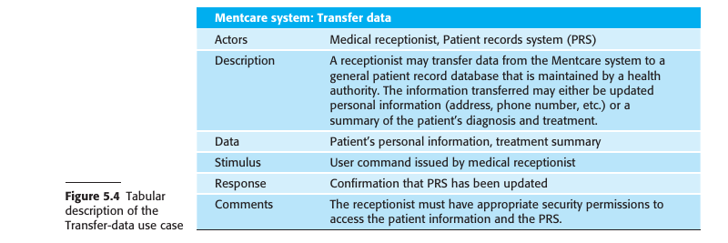

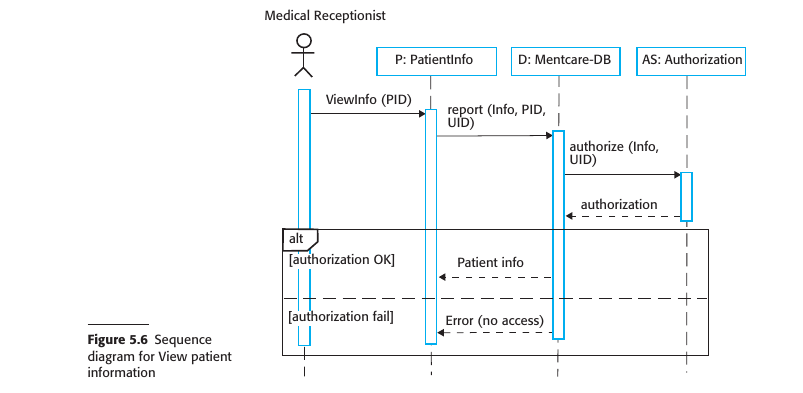

### 4.2 Requirements engineering processes

#### Core Activities in Requirements Engineering (RE)
1. **Elicitation and Analysis**: Discovering requirements by interacting with stakeholders.
2. **Specification**: Converting discovered requirements into a standard form.
3. **Validation**: Ensuring the requirements define the system that the customer wants.

#### Iterative Nature of RE
- RE is an iterative process where activities are interleaved.
- The output is a system requirements document.

#### Effort Allocation in the Spiral Model
- Early stages focus on high-level business and non-functional requirements.
- Later stages focus on detailed non-functional and system requirements.

#### Flexibility in the Spiral Model
- The number of iterations can vary.
- Agile development can be used to develop requirements and implementation concurrently.

#### Requirements Change Management
- Requirements often change due to better understanding, organizational shifts, or system modifications.
- Changes must be managed to understand their impact on other requirements and the overall system.

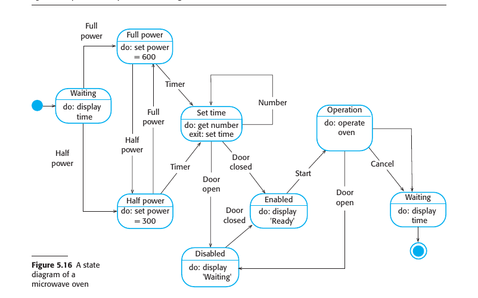

### 4.3 Requirements Elicitation

#### Aims of Requirements Elicitation
- To understand stakeholders' work and how a new system could support it.
- To gather information on the application domain, services, features, performance, hardware constraints, etc.

#### Challenges in Requirements Elicitation
1. **Unclear Expectations**: Stakeholders often have general or unrealistic expectations.
2. **Domain-Specific Language**: Stakeholders may express requirements in terms specific to their domain, which engineers might not understand.
3. **Diverse Stakeholders**: Different stakeholders may express conflicting requirements.
4. **Political Factors**: Internal politics may influence system requirements.
5. **Dynamic Environment**: Economic and business conditions may change, affecting requirements priorities.

#### Process Activities
1. **Requirements Discovery and Understanding**: Interact with stakeholders to discover their requirements.
2. **Requirements Classification and Organization**: Group and organize the unstructured collection of requirements.
3. **Requirements Prioritization and Negotiation**: Resolve conflicting requirements through prioritization and negotiation.
4. **Requirements Documentation**: Document the requirements for the next iteration or for the final requirements document.

#### Iterative Nature of the Process
- Elicitation and analysis is an iterative process with continual feedback.
- The process cycle starts with discovery and ends with documentation.

#### Stakeholder Engagement
- Regular stakeholder meetings are crucial for resolving conflicts and achieving compromises.
  
#### Requirements Documentation
- Use simple language and diagrams.
- Use shared documents or wikis for better stakeholder engagement.

#### 4.3.1 Requirements Elicitation Techniques

#### Fundamental Approaches to Requirements Elicitation
1. **Interviewing**: Talking to people about what they do.
2. **Observation or Ethnography**: Watching people do their job to understand their tasks and tools.

#### Interviewing
- **Types of Interviews**:
  1. **Closed Interviews**: Predefined set of questions for stakeholders.
  2. **Open Interviews**: No predefined agenda, more exploratory.
- **Challenges in Interviewing**:
  1. **Domain Jargon**: Stakeholders use domain-specific terminology that may be misunderstood.
  2. **Implicit Knowledge**: Stakeholders may omit mentioning basic domain knowledge, assuming it's understood.
- **Effectiveness**:
  - Good for general understanding but not for specific, detailed requirements.
  - Not effective for organizational constraints due to subtle power dynamics.
- **Best Practices**:
  1. Be open-minded and willing to listen.
  2. Use springboard questions or prototypes to prompt discussions.

#### Ethnography
- **Importance**: Helps understand social and organizational factors that impact practical system operation.
- **Benefits**:
  1. Discovers implicit system requirements.
  2. Observes actual tasks and work relationships.
- **Types of Requirements Derived**:
  1. Requirements based on how people actually work.
  2. Requirements based on cooperation and awareness among workers.
- **Limitations**:
  - Not effective for broader organizational or domain requirements.
  - May not aid in innovation.
  
#### Combining Techniques
- Information from interviews is often combined with ethnography and other sources.
- Both interviewing and ethnography have limitations and should be used in conjunction with other techniques.

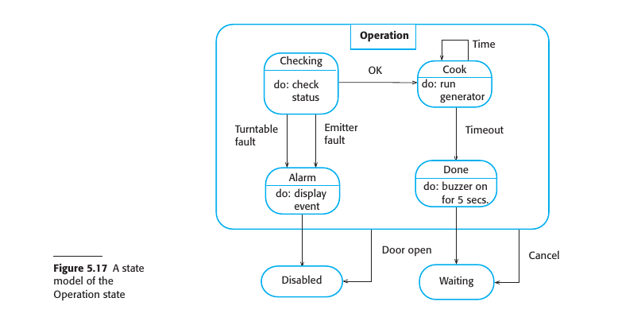

#### 4.3.2 Stories and Scenarios

#### Stories and Scenarios: An Introduction
- Both stories and scenarios capture real-life examples to describe how a system can be used for specific tasks.
- Stories provide high-level, narrative text descriptions for system use.
- Scenarios are structured and provide specific details like inputs and outputs.

#### Differences Between Stories and Scenarios
1. **Structure**: Stories are less structured than scenarios.
2. **Detail Level**: Stories provide a high-level overview, while scenarios delve into specifics.
3. **Purpose**: Stories are effective for setting out the "big picture," whereas scenarios are used for more specific user interactions.

#### Advantages of Using Stories
- Easily relatable and understood by stakeholders.
- Facilitates discussion and acts as a starting point for eliciting requirements.
- Useful for gathering information from a broader community by sharing them on platforms like wikis.

#### Developing Scenarios from Stories
- High-level stories can be broken down into more specific scenarios.
- Scenarios provide detailed descriptions of user interaction sessions.
  
#### Components of a Scenario
1. **Initial Expectations**: What the system and users expect when the scenario starts.
2. **Normal Flow of Events**: The usual sequence of actions in the scenario.
3. **Exception Handling**: What can go wrong and how the resulting problems are handled.
4. **Concurrent Activities**: Other activities that might be happening simultaneously.
5. **Ending State**: The system state when the scenario concludes.

#### Use in Agile Methods
- In agile methods like Extreme Programming, "user stories" are more like narrative scenarios designed to help elicit requirements.

#### Facilitation with Stakeholders
- Both stories and scenarios can be used to engage stakeholders in discussions, especially when there are different ways to achieve the same result.

By using stories and scenarios, you can capture both the high-level view and the detailed requirements, thereby providing a comprehensive understanding of what the system is expected to do.

### 4.4 Requirements specification

#### Requirements Specification: An Overview
- The process involves writing down both user and system requirements.
- The ideal attributes for these requirements are clarity, unambiguity, easy comprehension, completeness, and consistency.
- In reality, these attributes are hard to achieve due to different interpretations and inherent conflicts among stakeholders.

#### User Requirements
1. **Language**: Primarily written in natural language, supported by diagrams and tables.
2. **Scope**: Should focus on the external behavior of the system, not on how it is designed or implemented.
3. **Audience**: Intended to be understandable by users without detailed technical knowledge.
4. **Notation**: Should avoid software jargon and formal notations.

#### System Requirements
- These are expanded versions of user requirements and serve as the base for system design.
- Should be complete and detailed specifications of the whole system.
- While ideally focusing on external behavior and operational constraints, they may include some design details for practical reasons.

#### Reasons for Including Design Details in System Requirements
1. **Initial Architecture**: Helps to structure the requirements specification. For example, the requirements for the iLearn system were organized based on an initial architecture.
2. **Interoperability**: New systems often have to work with existing systems, imposing certain design constraints.
3. **Non-Functional Requirements**: Specific architectures might be necessary to satisfy non-functional requirements like reliability.

By adhering to these guidelines and considerations, the requirements specification will serve as a strong foundation for the subsequent phases of the software development process.

#### 4.4.1 Natural language specification

#### Natural Language Specification: Overview
- Natural language is expressive, intuitive, but potentially vague and ambiguous.
- Despite alternatives, it remains the most widely used way of specifying system and software requirements.

#### Guidelines for Writing Requirements in Natural Language
1. **Standard Format**: Create a standard format and make sure all requirements adhere to it. Ideally, use one or two sentences of natural language for each requirement.
2. **Consistency in Language**: Distinguish between mandatory ("shall") and desirable ("should") requirements for clarity.
3. **Text Highlighting**: Use bold, italic, or color to emphasize key parts of the requirement.
4. **Avoid Technical Jargon**: Do not assume that all readers understand software engineering terms. Avoid jargon, abbreviations, and acronyms.
5. **Requirement Rationale**: Include a rationale for each user requirement, specifying why it was included and who proposed it. This helps in future consultation or changes.

By adhering to these guidelines, you can make the natural language specifications clearer, more consistent, and easier to understand. This can be particularly helpful in minimizing misunderstandings among stakeholders.

#### 4.4.2 Structured specifications

#### Structured Specifications: Overview
- Structured natural language aims for uniformity while retaining the expressiveness and understandability of natural language.
- Standard templates or structured forms are used to specify requirements.
  
#### Features of Structured Specifications
- May use programming constructs for alternatives and iteration.
- Key elements can be highlighted using shading or different fonts.
  
#### Card-Based Approach (VOLERE)
- User requirements are initially written on cards, one per card.
- Fields on the card may include rationale, dependencies, source, and supporting materials.
  
#### Structured Specification Components
1. **Function/Entity Description**: Briefly describes the function or entity being specified.
2. **Inputs**: Describes the inputs and their origins.
3. **Outputs**: Describes the outputs and their destinations.
4. **Requirements**: Information about other entities required for computation.
5. **Action Description**: Description of the action to be taken.
6. **Preconditions and Postconditions**: Conditions before and after the function is called.
7. **Side Effects**: Description of any side effects of the operation.

#### Advantages and Challenges
- Addresses some problems of natural language by reducing variability and improving organization.
- Still can be difficult to specify complex computations clearly.

#### Extending Natural Language Specifications
- Tables or graphical models can be used to add extra information.
- Especially useful for alternative situations or complex computations (e.g., calculating insulin doses based on rate of blood sugar change).

By utilizing structured specifications, you can balance the natural language's flexibility with the precision needed for complex requirements, providing a more consistent and organized approach.

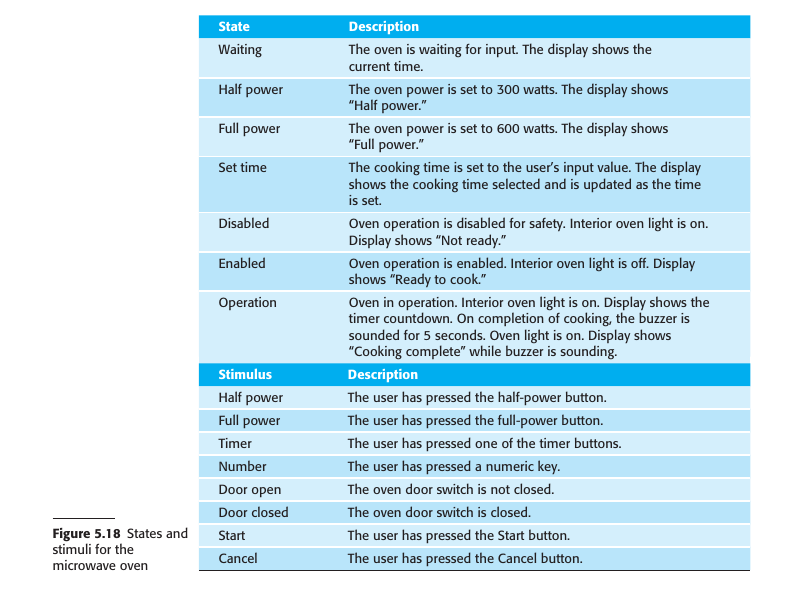

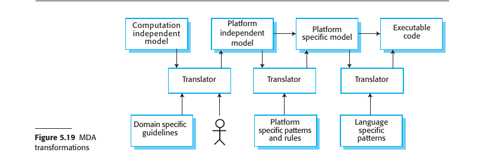

#### 4.4.3 Use cases

#### Use Cases: Overview
- Use cases describe interactions between users and a system via graphical models and structured text.
- They originated from the Objectory method and are now a fundamental part of Unified Modeling Language (UML).

#### Components of Use Cases
1. **Actors**: Represented as stick figures, these can be human users or other systems.
2. **Type of Interaction**: Represented as a named ellipse, each class of interaction is distinct.
3. **Linking Lines**: Lines connect actors with the interaction. Optionally, arrowheads may indicate who initiates the interaction.

#### Documentation
- Use cases are documented using high-level use case diagrams.
- Each use case should have a textual description that can be further elaborated using other UML models.

#### Application & Limitations
- Use cases are commonly used in object-oriented modeling.
- They are considered by some as too fine-grained for initial requirements elicitation and are often more useful in system design.

#### Interpretation of Use Cases
- Some consider each use case as a single, low-level interaction scenario.
- Others, like Stevens and Pooley, argue that a use case can include a set of related, low-level scenarios.
  - This set would include a normal interaction scenario plus scenarios for each possible exception.

In summary, use cases offer a structured way to document system-user interactions but may be too detailed for early stages of requirements engineering. They can be adapted to represent either single interactions or sets of related interactions.

#### 4.4.4 The software requirements document

#### The Software Requirements Document (SRS)
- Serves as an official statement specifying what developers should implement.
- May include both user and system requirements.
- Essential for outsourced systems, complex multi-team developments, and where detailed analysis is mandatory.

#### Agile Methods vs Traditional Approaches
1. **Agile Methods**: 
  - Argue that requirements change rapidly, making a static document outdated quickly.
  - Use incremental collection of user requirements through short user stories prioritized by users.
2. **Traditional Approaches**: 
  - Often require detailed documents, especially for business and dependability requirements.
  - More suitable for stable or critical systems where safety and security are paramount.

#### Target Audience
- The document caters to a diverse set of users, from senior management to software engineers.
- Due to the diversity of users, the document must be a compromise, providing both general overviews and detailed specifications.

#### Level of Detail
- Varies based on the type of system and the development process.
- Outsourced or critical systems require more detailed specifications.
- In-house, iterative developments may opt for less detailed initial requirements, refining them as the project progresses.

#### Structure and Content
- Often follows standards like IEEE 1998, which can be adapted to specific uses.
- Should include information about future system evolution to guide designers and maintainers.
- Comprehensive table of contents and document index are essential for complex systems.

#### Variability
- The content and structure are influenced by the type of software being developed and the development approach.
- For in-house software products, focus is mainly on user requirements and high-level, nonfunctional system requirements.

In summary, the Software Requirements Document is a versatile tool that varies in structure and detail depending on the project's needs. It balances between being comprehensive for developers and testers, and being understandable for stakeholders.

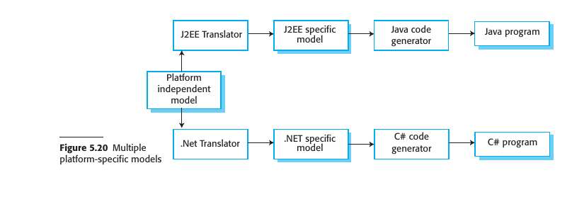

### 4.5 Requirements validation 

#### Requirements Validation: Overview
- A critical process aimed at ensuring the requirements define the system the customer truly wants.
- Errors in the requirements document can lead to extensive rework and associated costs.

#### Importance of Validation
- Cost of fixing requirements errors is usually much higher than fixing design or coding errors.
- Changes to requirements often necessitate changes in design, implementation, and retesting.

#### Types of Checks
1. **Validity Checks**: Ensure requirements reflect real needs of users, considering possible changes since initial elicitation.
2. **Consistency Checks**: Ensure there are no conflicting or contradictory requirements in the document.
3. **Completeness Checks**: Verify that all functions and constraints intended by the user are defined.
4. **Realism Checks**: Validate that requirements can be implemented within budget and schedule constraints.
5. **Verifiability**: Make sure requirements are written in a way that allows them to be verified through testing.

#### Validation Techniques
1. **Requirements Reviews**: Systematic analysis by a review team to check for errors and inconsistencies.
2. **Prototyping**: Creation and use of an executable model to gather feedback from end-users and customers.
3. **Test-case Generation**: Developing tests based on requirements to identify issues; integral to test-driven development.

#### Challenges and Limitations
- Difficult to guarantee that requirements fully meet users' needs.
- Users may struggle to visualize the system and how it fits into their work.
- Not all requirements problems are usually found during validation; further changes are often needed later.

In summary, requirements validation is a complex but critical process that uses various checks and techniques to ensure that the system being developed aligns with what the customer actually wants. Despite its challenges, it is a vital step to minimize future rework and associated costs.

### 4.6 Requirements change

#### Requirements Change: Overview
- Requirements for large systems are subject to constant change, often due to the complexity of "wicked" problems that cannot be fully defined.

#### Reasons for Change
1. **Business and Technical Environment**: Post-installation changes in hardware, interfacing with other systems, business priorities, and new regulations may necessitate adjustments.
2. **Diverse Stakeholders**: Requirements may be imposed by system customers for organizational and budgetary reasons, which may conflict with end-user needs. Post-delivery adjustments may be necessary.
3. **Stakeholder Priorities**: Large systems usually have diverse stakeholders with potentially conflicting requirements. Experience may reveal the need to re-prioritize support for different stakeholders.

#### Managing Requirements Change
- Formal process needed for making change proposals and linking these to existing requirements, known as "requirements management."
- Should start as soon as a draft version of the requirements document is available.

#### Agile Development and Requirements Change
- Agile processes are designed to cope with changing requirements.
- Users prioritize changes, and high-priority changes can replace planned features for the next iteration.
- However, this approach can be problematic as users may not be the best to decide cost-effectiveness.

#### Independent Authority
- An independent authority is often better suited to balance the needs of all stakeholders and decide on the changes to be accepted.

In summary, requirements change is an inevitable aspect of software development, especially for complex systems. Various factors contribute to this, including changes in the business environment, conflicting stakeholder priorities, and the inherent nature of complex problems. Effective management of these changing requirements is crucial, and different approaches like Agile have their own pros and cons. An independent authority can often offer a balanced perspective on what changes should be accepted.

#### 4.6.1 Requirements management planning

#### Requirements Management Planning: Overview
- The focus is on establishing how an evolving set of requirements will be managed.

#### Planning Stage Decisions
1. **Requirements Identification**: Each requirement needs a unique identifier for cross-referencing and traceability.
2. **Change Management Process**: A set of activities to assess the impact and cost of changes.
3. **Traceability Policies**: Define the relationships between each requirement and between the requirements and system design, along with how these records are maintained.
4. **Tool Support**: Tools range from specialist requirements management systems to spreadsheets and simple databases.

#### Tool Support Needs
1. **Requirements Storage**: A secure, managed data store accessible to all stakeholders.
2. **Change Management**: Tools can simplify the change management process by tracking suggested changes and responses.
3. **Traceability Management**: Tools can help discover related requirements, some even using natural language processing techniques for this purpose.

#### Scale of the System and Tooling
- For small systems, simple tools like shared web documents, spreadsheets, and databases may suffice.
- For larger systems, specialized tools like DOORS are more appropriate for managing a large number of changing requirements.

In summary, requirements management planning involves key decisions on identifying requirements, managing changes, establishing traceability policies, and selecting appropriate tools. The scale of the system often dictates the complexity of the tools needed, with specialized software being more suited for larger, more complex projects.

#### 4.6.1 Requirements change management

#### Requirements Change Management: Overview
- Change management is crucial after the requirements document has been approved to weigh the benefits and costs of implementing new requirements. 
- A formal process ensures consistent treatment of all change proposals and controlled changes to the requirements document.

#### Principal Stages of Change Management
1. **Problem Analysis and Change Specification**: 
    - Begins with an identified requirements problem or a specific change proposal.
    - Validate the problem or change proposal and get feedback from the requestor for further clarification or withdrawal.
  
2. **Change Analysis and Costing**:
    - Evaluate the impact of the proposed change using traceability information and general system knowledge.
    - Estimate the cost of the change in terms of modifications to the requirements document and possibly to the system design and implementation.
    - Decide whether or not to proceed with the requirements change.

3. **Change Implementation**:
    - Modify the requirements document and, if necessary, the system design and implementation.
    - Aim for a changeable document structure to allow for easy modifications without extensive rewriting.

#### Emergency Changes
- In cases of urgent new requirements, the temptation to change the system first and update the document later should be resisted.
- Failure to immediately update the requirements document can lead to inconsistencies between the document and the actual system.

In summary, requirements change management is a structured process comprising problem analysis, change analysis and costing, and change implementation. It aims to control and document changes to the system requirements in an organized and consistent manner. Emergency changes are a special case where immediate action may be necessary, but these should be documented as soon as possible to maintain consistency.

### Summary

- Requirements for a software system set out what the system should do and define constraints on its operation and implementation.

- Functional requirements are statements of the services that the system must provide or are descriptions of how some computations must be carried out.

- Non-functional requirements often constrain the system being developed and the development process being used. These might be product requirements, organizational requirements, or external requirements. They often relate to the emergent properties of the system and therefore apply to the system as a whole.

- The requirements engineering process includes requirements elicitation, requirements specification, requirements validation, and requirements management.

- Requirements elicitation is an iterative process that can be represented as a spiral of activities— requirements discovery, requirements classification and organization, requirements negotiation, and requirements documentation.

- Requirements specification is the process of formally documenting the user and system requirements and creating a software requirements document.

- The software requirements document is an agreed statement of the system requirements. It should be organized so that both system customers and software developers can use it.

- Requirements validation is the process of checking the requirements for validity, consistency, completeness, realism, and verifiability.

- Business, organizational, and technical changes inevitably lead to changes to the requirements for a software system. Requirements management is the process of managing and controlling these changes.

---
---
# Chapter 5 System Modelling

## 5.1 Context models
## 5.2 Interactions model
## 5.3 Structural models
## 5.4 Behavioral models
## 5.5 Model-driven architecture

---

#### Five UML Diagram Types

1. **Activity Diagrams**: 
    - Depict the activities involved in a process or in data processing.
  
2. **Use Case Diagrams**: 
    - Illustrate the interactions between a system and its environment.
  
3. **Sequence Diagrams**: 
    - Demonstrate interactions between actors and the system as well as between system components.

4. **Class Diagrams**: 
    - Display the object classes in the system and the associations between these classes.

5. **State Diagrams**: 
    - Reveal how the system reacts to internal and external events.

Each type of UML diagram serves a specific purpose and offers different insights into the system's design, functionality, or interaction.

### 5.1 Context models

#### Context Models in System Specification

1. **Defining System Boundaries**:
    - Early in the specification process, decide what is and isn't part of the system.
    - Work with stakeholders to determine what functionalities should be included.
    - Make decisions early to limit costs and time.

2. **System vs. Environment Boundaries**:
    - Sometimes the boundary is clear, especially if replacing an existing system.
    - Flexibility exists in determining what constitutes the boundary.

3. **Example: Mentcare System**:
    - Must decide if the system will only collect consultation info or also collect personal patient info.
    - Consider advantages and disadvantages, such as data duplication and system speed.

4. **User Base Diversity**:
    - Diverse user bases may require configurable systems that can adapt to varying needs.

5. **Non-Technical Factors**:
    - Boundaries may be influenced by social and organizational concerns, such as avoiding a difficult manager or increasing system costs for departmental expansion.

6. **Context Definition and Dependencies**:
    - After deciding on boundaries, define the system's context and its dependencies on its environment.
    - Architectural models often serve as the first step.

7. **Relation with Other Systems**:
    - Context models show that the environment often includes several other automated systems but do not detail the types of relationships.
    - Other models, like business process models, can be used in conjunction.

8. **UML Activity Diagrams**:
    - Can be used to show business processes where systems are used.
    - Detail the flow of control from one activity to another.
  
9. **Critical Functions Example**:
    - The Mentcare system must implement legal safeguards for involuntary detention of patients.

10. **Flow and Coordination in Activity Diagrams**:
    - Arrows indicate the flow of work; solid bars indicate activity coordination.
    - Activities can be concurrent or sequential based on the diagram.

This summary captures the intricacies of defining system boundaries, making considerations for diverse user bases, and employing various models, like UML activity diagrams, to better understand the system's context and dependencies.

### 5.2 Interactions model

#### Interaction Models in Software Systems

1. **Types of Interactions**:
    - User interaction (user inputs and outputs)
    - System-to-system interaction
    - Component-to-component interaction within a software system

2. **Importance of Interaction Modeling**:
    - Helps identify user requirements
    - Highlights potential communication problems
    - Aids in understanding system performance and dependability

3. **Approaches to Interaction Modeling**:
    1. **Use Case Modeling**:
        - Primarily used for interactions between a system and external agents (either human users or other systems)
    2. **Sequence Diagrams**:
        - Used to model interactions between system components
        - External agents may also be included

4. **Complementary Use**:
    - Use case models and sequence diagrams can be used together to present interactions at different levels of detail
    - High-level use case interactions can be further detailed using sequence diagrams

5. **UML Communication Diagrams**:
    - Another tool for modeling interactions
    - Not discussed in detail as they are considered an alternative representation of sequence diagrams

These key points outline the types of interactions that can occur in a system, the importance of modeling these interactions, and the methodologies used for this purpose.

#### 5.2.1 use case modelling

1. **Origins and Utility**:
    - Developed by Ivar Jacobsen in the 1990s.
    - Part of the Unified Modeling Language (UML).
    - More useful in early stages of system design than in requirements engineering.

2. **Basic Components**:
    1. **Use Case**: Represents a discrete task involving external interaction with a system.
    2. **Actors**: External entities interacting with the use case, represented as stick figures.
    3. **Ellipse**: A simple graphical representation of a use case.
  
3. **Actors and Directionality**:
    - Actors can be human or other systems.
    - UML formally uses lines without arrows to show interactions.
    - Arrows can be used informally to indicate the initiator of the transaction.
  
4. **Detailing a Use Case**:
    - Use case diagrams provide a simple overview.
    - Additional detail can be added through:
        1. Textual description
        2. Structured description in a table
        3. Sequence diagrams
    - The format depends on the level of detail required.

5. **Composite Use Case Diagrams**:
    - Show multiple use cases together.
    - Can be categorized by actor or functionality.
    - May require several diagrams for complex systems.

6. **Advanced UML Constructs**:
    - UML allows for sharing parts of a use case in other diagrams.
    - Often found to be confusing by end-users, so not universally recommended.

The summary outlines the components, utility, and methods of detailing use case models as part of the Unified Modeling Language (UML). It also touches upon the intricacies and limitations of using advanced UML constructs for use cases.

#### 5.2.1 Sequence Diagrams

1. **Purpose and Scope**:
    - Used to model interactions between actors and objects, and among objects themselves.
    - Rich syntax but focus here is on basics.
  
2. **Core Elements**:
    1. **Objects and Actors**: Listed along the top of the diagram.
    2. **Dotted Line**: Represents the lifeline of an object or actor, indicating involvement over time.
    3. **Annotated Arrows**: Show interactions between objects and actors.
    4. **Rectangle on Dotted Lines**: Indicates the lifeline or time an object instance is involved.
  
3. **Reading Sequence**:
    - Interactions are read from top to bottom.
    - Annotations on arrows indicate calls, parameters, and return values.

4. **Alternatives and Conditions**:
    - "Alt" box used to indicate alternative interactions.
    - Conditions for alternatives are shown in square brackets.
  
5. **Example Scenarios**:
    1. **View Patient Information**: 
        - Triggered by a medical receptionist.
        - Involves security checks and conditional display of information.
    2. **Transfer to Patient Record System (PRS)**:
        - Receptionist logs onto PRS.
        - Two options for data transfer, both requiring authorization checks.
        - PRS issues a status message upon completion.

6. **Level of Detail**:
    - Not necessary to include every interaction, especially for early-stage modeling.
    - Some interactions might depend on later implementation decisions.

Sequence diagrams in UML serve as a valuable tool for modeling interactions within a system. They feature a range of elements that detail object lifetimes, interactions, and conditions for alternative pathways. The level of detail can be adjusted according to the stage of development, making these diagrams versatile for different uses.

### 5.3 Structural models

#### 5.3.1 Class Diagrams

1. **Purpose and Utility**:
    - Used in object-oriented system modeling to depict classes and their associations.
    - Early stages focus on real-world objects like patients, prescriptions, etc.
    - Can be used at different levels of detail.

2. **Basic Elements**:
    1. **Object Class**: Represents a kind of system object. Shown as a box with the class name.
    2. **Association**: Links between classes, indicating a relationship. Represented by a line between class boxes.

3. **Levels of Detail**:
    - Initial modeling identifies essential real-world objects as classes.
    - Simple class diagrams may not specify the nature of associations between classes.
    - More detailed diagrams can name the associations.

4. **Multiplicity in Associations**:
    - Indicates how many objects are involved in an association.
    - Examples: 1:1, 1:*, 1..4, etc.
  
5. **Similarity to Semantic Data Models**:
    - Resemble semantic data models used in database design.
    - Entities in a semantic data model can be thought of as simplified object classes.
  
6. **Attributes and Operations**:
    - To add more detail, include attributes (characteristics) and operations (functions) of the classes.
    - Shown by extending the rectangle that represents a class.
        1. Class name in the top section.
        2. Attributes in the middle section.
        3. Operations in the lower section.

Class diagrams in UML serve as a foundational tool in object-oriented system modeling, allowing for different levels of detail depending on the development stage. They can show simple to complex relationships between classes, include multiplicities to indicate the number of objects in an association, and can be extended to include attributes and operations for each class.

#### 5.3.2 generalization

1. **Concept of Generalization**:
    - A technique to manage complexity by focusing on general classes and their characteristics.
    - Example: Squirrels and rats are generalized as "rodents," sharing common characteristics like teeth for gnawing.

2. **Importance in System Design**:
    - Allows for centralized maintenance of common information.
    - Facilitates easier updates and changes, as you only need to modify the general class.

3. **Implementation in Object-Oriented Languages**:
    - In languages like Java, generalization is implemented through class inheritance mechanisms.

4. **UML Representation**:
    - UML uses a specific type of association to denote generalization.
    - Represented by an arrowhead pointing to the more general class.
  
5. **Inheritance and Attributes**:
    - Subclasses inherit attributes and operations from their superclasses.
    - Subclasses can add more specific attributes and operations.
  
6. **Examples**:
    - General practitioners and hospital doctors can be generalized as doctors.
    - Hospital doctors may have attributes like staff number and pager, which general practitioners do not.
    - Lower-level classes like "Trainee Doctor," "Registered Doctor," and "Consultant" fall under "Hospital Doctor" and add their own specific attributes and operations.

Generalization is a key concept in both everyday reasoning and system modeling, helping to manage complexity by focusing on shared characteristics. In system design, it simplifies maintenance and updates. It is implemented in object-oriented languages through inheritance, and its relationships are explicitly depicted in UML diagrams.

#### 5.3.3 Aggregation

1. **Concept of Aggregation**:
    - Represents the part-whole relationship between objects.
    - Useful for depicting how one object is composed of several other objects.
  
2. **Real-world Example**:
    - A study pack for a course could include components like a book, PowerPoint slides, quizzes, and further reading recommendations.

3. **UML Representation**:
    - In UML, aggregation is a special type of association between classes.
    - A diamond shape is added next to the class that represents the "whole" to indicate aggregation.
  
4. **Specific Example in System Modeling**:
    - A patient record could be an aggregate of the "Patient" class and an indefinite number of "Consultations."
    - This means the patient record maintains both personal patient information and individual records for each consultation with a doctor.

Aggregation is a concept in system modeling used to represent part-whole relationships between objects. It is visually represented in UML diagrams using a diamond shape next to the class that serves as the "whole." The concept is useful for showing how complex objects are composed of simpler parts.

### 5.4 Behavioral models

1. **Definition**: 
    - Models that describe the dynamic behavior of a system during its execution.
    - Illustrate how a system responds to stimuli from its environment.

2. **Types of Stimuli**: 
    - Stimuli triggering system behavior can be either data or events.
        1. **Data-driven Stimuli**: Availability of data triggers system processing.
        2. **Event-driven Stimuli**: Specific events trigger system processing, may or may not have associated data.

3. **Business Systems vs Real-Time Systems**:
    - **Business Systems**: 
        - Primarily data-driven.
        - Controlled by data input and involve a sequence of actions on that data.
        - Example: Phone billing system calculates costs based on call data and generates a bill.
    - **Real-Time Systems**: 
        - Primarily event-driven.
        - Respond to real-time events with limited data processing.
        - Example: Landline phone switching system responds to "handset activated" event by generating a dial tone.

Behavioral models are crucial for understanding how a system interacts with its environment and responds to various stimuli, which can be either data-driven or event-driven. The nature of the system—whether it's a business system or a real-time system—determines its primary mode of operation.

#### 5.4.1 Data-driven modelling

1. **Purpose**: 
    - Illustrates the sequence of actions for processing input data to generate an output.
    - Useful for requirement analysis as it shows end-to-end processing in a system.

2. **Historical Context**: 
    - One of the first graphical software models.
    - Originated in the 1970s with the use of data-flow diagrams (DFDs).

3. **Data-Flow Diagrams (DFDs)**:
    - Show how data associated with a process moves through the system.
    - Simple and intuitive, making them accessible to stakeholders including non-technical ones.
    - Can be represented in UML using activity diagrams.

4. **UML Sequence Diagrams**:
    - An alternative to DFDs for showing sequential data processing.
    - Messages are sent from left to right to show sequence.
    - Focuses on objects in the system.
  
5. **DFDs vs Sequence Diagrams**:
    - DFDs focus on operations or activities.
    - Sequence Diagrams focus on objects and their interactions.
    - Nonexperts often find DFDs more intuitive, while engineers may prefer sequence diagrams.

Data-driven models are instrumental in showing the sequence of actions that occur from the time an initial input is processed until an output is generated. These models can be presented in various forms such as Data-Flow Diagrams (DFDs) or UML Sequence Diagrams, each with its own set of advantages and limitations.

#### 5.4.2 Event-driven modelling

1. **Purpose**: 
    - To show how a system responds to internal and external events.
    - Particularly relevant for real-time systems.
  
2. **Concepts**: 
    - Assumes the system has a finite number of states.
    - Events (stimuli) trigger transitions between these states.
  
3. **UML State Diagrams**: 
    - Used to represent event-based modeling.
    - Show system states and transitions but not data flow.
    - Rounded rectangles represent states and labeled arrows signify stimuli triggering transitions.
  
4. **Example**: 
    - A simplified microwave oven model used to illustrate the approach.
    - Sequence of actions defined such as selecting power level, setting cooking time, and starting the oven.
    - Safety features like not operating when the door is open are included.
  
5. **Complexity Issue**: 
    - Number of possible states can increase rapidly for large systems.
    - One solution is to use "superstates" to encapsulate multiple states, simplifying the high-level view.
  
6. **Detailed Description**: 
    - State models are often extended with tables listing states, events, and descriptions for more clarity.

Event-driven modeling is a technique primarily used for real-time systems to show how a system responds to various events or stimuli. The UML supports this modeling approach through state diagrams, which depict the finite states of a system and the events that trigger transitions between these states. However, dealing with a large number of states can become complex, and thus, techniques like using "superstates" are employed to manage this complexity.

#### 5.4.3 model-driven Engineering (MDE)

1. **Definition and Approach**: 
    - Model-driven engineering is a software development method where the primary outputs are models, not programs. 
    - Software to run on hardware is automatically generated from these models.
    - The approach aims to abstract away the complexities of programming languages and execution platforms.

2. **Origins**: 
    - MDE evolved from the concept of Model-Driven Architecture (MDA), which was proposed by the Object Management Group (OMG).
    - MDA focuses only on the design and implementation stages of software development.

3. **Scope**:
    - Unlike MDA, MDE is concerned with the entire software engineering process. 
    - This includes model-based requirements engineering, model-based development processes, and model-based testing.

4. **Adoption in Industry**: 
    - MDA has been adopted by several large companies for their development processes.
    - However, the broader approach of MDE has not been widely adopted across the software development life cycle.

5. **Challenges**: 
    - The slow adoption of MDE is a subject of discussion, with some questioning the reasons for its limited uptake in the industry.

By focusing on models rather than code, MDE aims to elevate the level of abstraction in software engineering, thereby simplifying the development process. However, its adoption has been slow compared to its predecessor, MDA.

### 5.5 Model-driven architecture (MDA)

1. **Definition and Methodology**: 
    - MDA is a model-centric approach to software design and implementation.
    - Uses a subset of UML models at varying levels of abstraction to describe a system.
    - In theory, it can produce working programs automatically from high-level models.

2. **Types of Models**: 
    - Computation Independent Model (CIM): Focuses on domain abstractions. Multiple CIMs may exist for different system views.
    - Platform Independent Model (PIM): Describes the system operations without considering implementation specifics.
    - Platform Specific Model (PSM): Transforms PIMs to suit specific platforms. May exist in layers for different platform specifics.

3. **Advantages**: 
    - High-level abstraction reduces errors and speeds up design and implementation.
    - Facilitates the generation of platform-independent application models.
    - Allows for easy adaptation to new platform technologies via model translators.

4. **Challenges and Limitations**: 
    - Fully automated translation from models to code is often not feasible.
    - High-level models may not always be suitable for implementation.
    - Requires human intervention for concept mapping between different CIMs.
    - Off-the-shelf tool support may be limited, requiring custom tool development.

5. **Industry Adoption and Criticism**: 
    - MDA has been slow to become mainstream for several reasons:
        1. Limited applicability in addressing major issues like requirements engineering and security.
        2. Gains from using MDA are often offset by costs of tooling and introduction.
        3. Divergence from agile methodologies, which focus less on up-front modeling.
    - Success stories are mostly from companies with systems products that have long lifetimes and well-understood domains.

6. **Productivity and Reusability**: 
    - MDA has shown to increase productivity and reduce maintenance costs in some cases.
    - Particularly useful in facilitating reuse, leading to significant productivity improvements.

7. **Agile Methods and MDA**: 
    - There is tension between agile methods and MDA due to differing philosophies.
    - Some suggest that elements of MDA can be incorporated into agile processes, but with reservations about automated code generation.

MDA focuses on creating models to abstract away the complexities of system design and implementation. While promising in theory, the approach has several practical limitations and has seen mixed results in terms of industry adoption.

---

### Summary

- A model is an abstract view of a system that deliberately ignores some system details. Complementary system models can be developed to show the system’s context, interactions, structure, and behavior.

- Context models show how a system that is being modeled is positioned in an environment with other systems and processes. They help define the boundaries of the system to be developed.

- Use case diagrams and sequence diagrams are used to describe the interactions between users and systems in the system being designed. Use cases describe interactions between a system and external actors; sequence diagrams add more information to these by showing interactions between system objects.

- Structural models show the organization and architecture of a system. Class diagrams are used to define the static structure of classes in a system and their associations.

- Behavioral models are used to describe the dynamic behavior of an executing system. This behavior can be modeled from the perspective of the data processed by the system or by the events that stimulate responses from a system.

- Activity diagrams may be used to model the processing of data, where each activity represents one process step.

- State diagrams are used to model a system’s behavior in response to internal or external events.

- Model-driven engineering is an approach to software development in which a system is represented as a set of models that can be automatically transformed to executable code.

---
---
# Chapter 6 Architectural Design

## 6.1 Architecture Design Decisions
## 6.2 Architectural Views
## 6.3 Architectural patterns
## 6.4 Application Architectural

---

### Architectural Design

1. **Definition and Role**: 
    - Architectural design is about designing the overall structure of a software system.
    - It links requirements engineering to design by identifying main structural components and their relationships.
    - The output is an architectural model that shows how the system's components communicate.

2. **In Agile Processes**: 
    - Early stages focus on architectural design.
    - Incremental development of architecture is not effective; refactoring architecture is expensive.

3. **Overlap with Requirements Engineering**: 
    - In practice, architectural design often overlaps with requirements engineering.
    - Main components may be identified during the requirements phase to facilitate discussions with stakeholders.

4. **Levels of Abstraction**: 
    - Architecture in the Small: Focuses on individual programs and their decomposition.
    - Architecture in the Large: Concerned with complex enterprise systems and their interconnections.

5. **Importance and Impact**: 
    - Affects performance, robustness, distributability, and maintainability.
    - Non-functional requirements significantly influence the architecture.

6. **Advantages of Explicit Architecture**: 
    1. Facilitates stakeholder communication.
    2. Aids in early-stage system analysis.
    3. Supports large-scale reuse through product-line architectures.

7. **Modeling Techniques**: 
    - Block diagrams are commonly used but are criticized for their lack of detail.
    - More rigorous architectural description languages exist but are not widely used due to their complexity and cost.

8. **Contradictions in Practice**: 
    - Architectural models serve two purposes:
        1. Encouraging discussions about system design for stakeholder communication and project planning.
        2. Documenting a fully fleshed-out architecture to facilitate system understanding and evolution.

Architectural design is a critical phase in the software development process, serving as the bridge between requirements and implementation. While it plays a significant role in influencing various system attributes, the ways in which architectural models are created and used can vary, often depending on project-specific needs and constraints.

### 6.1 Architecture Design Decisions

1. **Nature of Architectural Design**: 
    - Not a formulaic process; depends on the system, the architect's experience, and specific requirements.
    - Considered a series of decisions rather than a sequence of activities.

2. **Structural Decisions**: 
    - Architects make key structural decisions that impact both the system and its development.
    - These decisions often depend on the architect's knowledge, experience, and the domain of the application.

3. **Reuse and Domain Similarities**: 
    - Systems in the same domain often share architectural similarities.
    - Architects should identify what can be reused from existing architectures within the same or broader application classes.

4. **Distributed vs. Localized Systems**: 
    - The choice between a distributed and a localized architecture is crucial, especially for large systems.
    - This choice affects performance and reliability.

5. **Architectural Patterns and Styles**: 
    - Based on well-known patterns like client–server or layered architectures.
    - Patterns capture the essence of architectures used in different systems.

6. **Non-Functional Requirements and Architecture**: 
    - Architecture style should depend on non-functional requirements such as:
        1. Performance: Localize critical operations to reduce component communications.
        2. Security: Use layered structures with higher validation for innermost layers.
        3. Safety: Co-locate safety-related operations to simplify validation and provide fail-safes.
        4. Availability: Include redundant components for higher availability.
        5. Maintainability: Use fine-grained, self-contained components for easier changes.

7. **Potential Conflicts**: 
    - Trade-offs may be necessary when multiple non-functional requirements are important.
    - Different architectural patterns may be used for different parts of the system to balance conflicting requirements.

8. **Evaluation of Architectural Design**: 
    - Difficult to evaluate definitively, as the true test comes when the system is in use.
    - Comparing against reference architectures or generic patterns can provide some level of evaluation.

Architectural design is a complex and creative process that involves a series of crucial decisions. These decisions are influenced by various factors including the type of system, the architect's background, and specific functional and non-functional requirements. The chosen architecture profoundly affects the system's performance, security, and other attributes, necessitating careful consideration and sometimes trade-offs among conflicting requirements.

### 6.2 Architectural Views

1. **Purpose of Architectural Models**: 
    - Used for discussing software requirements or design.
    - Serve as documentation for detailed design and implementation.

2. **Multiple Views for Complexity**: 
    - A single diagram cannot capture all aspects of a system's architecture.
    - Multiple views are often needed for both design and documentation.

3. **Krutchen’s 4+1 View Model**: 
    - Krutchen suggests four fundamental architectural views linked through use cases:
        1. **Logical View**: Shows key abstractions as objects or object classes.
        2. **Process View**: Shows runtime composition of interacting processes.
        3. **Development View**: Shows software decomposition for development.
        4. **Physical View**: Shows distribution of software components across hardware.

4. **Hofmeister's Conceptual View**: 
    - Hofmeister et al. add a "Conceptual View" that serves as an abstract representation of the system.
    - Useful for decomposing high-level requirements and informing architectural decisions.

5. **Informality vs Formality in Notations**: 
    - UML often used informally for architecture description.
    - Some argue for more specialized Architectural Description Languages (ADLs), but these are less accessible to non-specialists.

6. **Agile Perspective on Documentation**: 
    - Detailed design documentation is often seen as unnecessary in agile methods.
    - Focus is on developing views useful for communication rather than complete documentation.

In summary, architectural views serve to capture different aspects of a system's design and are crucial for both discussion and documentation. While there are formal methods and notations, such as UML and ADLs, the industry often leans towards more informal, accessible representations, especially in agile environments. Different architects and methodologies propose various sets of views, but the emphasis is on capturing what is most useful for the project's specific needs.

### 6.3 Architectural patterns

1. **Introduction and Origin**: 
    - Patterns are stylized, reusable solutions in software engineering.
    - The concept gained traction with a book on object-oriented design patterns (Gamma et al. 1995).

2. **Other Types of Patterns**: 
    - Exist in organizational design, usability, cooperative interaction, and configuration management.

3. **Architectural Patterns vs Styles**: 
    - Initially proposed as "architectural styles" in the 1990s.
    - Detailed handbooks published on pattern-oriented software architecture.

4. **Definition and Utility**: 
    - Architectural patterns are abstract descriptions of tried and tested good practices.
    - They include information on when to use them and their strengths and weaknesses.

5. **Model-View-Controller (MVC) as an Example**: 
    - Commonly used for interaction management in web-based systems.
    - Descriptions often include pattern name, brief description, graphical model, and example usage.

6. **Graphical Representations**: 
    - Patterns can be illustrated from different views, like conceptual and runtime system architectures.

7. **Scope and Limitations**: 
    - Not all generic patterns can be described due to space limitations, but selected examples provide insights into good architectural design principles.

In summary, architectural patterns offer a formalized way to introduce tried and tested system organizations into new projects. These patterns can vary in type and application but generally include guidelines on when and how to use them. They are often visually represented to give both conceptual and practical insights into their structure and utility.

#### 6.3.1 Layered Architecture

1. **Fundamental Concepts**: 
    - Separation and independence are key to architectural design.
    - Allows for changes to be localized within the system.

2. **Layered Architecture Purpose**: 
    - Achieves separation and independence by organizing system functionality into separate layers.
    - Each layer relies only on the layer immediately beneath it.

3. **Advantages**:
    - **Incremental Development**: Allows for the incremental release of services as layers are developed.
    - **Changeability and Portability**: A new layer can replace an existing one without affecting the rest of the system, provided the interface remains the same.
    - **Localizing Dependencies**: Makes it easier to adapt to different operating systems or databases, as only machine-dependent layers need to be changed.

4. **Example Structure**: 
    - Four-layer example consists of:
        1. System support software layer (e.g., database and OS support).
        2. Application layer with application functionality and utility components.
        3. User interface management, authentication, and authorization layer.
        4. Top layer focused on user interface facilities.
    - The number of layers is arbitrary and can be adjusted as needed.

5. **Real-world Examples**: 
    - iLearn digital learning system and Mentcare system both employ a four-layer architecture following this pattern.

In summary, the Layered Architecture pattern organizes a system into separate, interdependent layers to achieve modularity, ease of development, and change resilience. This architecture is flexible, allowing for incremental development and adaptability to different technological platforms.

#### 6.3.2 Repository Architecture

1. **Core Concept**:
    - Focuses on how a set of interacting components can share data through a centralized database or repository.

2. **Applicability**: 
    - Suited for systems where data is generated by one component and used by another.
    - Examples include command and control systems, management information systems, CAD systems, and software development environments.

3. **Advantages**:
    - **Efficient Data Sharing**: Eliminates the need to transmit data explicitly between components.
    - **Version Control**: Can include features like versioning and rollback.

4. **Challenges**:
    - **Data Model Compromise**: All components must agree on a repository data model, which could be a limiting factor for integrating new components.
    - **Distribution Difficulty**: Logically centralized repositories can be technically challenging to distribute over multiple machines due to consistency and data duplication issues.

5. **Variations**:
    - **Passive Repository**: Control is managed by the components using the repository.
    - **Blackboard Model**: An alternative used in AI systems where the repository triggers components based on the availability of certain data.
  
In summary, the Repository Architecture pattern is useful for systems that require efficient sharing of large amounts of data between components. It comes with its own sets of advantages and challenges, including efficient data sharing but also potential difficulties with data model agreement and distribution. Various models like the passive repository and blackboard model offer different approaches to control and data availability.

#### 6.3.3 Client-Server Architecture

1. **Core Concept**:
    - Focuses on runtime organization, particularly for distributed systems.
    - Organized as a set of services offered by servers and accessed by clients.

2. **Major Components**:
    1. Servers: Offer services like printing, file management, or programming language compilation.
    2. Clients: Access the services offered by servers.
    3. Network: Allows clients to access servers, usually implemented as distributed systems using Internet protocols.

3. **Applicability**:
    - Common in distributed systems but can also be implemented on a single computer.
    - Examples include multiuser, web-based systems for media management.

4. **Advantages**:
    - **Separation and Independence**: Services and servers can be changed without affecting other parts of the system.
    - **Scalability**: Easy to add new servers or upgrade existing ones.
    - **Effective Use of Networked Systems**: Allows for distribution across multiple processors.

5. **Communication Protocol**:
    - Typically uses a request–reply protocol like HTTP for remote procedure calls.
    - Clients need to know the names of servers and services but servers don’t need to know client identities.

6. **Example Use-case**:
    - A multiuser web-based system for a film and photograph library, with separate servers for different media types and functionalities.

In summary, the Client–Server Architecture pattern is well-suited for distributed systems requiring runtime organization. It offers advantages like separation, independence, and scalability, usually using a request–reply protocol for client-server communication. The architecture can also be adapted to single-computer implementations.

#### 6.3.4 Pipe and Filter Architecture

1. **Core Concept**:
    - Focuses on runtime organization where functional transformations process inputs and produce outputs.
    - Data flows sequentially or in parallel through transforms.

2. **Terminology**:
    - "Pipe" refers to the mechanism for passing data from one process to another.
    - "Filter" refers to the transformation that processes the data.

3. **Variants**:
    - When transformations are sequential and data is processed in batches, it becomes a batch sequential model.
    - Can also be used in embedded systems as a process pipeline.

4. **Applicability**:
    - Suited for batch processing systems and embedded systems.
    - Not well-suited for interactive systems with complex I/O formats.

5. **Example Use-case**:
    - In a batch processing application, an organization issues invoices and then reconciles payments once a week. Receipts and reminders are generated based on payment status.

6. **Challenges**:
    - Difficult to implement in systems requiring interactive, event-based user interfaces.

In summary, the Pipe and Filter Architecture pattern is primarily used for batch processing and embedded systems. It's based on functional transformations that can be executed either sequentially or in parallel. While effective for certain types of systems, it's not well-suited for interactive systems with complex user interactions.

### 6.4 Application Architectural

1. **Core Concept**: 
    - Application architectures encapsulate the essential characteristics of a class of systems, providing a common structural basis for quick development.

2. **Types of Common Application Systems**:
    1. **Transaction Processing Applications**: 
        - Centered around databases, maintaining data integrity.
        - Includes interactive banking, e-commerce, booking systems.
    2. **Language Processing Systems**: 
        - Interpret formal languages like programming languages.
        - Includes compilers and database command interpreters.

3. **Reuse and Adaptability**: 
    - Application architectures can be reused and adapted for specific needs.
    - Often found in Enterprise Resource Planning (ERP) systems and other configurable off-the-shelf systems.

4. **Roles in Software Development**:
    1. **Design Starting Point**: 
        - Useful for initial architectural designs, especially when unfamiliar with the application type.
    2. **Design Checklist**: 
        - Can be used to compare and validate your architectural design against a generic model.
    3. **Team Organization**: 
        - Helps in assigning work based on stable structural features that can often be developed in parallel.
    4. **Component Reuse Assessment**: 
        - Facilitates evaluation of existing components for their reusability.
    5. **Vocabulary for Discussion**: 
        - Provides a common language for discussing and comparing different applications.

5. **Commonality Across Domains**:
    - Superficially different applications often share abstract application architectures, offering avenues for reuse and standardization.

In summary, application architectures serve as blueprints for software systems, offering a starting point for design, a standard for validation, and a basis for team organization and component reuse. They are especially useful in commonly encountered types like transaction processing and language processing systems.

#### 6.4.1 Transactional Processing Systems

1. **Definition and Objective**: 
    - Transaction processing systems handle user requests for database information or updates. 
    - The primary objective is to maintain data integrity during operations.

2. **Technical vs User Transactions**: 
    - A technical database transaction is an atomic unit consisting of a sequence of operations. 
    - A user transaction could be a coherent sequence of operations like querying flight times, which may not always require a technical transaction.

3. **Example**: 
    - Withdrawing money from an ATM involves multiple steps, from checking account balance to dispensing cash, all treated as a single transaction.

4. **Interactive Nature**: 
    - These are typically interactive systems where users make asynchronous service requests.
  
5. **Conceptual Architecture**:
    - User initiates a request via an I/O component.
    - Application-specific logic processes the request.
    - A transaction manager, usually within the DBMS, ensures transaction completion.

6. **Pipe and Filter Organization**: 
    - Transaction processing systems may be organized following the "pipe and filter" pattern.
    - Components are responsible for input, processing, and output.
  
7. **Example Architecture**:
    - In a banking system with ATMs, the ATM software handles input and output, while the bank's database server handles processing.

In summary, transaction processing systems are designed to handle database queries and updates in an interactive and atomic manner, ensuring data integrity. The architecture often involves I/O components, application-specific logic, and a transaction manager. They can also be designed following the "pipe and filter" architectural pattern.

#### 6.4.2 Information Systems

1. **Definition and Scope**:
    - Information systems allow controlled access to large databases like library catalogs, flight timetables, or medical records.
    - Often considered as transaction-based systems.
    - Typically web-based, with user interfaces in web browsers.

2. **General Architecture**:
    - Modeled using a layered approach.
    - Top layer for user interface, bottom layer for the database.
    - User communications layer handles I/O.
    - Information retrieval layer contains application-specific logic.
  
3. **Example: Mentcare System**:
    - Four layers identified:
        1. Browser-based user interface.
        2. User interface functionality, including login and data validation.
        3. System functionality like security, data creation/updating, and report generation.
        4. Commercial database for transaction management and persistent storage.

4. **Relation to Transaction Processing Systems**:
    - Information systems can sometimes also be transaction processing systems.
    - E-commerce systems are an example where the application-specific layer includes additional functionality like a shopping cart.

5. **Multi-tier Client-Server Architecture**:
    - Often implemented as distributed systems.
    - Layers map to different servers:
        1. Web server for user communications.
        2. Application server for application-specific logic and information retrieval.
        3. Database server for transaction management and data storage.
  
6. **Scalability**:
    - Using multiple servers allows for high throughput.
    - Scalable to handle thousands of transactions per minute.

In summary, information systems are often web-based, layered architectures that provide controlled access to large databases. They can also function as transaction processing systems, as seen in e-commerce platforms. The architecture often maps to multi-tier client-server setups, allowing for scalability and high throughput.

#### 6.4.3 Language Processing Systems

1. **Purpose and Types**:
    - Translate languages into alternative representations.
    - May include compilers, XML translators, and natural language processing systems.
    - Can translate programming languages into machine code or other languages like XML into database queries.

2. **Basic Architecture**:
    - Source language instructions are converted into instructions for an abstract machine.
    - Another component interprets these instructions, potentially using data from the environment.

3. **Components in a Programming Environment**:
    - Lexical Analyzer: Converts input language tokens into internal form.
    - Symbol Table: Holds information about names of entities used in the text.
    - Syntax Analyzer: Checks the syntax and builds a syntax tree.
    - Syntax Tree: Internal structure representing the program.
    - Semantic Analyzer: Checks semantic correctness using the syntax tree and symbol table.
    - Code Generator: Generates abstract machine code based on the syntax tree.

4. **Additional Components**:
    - In natural language translators, a dictionary may be included.
    - Efficiency and redundancy analyzers can also be included.

5. **Integrated Programming Support Tools**:
    - Symbol table and syntax tree can act as central repositories for tool communication.
    - Syntax-directed editors, program formatters, and other tools can interact through this repository.

6. **Architectural Patterns**:
    - Pipe and Filter Model: Effective for batch environments, organizes phases of analysis sequentially.
    - Repository Model: Better for integrated language processing tools where immediate reflection of changes is needed.

In summary, language processing systems serve to translate different types of languages and can have various architectures depending on their use-cases. In programming environments, they often include a series of analyzers and generators. The architecture may vary based on whether the system is designed for batch processing or needs to be integrated with other tools.

---

### Summary

- A software architecture is a description of how a software system is organized. Properties of a system such as performance, security, and availability are influenced by the architecture used.

- Architectural design decisions include decisions on the type of application, the distribution of the system, the architectural styles to be used, and the ways in which the architecture should be documented and evaluated.

- Architectures may be documented from several different perspectives or views. Possible views include a conceptual view, a logical view, a process view, a development view, and a physical view.

- Architectural patterns are a means of reusing knowledge about generic system architectures.

- They describe the architecture, explain when it may be used, and point out its advantages and disadvantages.

- Commonly used Architectural patterns include model-view-controller, layered architecture, repository, client–server, and pipe and filter.

- Generic models of application systems architectures help us understand the operation of applications, compare applications of the same type, validate application system designs, and assess large-scale components for reuse.

- Transaction processing systems are interactive systems that allow information in a database to be remotely accessed and modified by a number of users. Information systems and resource management systems are examples of transaction processing systems.

- Language processing systems are used to translate texts from one language into another and to carry out the instructions specified in the input language. They include a translator and an abstract machine that executes the generated language.

---
---
# Chapter 7 Design and implementation
## 7.1 Object oriented design using UML
## 7.2 Design patterns
## 7.3 Implementation issues
## 7.4 Open source development

---

### 7.1 Object oriented design using UML

#### Overview
- Object-oriented systems consist of interacting objects that have private local states and provide operations to manipulate these states.
- Object-oriented design focuses on creating object classes and defining the relationships between them.
- Objects encompass both data and methods to operate on that data, functioning as standalone entities.
- Objects often map directly to real-world entities, making the system easier to understand and maintain.

#### Design Process
To develop an object-oriented system design, the following steps are generally followed:
1. Define context and external interactions of the system.
2. Design the system architecture.
3. Identify principal objects in the system.
4. Develop design models.
5. Specify interfaces.

#### Creative Nature of Design
- Design is a non-linear, iterative process involving idea generation, solution proposal, and refinement.
- The design process may require backtracking and option exploration.
- Notations like UML can be used both formally to clarify design aspects and informally to stimulate discussions.

#### Case Study: Wilderness Weather Station
- The design principles are illustrated through the example of embedded software for wilderness weather stations.
- These stations are deployed in remote areas and record local weather data.
- The data is periodically transferred to a central weather information system via satellite link.

#### 7.1.1 System context and interactions

#### Understanding System Context
- The first step in software design is to understand the relationship between the software and its external environment.
- Understanding the context helps set system boundaries, deciding what features are within the system and what are in associated systems.

#### Types of Models for Context and Interactions
1. **System Context Model**: A structural model showing other systems in the environment.
2. **Interaction Model**: A dynamic model displaying how the system interacts with its environment.

#### Representation Techniques
- Associations in the context model show relationships between entities.
- Block diagrams can be used to document the environment, showing entities and their associations.
- Use case models provide an abstract view of system interactions, each use case representing a specific interaction.

#### Case Study: Weather Station
- Systems in the environment include a weather information system, an onboard satellite system, and a control system.
- Use case models show that the weather station reports data to the weather information system and receives commands from the control system.

#### Detailing Use Cases
- Use cases are described in structured natural language, specifying information exchange, how interactions are initiated, etc.
- This helps in identifying objects in the system and understanding the system's intended functions.

#### Embedded Systems
- Embedded systems are often modeled by describing their response to internal or external stimuli.
- Stimuli and responses should be listed in the use case descriptions.

#### 7.1.2 Architectural design

#### Basis for Architectural Design
- After defining interactions with the environment, this information is used to design the system architecture.
- This combines general architectural principles and domain-specific knowledge to identify major system components and their interactions.

#### Architectural Patterns
- System organization can be designed using architectural patterns like layered or client–server models.

#### Case Study: Weather Station
- The weather station uses a "listener model," where subsystems communicate via broadcasting messages on a common infrastructure.
- Subsystems pick up messages intended for them, allowing easy support for different configurations.
  
#### Benefits of Listener Model
- The architecture is flexible as the sender doesn't need to address a message to a specific subsystem.
- For example, when a "shutdown" command is broadcast, each subsystem picks it up and shuts down appropriately.

#### Data Collection Subsystem
- Includes Transmitter and Receiver objects for managing communications.
- Features a WeatherData object that gathers and transmits data.
- Follows the producer–consumer pattern for its organizational structure.

#### 7.1.3 Object class identification

#### Stage in Design Process
- At this stage, essential system objects should be identified, and use case descriptions assist in this.

#### Traditional Methods for Object Identification
1. **Grammatical Analysis**: Nouns become objects and attributes, verbs become operations.
2. **Domain Entities**: Use tangible entities like roles, events, or organizational units to identify objects.
3. **Scenario-Based Analysis**: Analyze various use cases to identify required objects, attributes, and operations.

#### Multiple Sources for Object Identification
- Different knowledge sources like domain knowledge and scenario analysis refine initial object classes identified from informal system descriptions.
- Implementation objects may also be needed for general services like searching and validity checking.

#### Case Study: Wilderness Weather Station
1. **WeatherStation Object**: Serves as the basic interface, encapsulating all system interactions.
2. **WeatherData Object**: Processes the report weather command and sends summarized data.
3. **Instrument Objects**: Ground thermometer, Anemometer, and Barometer are hardware-related objects that operate autonomously to collect and store data.

#### Additional Object Attributes and Services
1. Instrument failures should be automatically reported, requiring additional attributes and operations.
2. Each weather station should have a unique identifier for communications.
3. Instruments should also be uniquely identified, and a database of instrument information should be maintained.

#### Focus and Further Refinement
- Initial focus should be on object identification without worrying about implementation.
- Once objects are identified, the design is refined to look for common features and design inheritance hierarchies (e.g., an Instrument superclass with common features).

#### 7.1.4 Design models

#### Purpose of Design Models
- Serve as a bridge between system requirements and implementation.
- Must balance abstraction and detail to facilitate implementation without obscuring relationships.

#### Dependency on Development Process
- In agile or close-knit teams, abstract models may suffice.
- In plan-based or distributed teams, more detailed models are needed for clear communication.

#### Types of Design Models in UML
1. **Structural Models**: Describe the static structure using object classes and relationships like inheritance, composition, and usage.
2. **Dynamic Models**: Describe runtime interactions, including sequence of service requests and state changes.

#### Useful UML Models for Detailing
1. **Subsystem Models**: Structural models showing logical groupings of objects.
2. **Sequence Models**: Dynamic models detailing the sequence of interactions among objects.
3. **State Machine Models**: Dynamic models showing how objects change states in response to events.

#### Case Study: Sequence and State Diagrams
- Sequence diagrams are used to detail the interactions for significant use cases.
- State diagrams show how the system responds to various services or messages.

#### When to Use State Diagrams
- Not all objects need a state diagram; they are most useful for complex objects where understanding state changes is critical.

#### Guidelines for Model Detailing
1. Avoid over-modeling; focus on essential details.
2. Models should facilitate understanding and implementation, not become an end in themselves.

#### 7.1.5 Interface specification

#### Importance of Interface Specification
- Crucial for parallel development of objects and subsystems.
- Once specified, interfaces are assumed to be implemented by developers.

#### What Interface Design Entails
- Specifies the detail of the interface to an object or a group of objects.
- Defines the signatures and semantics of services provided.

#### UML Notation for Interfaces
- Similar to class diagrams but without an attribute section.
- Uses the UML stereotype «interface».
- Semantics can be defined using the Object Constraint Language (OCL).

#### Exclusions in Interface Design
- Data representation details are not included.
- Operations for data access and update are included.

#### Maintainability Benefits
- Data representation is hidden, allowing easy changes without affecting other objects.

#### Object-Interface Relationship
- Not a 1:1 relationship; an object can have multiple interfaces.
- A group of objects can be accessed through a single interface.

#### Case Study: Weather Station Interfaces
- Two interfaces: a reporting interface for generating reports and a remote control interface for various operations.
- Operations in interfaces map to methods in the WeatherStation object.

---

### 7.2 Design patterns

#### Origin and Purpose
- Derived from architectural design principles proposed by Christopher Alexander.
- A way to encapsulate and reuse design wisdom and experience.
- Serve as a vocabulary for discussing designs.

#### Impact and Domain
- Huge impact on object-oriented software design.
- Also applicable to any kind of software design, like configuration patterns.

#### Four Essential Elements of a Design Pattern
1. **Name**: A meaningful reference for easy communication.
2. **Problem Description**: Explains when the pattern is applicable.
3. **Solution Description**: A template of the design solution, often expressed graphically.
4. **Consequences**: Results and trade-offs of applying the pattern.

#### Pattern Description Breakdown
- Problem description further divided into motivation and applicability.
- Solution description may cover pattern structure, participants, collaborations, and implementation.

#### Examples from Gang of Four’s Book
1. **Observer Pattern**: Notify multiple objects of state changes in another object.
2. **Façade Pattern**: Tidy up the interfaces of related, incrementally developed objects.
3. **Iterator Pattern**: Standard way to access elements in a collection.
4. **Decorator Pattern**: Extend the functionality of an existing class at runtime.

#### Pattern Usage in Design Process
- Design patterns often recognized and applied when a design problem is experienced.
- Hundreds of patterns available, but experience is needed to recognize when to use one.

#### Flexibility of Patterns
- Allow adaptation of implementation to suit specific system needs.

#### Observer Pattern Example
- **Name**: Observer
- **Description**: Allows multiple displays of an object’s state without the object knowing about the displays.
- **Problem**: Need for multiple, possibly unknown, display formats that update automatically.
- **Solution**: Involves abstract objects (Subject, Observer) and concrete objects (ConcreteSubject, ConcreteObserver) that inherit attributes and operations.
- **Consequences**: Minimizes coupling but may limit optimization and cause unnecessary updates.

#### Final Note
- Effective use of design patterns requires experience; not straightforward for inexperienced programmers.

---

### 7.3 Implementation issues

#### Overview
- Software engineering encompasses activities from initial requirements to maintenance and management.
- System implementation is a critical stage involving creating an executable version of the software.
- Implementation can use high- or low-level programming languages, or adapt off-the-shelf systems.

#### Key Aspects in Software Engineering Implementation
1. **Reuse**: Utilization of existing components or systems is common in modern software development. Aim to maximize the use of existing code.
2. **Configuration Management**: Different versions of each software component are created during development. Tracking these versions in a configuration management system is essential to avoid errors.
3. **Host-Target Development**: Software is usually developed on one computer (the host) and executed on a different computer (the target). These systems can be of the same or different types.

### 7.3.1 Reuse

#### Historical Context
- Before the 1990s, new software was generally developed from scratch.
- Due to costs and schedule pressures, the trend shifted towards reuse-based development, especially in commercial, web-based, and embedded systems.

#### Levels of Software Reuse
1. **Abstraction Level**: Reuse of design patterns and architectural patterns, representing abstract knowledge.
2. **Object Level**: Direct reuse of objects from libraries, such as using JavaMail library for email processing in Java.
3. **Component Level**: Reuse of collections of objects and classes that provide related functions, often requiring some adaptation. For instance, using a UI framework.
4. **System Level**: Reuse of entire application systems, typically involving configuration or even integration of multiple systems.

#### Benefits of Reuse
- Faster development.
- Lower costs.
- Lower development risks.
- Increased reliability due to tested components.

#### Costs Associated with Reuse
1. Time spent searching for and assessing reusable software.
2. Purchasing costs of off-the-shelf software.
3. Costs of adapting and configuring the reusable components.
4. Costs of integrating reusable components from different sources, which can be complex and expensive.

#### Reuse in Software Development Process
- Reuse considerations should be the first step when starting a new software project.
- Adapt the design and requirements based on available reusable elements.
- Several chapters in the book are devoted to the topic due to its importance in modern software engineering.

### 7.3.2 Configuration management

#### Importance and Purpose
- Configuration management is essential in managing a changing software system.
- Aims to support system integration and enable controlled access to project code and documents.

#### Fundamental Activities
1. **Version Management**: 
   - Keeps track of different versions of software components.
   - Coordinates development to prevent one developer from overwriting another's work.
  
2. **System Integration**: 
   - Defines what versions of components create each system version.
   - Enables automatic system building by compiling and linking required components.

3. **Problem Tracking**: 
   - Allows users to report bugs and other issues.
   - Lets developers see who is working on issues and their status.

4. **Release Management**: 
   - Concerned with releasing new versions to customers.
   - Plans the functionality of new releases and organizes software for distribution.

#### Tools and Support
- Configuration management tools are often part of integrated development environments (e.g., Eclipse).
- Version management systems like Subversion or Git support multi-site, multi-team development.
- System integration may use language-specific support or separate toolsets like the GNU build system.
- Bug tracking systems like Bugzilla are used for problem tracking.

#### Additional Notes
- Detailed discussion on change and configuration management is covered in Chapter 25 of the source material.

### 7.3.3 Host-target development

#### Basic Concept
- Software is developed on one platform (the host) but is executed on a separate platform (the target).
- Both host and target platforms consist of hardware, operating system, and other supporting software.

#### Scenarios
- Sometimes, host and target platforms are identical, enabling development and testing on the same machine.
- For embedded and mobile systems, host and target are usually different, necessitating either software transfer for testing or the use of simulators.

#### Simulators
- Commonly used in embedded systems development.
- Simulate hardware devices and environmental events.
- Speed up development but can be expensive to create.

#### Software and Licensing
- If target system uses specific middleware or software, it may require testing on the target platform due to licensing restrictions.

#### Development Tools
1. Integrated compiler and syntax-directed editing system.
2. Language debugging system.
3. Graphical editing tools, e.g., for UML models.
4. Testing tools like JUnit.
5. Tools for refactoring and program visualization.
6. Configuration management tools.

#### Integrated Development Environments (IDEs)
- Standard tools are often part of an IDE.
- IDEs can be specialized for different languages or domains, e.g., Eclipse with plug-ins.

#### Deployment Considerations
1. **Hardware and Software Requirements**: Ensure the target platform meets them.
2. **Availability Requirements**: High-availability systems may require multi-platform deployment.
3. **Component Communications**: Components that communicate frequently should be close to minimize latency.

#### Documentation and Further Topics
- Deployment decisions can be documented using UML deployment diagrams.
- Embedded systems have additional considerations like physical size, power capabilities, and real-time responses, covered in Chapter 21.

---

### 7.4 Open source development

#### General Concept
- Open-source development involves publishing the source code and inviting volunteers to participate.
- Rooted in the Free Software Foundation's philosophy that source code should be available for public scrutiny and modification.

#### Core Developers and Community
- Generally controlled and developed by a small core group of developers.
- The Internet allows for a larger population of volunteer developers, many of whom are also users.

#### Importance and Examples
- Forms the backbone of Internet and software engineering.
- Examples include Linux, Apache, Java, Eclipse IDE, mySQL, and Android.
- Supported by major industry players like IBM and Oracle.

#### Benefits
- Usually cheap or free to acquire.
- Widely used open-source systems are very reliable.
- Bugs are discovered and fixed rapidly due to community involvement.

#### Company Considerations
1. **Use of Open-Source Components**: Time-to-market and cost reductions can make using open-source components beneficial.
2. **Adopting Open-Source Model**: This approach can offer faster, cheaper development and create a user community. The model is especially useful for specialized systems where support, rather than the software itself, is the product.

#### Limitations and Risks
- May not be suitable for specific organizational requirements or for integration with incompatible existing systems.
- Concerns about revealing confidential business knowledge.

#### Community Involvement
- Simply open-sourcing a project does not guarantee community involvement.
- Most successful open-source projects are platform products rather than specialized application systems.
- Open-sourcing can reassure users about the future availability of the software.
- 
### 7.4.1 Open source licensing

#### Ownership and Restrictions
- Developers own the code legally and can impose conditions through open-source software licenses.
- Some developers require that derivative works must also be open-source, while others don't.

#### Types of Licenses
1. **GNU General Public License (GPL)**: A reciprocal license requiring any software using GPL-licensed components to be open-source.
2. **GNU Lesser General Public License (LGPL)**: Allows linking to open-source code without needing to make the linked components open-source. If you modify the LGPL component, it must be published as open-source.
3. **Berkley Standard Distribution (BSD) and MIT Licenses**: Nonreciprocal licenses allowing integration into proprietary systems. Acknowledgment of the original creator is required.

#### Implications for Software Products
- Using GPL-licensed software may require making your product open-source, affecting your ability to keep the software proprietary.

#### Management Guidelines
1. **Maintain License Information**: Keep track of licenses for each used component. Licenses may change over time.
2. **Understand License Types**: Know the license type before using a component, as it affects its applicability to various systems.
3. **Monitor Component Evolution**: Be aware of how open-source components might change in the future.
4. **Educate About Open Source**: Make sure developers understand open-source and its licensing.
5. **Implement Auditing Systems**: Use software to detect and prevent license violations.
6. **Community Participation**: Engage in the open-source community if relying on open-source products.

#### Business Model
- Open-source is becoming an important business model where companies offer add-on services, cloud-based software, or specialized versions along with the open-source software.

### Summary

- Software design and implementation are interleaved activities. The level of detail in the design depends on the type of system being developed and whether you are using a plan-driven or agile approach.

- The process of object-oriented design includes activities to design the system architecture, identify objects in the system, describe the design using different object models, and document the component interfaces.

- A range of different models may be produced during an object-oriented design process. These include static models (class models, generalization models, association models) and dynamic models (sequence models, state machine models).

- Component interfaces must be defined precisely so that other objects can use them. A UML interface stereotype may be used to define interfaces.

- When developing software, you should always consider the possibility of reusing existing software, either as components, services, or complete systems.

- Configuration management is the process of managing changes to an evolving software system.

- It is essential when a team of people is cooperating to develop software.

- Most software development is host-target development. You use an IDE on a host machine to develop the software, which is transferred to a target machine for execution.

- Open-source development involves making the source code of a system publicly available. This means that many people can propose changes and improvements to the software.

---
---
# Chapter 8 Software testing:
## 8.1 Development testing
## 8.2 Test-driven development
## 8.3 Release testing
## 8.4 User testing

---

### 8.1 Development testing:

#### Overview
Development testing encompasses all testing activities conducted by the development team. The tester is often the programmer who wrote the software. Development testing serves mainly as a defect testing process aimed at bug discovery and is closely related to debugging.

#### Testing Approaches
- For standard projects, the developer often acts as the tester.
- In some methodologies, each programmer has an associated tester who assists in the testing process.
- For critical systems, a dedicated testing group within the development team may handle testing.

#### Debugging
- Debugging is the action of correcting errors found during testing.
- Debuggers use specialized interactive tools to provide additional program execution information.
- Debugging is typically interleaved with development testing.

#### Stages of Development Testing
1. **Unit Testing**
    - Focuses on individual program units or object classes.
    - The main objective is to test the functionality of objects or methods.

2. **Component Testing**
    - Involves testing integrated units to form composite components.
    - Focuses on testing the interfaces that enable access to component functions.

3. **System Testing**
    - Involves testing the system as a whole after integrating some or all components.
    - Focuses on testing interactions between components.

#### Conclusion
Development testing is a critical part of the software development lifecycle. It is primarily concerned with defect discovery and is closely related to debugging. The approach to development testing may vary depending on the criticality of the system.

### 8.1.1 Unit testing

#### Overview
Unit testing focuses on testing individual program components like methods or object classes. It aims for thorough coverage of all features of the object under test.

#### Key Aspects of Unit Testing

1. **Test Design**
    - Your tests should include calls to the routines with varying input parameters.
    - For object classes, strive to test all operations, attributes, and states associated with the object.

2. **Testing Sequences**
    - Some methods may require preconditions to be met or other methods to be executed first.
    - For example, to test a `shutdown` method, a `restart` method might need to be executed first.

3. **Inheritance Complications**
    - Inheritance can complicate testing, as operations in parent classes may make assumptions that are not valid in subclasses.
    - Inherited operations need to be tested in every subclass where they are used.

4. **State Testing**
    - Utilize state models to identify sequences of state transitions for testing.
    - Example sequences include "Shutdown → Running → Shutdown" and "Configuring → Running → Testing → Transmitting → Running".

5. **Automated Unit Testing**
    - Make use of test automation frameworks like JUnit.
    - Automated tests typically consist of three parts:
        1. Setup: Initialize the system with the test case.
        2. Call: Execute the object or method to be tested.
        3. Assertion: Compare the result with the expected outcome.

6. **Mock Objects**
    - Used when the object under test has dependencies that are not yet implemented or would slow down testing.
    - Mock objects simulate the functionality of real objects but are faster to set up and execute.

#### Conclusion
Unit testing is a critical and detailed activity that aims to validate the functionality of individual components. It often employs automated frameworks and may use mock objects to handle dependencies.

### 8.1.2 Choosing unit test cases

#### Objectives of Effective Test Cases
1. Confirm that the component functions as expected.
2. Uncover any defects in the component.

#### Types of Test Cases
1. **Normal Operation Cases**: Test if the component functions as expected under normal conditions.
2. **Abnormal Operation Cases**: Use abnormal inputs to check that they are properly processed and do not crash the component.

#### Strategies for Test Case Selection

1. **Partition Testing**
    - Identify groups of inputs with common characteristics.
    - Design test cases so that inputs lie within these partitions.
    - Rule of thumb: Choose test cases on the boundaries and close to the midpoint of each partition.

2. **Guideline-based Testing**
    - Use testing guidelines reflecting previous experience of common errors.
  
#### Input and Output Partitions
- Input and output data can be categorized into sets with common characteristics, known as equivalence partitions.
- Partition testing can be applied to both system and component levels.

#### Black-box and White-box Testing
- **Black-box Testing**: Based solely on the program specification.
- **White-box Testing**: Involves looking at the code to find other possible tests, such as exception handling.

#### Testing Guidelines for Sequences, Arrays, or Lists
1. Test with sequences that have only a single value.
2. Use sequences of different sizes in different tests.
3. Access the first, middle, and last elements of the sequence.

#### General Testing Guidelines
- Choose inputs that force the system to generate all error messages.
- Design inputs that cause input buffers to overflow.
- Repeat the same input or series of inputs multiple times.
- Force invalid outputs to be generated.
- Force computation results to be too large or too small.

#### Conclusion
Choosing effective unit test cases is crucial for the verification of component functionality and the discovery of defects. The use of partition testing and guideline-based testing can aid in this selection process.

### 8.1.3 Component testing

#### Focus of Component Testing
- Testing targets the component interfaces, assuming unit tests on individual objects are complete.
- Interface errors in composite components may arise from interactions between objects.

#### Types of Interfaces and Errors
1. **Parameter Interfaces**
    - Data or function references are passed between components.
    - Common errors: wrong type, wrong order, or wrong number of parameters.
  
2. **Shared Memory Interfaces**
    - Memory is shared between components, often in embedded systems.
    - Common error: timing issues leading to outdated information.

3. **Procedural Interfaces**
    - One component provides a set of procedures for others to call.
    - Common error: differing failure assumptions or misunderstandings about behavior.

4. **Message Passing Interfaces**
    - Components communicate through messages, common in client–server systems.
    - Common error: timing problems due to different speeds of producer and consumer.

#### Classes of Interface Errors
1. **Interface Misuse**: Incorrect use of a component's interface by the calling component.
2. **Interface Misunderstanding**: The calling component misunderstands the called component's behavior.
3. **Timing Errors**: Occur in real-time systems, particularly with shared memory or message-passing interfaces.

#### General Guidelines for Interface Testing
1. Test with extreme values of parameter ranges to reveal inconsistencies.
2. Always test with null pointer parameters where pointers are passed.
3. Deliberately cause component failure through procedural interfaces to test assumptions.
4. Use stress testing in message-passing systems to reveal timing problems.
5. Vary the activation order of components interacting through shared memory.

#### Alternatives to Testing
- Inspections and reviews can sometimes be more effective for detecting interface errors.

#### Summary
Component testing is crucial for verifying the correct interaction between different parts of a system, focusing primarily on the interfaces. Different types of interfaces are susceptible to different kinds of errors, often arising from misunderstandings or misuse. Carefully designed testing strategies, sometimes supplemented by inspections, can help in identifying and rectifying these errors.

### 8.1.4 System testing

#### Objectives and Scope
- Integrates and tests the complete system to check component compatibility and correct interaction.
- Distinguishes itself from component testing by including reusable and off-the-shelf components and by being a collective process.

#### Types of Behavior
1. **Planned Emergent Behavior**: Tested to ensure the system performs as designed when components are integrated.
2. **Unplanned Emergent Behavior**: Tests are developed to make sure the system only does what it is intended to do.

#### Focus Areas
- Emphasis on testing interactions between components and objects.
- Use case-based testing is effective for this purpose, as it naturally involves multiple components.
  
#### Use Case and Sequence Diagrams
- Useful for designing specific test cases, as they show required inputs and expected outputs.

#### Challenges and Strategies
- Difficult to determine the extent of system testing needed.
- Exhaustive testing is impossible; testing is based on a subset of possible test cases.
- Incremental integration and testing is recommended.

#### Testing Policies
1. Test all system functions accessed through menus.
2. Test combinations of functions accessed through the same menu.
3. Test all functions with both correct and incorrect user input.

#### Automation Limitations
- More difficult than automated unit or component testing due to unpredictable outputs.

#### Summary
System testing is a comprehensive process that aims to validate the integrated system as a whole, focusing on both planned and unplanned emergent behavior. It leverages use case-based testing and sequence diagrams to create effective test cases. The process faces challenges in determining the necessary extent and type of tests, often relying on incremental approaches and specific testing policies.

---

### 8.2 Test-driven development

#### Fundamental Process
1. **Identify Functionality**: Start by identifying a small, implementable increment of functionality.
2. **Write Test**: Create an automated test for the functionality.
3. **Run Test**: Initially, the test will fail as the functionality is not yet implemented.
4. **Implement Functionality**: Write code for the functionality and possibly refactor existing code.
5. **Pass All Tests**: Ensure the new and existing tests all pass before moving on to the next functionality increment.

#### Essential Tools
- An automated testing environment, such as JUnit, is crucial for TDD due to the frequent running of tests.

#### Advantages
1. **Code Coverage**: Ensures all code segments are tested, identifying defects early.
2. **Regression Testing**: Builds a test suite incrementally, allowing for easy regression tests.
3. **Simplified Debugging**: When a test fails, the issue is likely in the newly written code, minimizing debugging effort.
4. **System Documentation**: Tests act as documentation, explaining what the code is supposed to do.
  
#### Limitations
- **Incomplete Knowledge**: If you don't know enough to write tests, you won't develop the required code.
- **Large Component Reuse**: Not suitable for scenarios where large code components or legacy systems are being reused.
- **Multithreaded Systems**: May produce inconsistent results due to interleaved threads.

#### Regression Testing Costs
- TDD significantly reduces the costs associated with regression testing by utilizing automated tests.

#### Applicability
- Useful in both agile and plan-based development processes.
- Does not eliminate the need for system testing.

#### Overall Effectiveness
- Widely accepted and considered productive by most programmers.
- Claims about improved code structure and quality are still inconclusive.

#### Summary
Test-Driven Development (TDD) is an iterative process that integrates coding with automated testing. It has benefits like early defect detection and simplified debugging but has limitations such as being less effective for legacy or multithreaded systems. It is a mainstream practice but still requires system testing for full validation.

---

### 8.3 Release testing

#### Definition
- Release testing is the final testing phase for a system intended for external use, be it customers, other development teams, or product management.

#### Key Distinctions from System Testing
1. **Responsibility**: The development team should not conduct release testing.
2. **Purpose**: While system testing aims to discover bugs, release testing focuses on validating that the system meets its requirements and is fit for use by the customers.

#### Primary Goal
- The main objective is to convince the supplier that the system is good enough for release. It must deliver on its specified functionality, performance, and dependability, and not fail during normal use.

#### Testing Approach
- Typically, employs black-box testing, where tests are based on the system specification.
- Also known as functional testing, as the focus is solely on the system's functionality and not its implementation.

#### Summary
Release testing is the validation phase that ensures a system is ready for external use. It is distinct from system testing, primarily in its responsibility and purpose. The approach commonly used is black-box or functional testing.

### 8.3.1 Requirements-based testing

#### Definition
- Focuses on ensuring each requirement is testable and then designing a test case for it.
- The aim is to validate that the system has properly implemented its requirements.

#### Testing Approach
- Derive a set of tests for each requirement.
- Typically, involves multiple tests for each requirement to ensure full coverage.

#### Example Scenario
For a Mentcare system concerned with drug allergies, several related tests may need to be developed:
1. **No Allergies**: Create a patient record with no known allergies and prescribe medication. Verify that no warning message is issued.
2. **Known Allergy**: Create a patient record with a known allergy and prescribe that medication. Verify that a warning is issued.
3. **Multiple Allergies**: Create a patient record with allergies to two or more drugs. Prescribe these drugs separately and verify that the correct warnings are issued.
4. **Multiple Warnings**: Prescribe two drugs that the patient is allergic to and verify that two warnings are issued.
5. **Overrule Warning**: Prescribe a drug that triggers a warning, overrule it, and verify that the system prompts for a reason for the override.

#### Traceability
- Maintain records linking tests to specific requirements to ensure each requirement is adequately tested.

#### Summary
Requirements-based testing is a systematic approach to validate the implementation of each system requirement. It often involves multiple test cases per requirement for comprehensive coverage and maintains traceability records.

### 8.3.2 Scenario testing

#### Definition
- Scenario testing is an approach to release testing using typical scenarios or stories that describe one way the system might be used.
- Targets real-world use cases to develop test cases for the system.

#### Characteristics of a Good Scenario
- Should be a credible, fairly complex narrative story.
- Should be relatable to stakeholders.

#### Example Scenario: Mentcare System
The scenario involves a nurse named George who uses the Mentcare system during home visits to patients. The scenario tests multiple features:
1. **Authentication**: Logging into the system.
2. **Data Transfer**: Downloading and uploading patient records to a laptop.
3. **Scheduling**: Managing home visit schedules.
4. **Encryption/Decryption**: Secure handling of patient records on a mobile device.
5. **Record Modification**: Retrieval and modification of patient records.
6. **Drug Database**: Interfacing with a database that maintains drug side-effect information.
7. **Call Prompting**: Generating a call list for follow-up actions.

#### Testing Approach
- Role-play the scenario and go through it step-by-step.
- Deliberately introduce errors to test the system's robustness.
- Note any issues, including performance problems.

#### Benefits
- Tests multiple requirements within a single scenario.
- Helps in checking that combinations of requirements do not cause issues.
- Useful for identifying usability and performance issues that might change real-world use.

#### Summary
Scenario testing involves using realistic, complex stories that stakeholders can relate to for release testing. It enables the testing of multiple features and their combinations, often revealing issues not easily caught by isolated requirement-based tests.

### 8.3.3 Performance testing

#### Objectives
- Test emergent properties like performance and reliability once the system is completely integrated.
- Aim to ensure that the system can handle its intended load.

#### Two-Fold Focus
1. **Demonstrate Compliance**: Show that the system meets its performance requirements.
2. **Defect Identification**: Discover problems and defects, particularly those that manifest under heavy load.

#### Operational Profile
- A set of tests reflecting the actual mix of work the system will handle.
- For example, if 90% of transactions are of type A, the operational profile should predominantly test type A transactions to get an accurate measure of performance.

#### Stress Testing
- Purposefully overload the system to test its limits.
- Gradually increase the load beyond the system's maximum design limit to test how it behaves under failure conditions.

### Goals of Stress Testing
1. **Test Failure Behavior**: Ensure that system failure under extreme conditions does not result in data corruption or loss of services. Aim for a "fail-soft" rather than a collapse.
2. **Reveal Hidden Defects**: Identify defects that may only show up when the system is fully loaded.

#### Applicability
- Especially relevant for distributed systems where network load can significantly affect performance.
- Helps identify the point at which system degradation begins, allowing for transaction rejection beyond this point.

#### Summary
Performance testing is crucial for ensuring that a system can handle its intended load and for identifying potential defects. It often involves the use of an operational profile for realistic testing and employs stress testing to examine the system's behavior under extreme conditions. This is particularly important for distributed systems where performance degradation can be a major issue.

---

### 8.4 User testing

#### Overview
- User testing involves customers or users providing input and advice on system testing.
- Essential for capturing influences from the user’s working environment that can affect system reliability, performance, and usability.

#### Types of User Testing
1. **Alpha Testing**: A selected group of users works closely with developers to test early releases.
   - Allows for early identification of problems and issues not apparent to the development team.
   - Commonly used in both product development and agile methodologies.
  
2. **Beta Testing**: A larger group of users tests an early release of the software.
   - Used to discover interaction problems between the software and its operational environment.
   - Also serves as a form of marketing.

3. **Acceptance Testing**: Customers test the system to decide if it's ready for deployment.
   - Integral part of custom systems development.
   - Outcome may lead to conditional acceptance of the system.

#### Stages in Acceptance Testing
1. **Define Acceptance Criteria**: Should be part of the system contract and approved by both parties.
2. **Plan Acceptance Testing**: Involves resource allocation, time, budget, and risk mitigation strategies.
3. **Derive Acceptance Tests**: Aim to cover both functional and nonfunctional characteristics of the system.
4. **Run Acceptance Tests**: Ideally conducted in the actual environment where the system will be used.
5. **Negotiate Test Results**: Developer and customer negotiate whether the system is good enough to be used.
6. **Reject/Accept System**: A final decision is made based on test outcomes and negotiations.

#### Agile Methods
- In agile methods like Extreme Programming, the end-user is part of the development team.
- These users should ideally be "typical" users, but finding such users can be challenging.
  
#### Challenges and Limitations
- It's difficult for developers to replicate the user’s actual working environment.
- Requirement for automated testing in agile methods limits the flexibility of interactive systems.

### Summary

- Testing can only show the presence of errors in a program. It cannot show that there are no remaining faults.

- Development testing is the responsibility of the software development team. A separate team should be responsible for testing a system before it is released to customers. In the user testing process, customers or system users provide test data and check that tests are successful.

- Development testing includes unit testing in which you test individual objects and methods; component testing in which you test related groups of objects; and system testing in which you test partial or complete systems.

- When testing software, you should try to “break” the software by using experience and ­ guidelines to choose types of test cases that have been effective in discovering defects in other systems.

- Wherever possible, you should write automated tests. The tests are embedded in a program that can be run every time a change is made to a system.

- Test-first development is an approach to development whereby tests are written before the code to be tested. Small code changes are made, and the code is refactored until all tests execute successfully.

- Scenario testing is useful because it replicates the practical use of the system. It involves inventing a typical usage scenario and using this to derive test cases.

- Acceptance testing is a user testing process in which the aim is to decide if the software is good enough to be deployed and used in its planned operational environment.

---
---
---
# Chapter 9 Software evolution:
## 9.1 Evolution processes
## 9.2 Legacy systems
## 9.3 Software maintenance

---

#### **Note:** Images excluded due to time constraints

---

### 9.1 Evolution processes:

#### Types of Evolution Processes
- No standard evolution process; varies depending on software type, organizational processes, and team skills.
- Evolution could be formal (e.g., embedded critical systems) or informal (e.g., mobile apps).

#### Change Proposals
- Driver for system evolution.
- Originates from unimplemented requirements, new requirements, bug reports, or improvement ideas from the development team.
- Cyclical process, continuing throughout system's lifetime.

#### Change Management Steps
1. **Change Analysis**: Assess which components need to be changed and the impact.
2. **Release Planning**: Decide which proposed changes will be in the next release.
3. **System Implementation**: Implement and validate changes.
4. **System Release**: Release the new version to customers.

#### Emergency Changes
- Triggered by serious system faults, environment changes, or new legislation.
- Often result in quick, workable solutions at the expense of long-term system structure.

#### Documentation Concerns
- Risk of code and documentation becoming inconsistent, particularly during emergency changes.
- Minimal documentation is an agile approach to mitigate this issue.

#### Agile Methods
- Can be used both in development and evolution.
- Seamless transition from development to evolution is possible.
- May need modifications for maintenance and evolution tasks.

#### Team Handover Challenges
1. **Agile to Plan-based**: Lack of detailed documentation can be problematic.
2. **Plan-based to Agile**: Lack of automated tests and non-refactored code can hinder agile processes.

#### Agile Techniques
- Test-driven development and automated regression testing are beneficial.
- User stories and Scrum can help prioritize changes.

#### Overall
- The most appropriate evolution process is context-dependent, and agile methods can adapt to fit maintenance and evolution needs.

---

### 9.2 Legacy systems:

#### 9.2.1 Legacy system management:

#### Overview
- Legacy systems are critical business systems that need to be adapted to changing business practices.
- Organizations must assess their legacy systems to decide the most appropriate evolution strategy.

#### Strategic Options for Legacy Systems
1. **Scrap the System**: Chosen when the system no longer contributes to business processes.
2. **Leave Unchanged**: Opt for regular maintenance when the system is stable and few changes are requested.
3. **Reengineer**: Improve its maintainability when the system quality is degraded but still relevant.
4. **Replace**: Opt for a new system when the old system cannot continue or off-the-shelf systems can be used.

#### Business and Technical Perspectives
- Assess legacy systems from both business and technical perspectives.
- Business value and system quality are key metrics to guide the decision-making process.

#### Factors to Consider for Business Value
1. **Use of the System**: Frequency and user base.
2. **Supported Business Processes**: Obsolescence and inefficiency.
3. **System Dependability**: Affects both technical and business perspectives.
4. **System Outputs**: Importance to business functioning.

#### Technical Assessment Factors
1. **Environment**: Hardware, support software, supplier stability, and other external factors.
2. **Application Quality**: Number of change requests, user interfaces, and volume of data.
  
#### Technical Quality Metrics
1. **Understandability**: Complexity of source code.
2. **Documentation**: Availability and completeness.
3. **Data**: Data model, data duplication, and consistency.
4. **Performance**: Effect on system users.
5. **Programming Language**: Modern compilers and usage.
6. **Configuration Management**: Version management.
7. **Test Data**: Existence and record of regression tests.
8. **Personnel Skills**: Availability of skilled maintainers.

#### Organizational and Political Considerations
- Decisions are often influenced by organizational and political factors, such as mergers or budget constraints, rather than purely objective assessments.

---

### 9.3 Software maintenance:

#### Overview
- Software maintenance is the act of modifying a system after delivery, often executed by different development groups.
- Changes could be minor, such as correcting coding errors, or major, like adding new functionalities.

#### Lehman's Laws
- Manny Lehman and Les Belady introduced laws applicable to evolving large-scale software systems, including the notion that programs must continually change to remain useful.

#### Types of Software Maintenance
1. **Fault Repairs**: Fixing bugs and vulnerabilities.
   - Coding errors are the cheapest to correct, while requirements errors are the most expensive.
  
2. **Environmental Adaptation**: Adapting the software to new platforms and environments.
   - Necessary when there's a change in the hardware, operating system, or other support software.
  
3. **Functionality Addition**: Adding new features to support new requirements.
   - Often required in response to organizational or business changes and generally the most extensive type of maintenance.

#### Maintenance Effort Distribution
- Fault repair constitutes 24%, environmental adaptation 19%, and functionality addition or modification 58% of maintenance effort.
  
#### Challenges in Software Maintenance
1. **Team Understanding**: New maintenance teams must spend time understanding the existing system.
2. **Lack of Incentive for Maintainability**: Maintenance and development contracts are often separate, reducing the incentive to write maintainable code.
3. **Unpopularity of Maintenance Work**: Often allocated to less experienced staff and seen as less skilled than development.
4. **Aging Program Structure**: Programs become harder to change as they age.

#### Solutions and Good Practices
1. **Software Reengineering Techniques**: Used to improve the system structure and understandability.
2. **Architectural Transformations**: Adapt the system to new hardware.
3. **Refactoring**: Improve the quality of the system code.
  
#### Business Reluctance
1. **Short-term Planning**: Managers aim to reduce short-term costs, neglecting long-term gains from maintenance.
2. **Development-Maintenance Gap**: Developers are not usually responsible for maintenance, reducing their incentive to make the system maintainable.

#### Ideal Scenario
- Integrating development and maintenance can make the original development team responsible for the software throughout its lifetime, though this is rare for custom software.

#### 9.3.1 Maintenance prediction:

#### Overview
- Maintenance prediction aims to assess future changes in a software system and identify the most costly components to change.
- Helps in setting budgets for maintenance and making systems more adaptable.

#### Factors in Maintenance Prediction
1. **System Interfaces**: The number and complexity of system interfaces influence the likelihood of required changes.
2. **Volatile System Requirements**: Requirements based on organizational policies are more likely to change than those based on stable domain characteristics.
3. **Business Processes**: As these evolve, they generate system change requests, increasing the demand for changes.

#### Relationship Between Complexity and Maintainability
- Studies have shown that more complex systems or components are more expensive to maintain.
- Complexity measurements can help identify which components should be simplified to reduce maintenance costs.

#### Process Metrics for Predicting Maintainability
1. **Number of Requests for Corrective Maintenance**: An increasing number may indicate declining maintainability.
2. **Average Time Required for Impact Analysis**: An increase implies more components are affected, lowering maintainability.
3. **Average Time to Implement a Change Request**: Increasing time can indicate declining maintainability.
4. **Number of Outstanding Change Requests**: An increase over time may imply a decline in maintainability.

#### Cost Estimation Models
- Managers often use a combination of metrics, intuition, and experience to estimate maintenance costs.
- COCOMO 2 model suggests estimates can be based on the effort to understand existing code and the effort to develop new code.

#### 9.3.2 Software reengineering:

#### Overview
- Software reengineering improves the structure and understandability of legacy systems without altering their functionality.
- It is an alternative to system replacement, offering benefits like reduced risk and cost.

#### Advantages of Reengineering Over Replacement
1. **Reduced Risk**: Redeveloping business-critical software comes with high risk, including specification errors and development delays.
2. **Reduced Cost**: Reengineering can be significantly cheaper than developing new software. 

#### General Model of Reengineering Process
The reengineering process involves several activities, each aimed at improving different aspects of the system:
1. **Source Code Translation**: Convert the program from an old language to a modern one using translation tools.
2. **Reverse Engineering**: Automatically analyze the program to document its organization and functionality.
3. **Program Structure Improvement**: Analyze and modify the program's control structure for better readability and understandability.
4. **Program Modularization**: Manually group related parts together, remove redundancy, and possibly refactor the architecture.
5. **Data Reengineering**: Modify data to reflect program changes, which might involve redefining database schemas and cleaning up data.

#### Limitations of Reengineering
- There are practical limits to the extent of improvements achievable through reengineering.
- Major architectural changes or radical data reorganization are very expensive.
- Reengineered systems may not be as maintainable as those built using modern methods.

#### Cost Spectrum
- Costs of reengineering depend on the extent of work involved.
- Source code translation is usually the cheapest option, while architectural migration is the most expensive.

#### Interoperability with New Software
- To make the reengineered system work with new software, adaptor services may be required. These present new, better-structured interfaces that can be used by other components.

#### 9.3.3 Refactoring:

#### Overview
- Refactoring aims to improve the structure and understandability of a program without adding new functionality.
- It serves as "preventative maintenance" that mitigates future problems and is integral to agile development methods.

#### Refactoring vs. Reengineering
- Unlike reengineering, which is done after a system has been maintained for some time, refactoring is a continuous process throughout the development and evolution of a software system.
- Refactoring aims to prevent code degradation, making future maintenance easier and less costly.

#### Indicators for Refactoring ("Bad Smells")
1. **Duplicate Code**: Identical or very similar code that appears in multiple places should be refactored into a single method or function.
2. **Long Methods**: Overly long methods should be broken down into shorter, more manageable methods.
3. **Switch (Case) Statements**: These often involve duplication and can usually be refactored using polymorphism in object-oriented languages.
4. **Data Clumping**: Repeated groups of data items should be encapsulated into an object.
5. **Speculative Generality**: Unneeded generality, added for potential future use, can often simply be removed.

#### Primitive Refactoring Transformations
- Examples include 'Extract Method', 'Consolidate Conditional Expression', and 'Pull up Method'.
- These transformations can be applied individually or in combination to deal with the identified "bad smells."

#### Tools and Environments
- Interactive development environments like Eclipse often include refactoring support, making it easier to implement these changes.

#### Limitations
- If a program's structure is significantly degraded, refactoring alone may not suffice, and more expensive and complex design refactoring may be required.

#### Importance in Long-term Maintenance
- Regular refactoring can significantly reduce the long-term maintenance costs of a program.

#### Summary

- Software development and evolution can be thought of as an integrated, iterative process that can be represented using a spiral model.

- For custom systems, the costs of software maintenance usually exceed the software development costs.

- The process of software evolution is driven by requests for changes and includes change impact analysis, release planning, and change implementation.

- Legacy systems are older software systems, developed using obsolete software and hardware technologies, that remain useful for a business.

- It is often cheaper and less risky to maintain a legacy system than to develop a replacement system using modern technology.

- The business value of a legacy system and the quality of the application software and its environment should be assessed to determine whether a system should be replaced, transformed, or maintained.

- There are three types of software maintenance, namely, bug fixing, modifying software to work in a new environment, and implementing new or changed requirements.

- Software reengineering is concerned with restructuring and redocumenting software to make it easier to understand and change.

- Refactoring, making small program changes that preserve functionality, can be thought of as preventative maintenance.

---
---
---
# Chapter 10 Dependable systems:
## 10.1 Dependability properties
## 10.2 Socio-technical systems
## 10.3 Redundancy and diversity
## 10.4 Dependable processes
## 10.5 Formal methods and dependability

---

#### **Note:** Images excluded due to time constraints

---

### 10.1 Dependability properties

#### Overview
- Dependability in computer systems refers to the trustworthiness and reliability with which a system operates.
- It is a complex property that cannot be quantified numerically but is usually described in relative terms like "not dependable," "very dependable," and "ultra-dependable."

#### Principal Dimensions of Dependability
1. **Availability**: The likelihood that a system will be operational and capable of providing useful services at any given time.
2. **Reliability**: The probability that a system will perform as expected over a given period.
3. **Safety**: A measure of the system's likelihood to cause harm to people or its environment.
4. **Security**: The system's ability to resist accidental or deliberate intrusions.
5. **Resilience**: The system's capability to maintain service continuity during disruptive events like equipment failure and cyberattacks.

#### Sub-properties of Dependability
- Security encompasses "integrity" and "confidentiality."
- Reliability includes "correctness," "precision," and "timeliness."

#### Related Properties
1. **Repairability**: The speed with which a system can be repaired after a failure.
2. **Maintainability**: The ease with which the system can adapt to new requirements without introducing new errors.
3. **Error Tolerance**: The system's ability to avoid and handle user input errors.

#### Factors for Building Dependable Systems
1. Avoid accidental errors during system specification and development.
2. Implement effective verification and validation processes.
3. Design systems to be fault-tolerant.
4. Implement protection mechanisms against external attacks.
5. Properly configure the system for its operating environment.
6. Include capabilities to recognize and resist external cyberattacks.
7. Design for quick recovery from system failures and cyberattacks without data loss.

#### Performance Trade-offs
- Designers often face trade-offs between system performance and dependability, particularly when adding redundant code for fault tolerance.

#### Costs and Challenges
- Increasing a system's dependability often results in higher costs for design, implementation, and validation.
- As systems become more dependable, the cost of further improvement increases, especially for ultra-dependable systems like safety-critical control systems.
- Extensive testing is required to demonstrate dependability, which can further escalate costs.

---

### 10.2 Socio-technical systems:

#### Overview
- Sociotechnical systems are complex structures that include not just hardware and software, but also people, processes, organizations, and societal elements.
- Software engineering should be viewed as an integral part of systems engineering, as software is deeply interconnected with other layers of the system.

#### Characteristics and Layers
- A system is more than the sum of its parts, having properties that only appear when all components work together.
- Sociotechnical systems can be viewed as layers in a stack:
  1. **Equipment Layer**: Consists of hardware devices, including computers.
  2. **Operating System Layer**: Interacts with hardware to provide common facilities.
  3. **Communications and Data Management Layer**: Extends the OS and allows for broader functionalities like access to remote systems and databases (also known as middleware).
  4. **Application Layer**: Provides application-specific functionalities.
  5. **Business Process Layer**: Includes organizational processes that utilize the software system.
  6. **Organizational Layer**: Contains higher-level strategies, rules, and norms.
  7. **Social Layer**: Involves societal laws and regulations governing the system.

#### Interactions and Complexities
- Ideally, interactions should be between neighboring layers, but real-world systems often have unexpected cross-layer interactions.
- Changes in one layer (e.g., law changes in the social layer) can trigger modifications in other layers.

#### System-Level Considerations
- A holistic view is essential for software security and dependability.
- Software failures can have cascading effects on the physical and human environment.
- Strategies must be in place to contain software failures within layers and to understand how failures in one layer can impact others.

#### Software as a Solution and Problem
- Software is often the go-to for solving unexpected problems in the system but can also become the point of failure when stretched beyond its capabilities.
- Many software failures are not due to software itself but result from trying to adapt the software to changing system requirements.

#### Challenges and Examples
- Software engineers often face challenges in enhancing software capabilities without increasing costs.
- Examples include failures like the Denver airport baggage system, where software was expected to compensate for equipment limitations.

### 10.2.1 Regulation and Compliance

#### Overview
- The prevalent economic model globally involves privately owned companies offering goods and services in a competitive environment. 
- Governments impose **regulations** to ensure the safety and security of citizens, limiting how these companies operate.

#### Role of Government
1. **Standard Setting**: Governments define rules and regulations that set the safety and security standards companies must meet.
2. **Regulatory Bodies**: Governments establish regulators with the power to enforce these standards.
   - Regulators can impose fines and even imprison company directors for breaches.
  
3. **Licensing**: In certain industries like aviation and nuclear energy, regulators issue licenses that a system must obtain before going operational.

#### Compliance Procedures
1. **Safety Case**: Companies must produce an extensive safety case to achieve certification.
   - This case should prove that the system can operate safely according to set regulations.
   - The process is costly and can be as expensive as developing the system itself.

2. **Sociotechnical System**: Compliance is not limited to just the software but applies to the sociotechnical system as a whole.
  
3. **Industry-Specific Concerns**: For example, in the nuclear industry, the safety case should address multiple elements like software protection systems, operational processes, and structural integrity.

#### Alternative Safety Mechanisms
- The safety case must also demonstrate that alternative safety mechanisms exist, which do not rely on software, in case the primary software protection system fails.

---

### 10.3 Redundancy and Diversity

#### Overview
- Component failures in systems are inevitable due to human errors, software bugs, and hardware degradation.
- Designing systems to be resilient against individual component failures is crucial, and this is often achieved through **redundancy** and **diversity**.

#### Key Strategies
1. **Redundancy**: Incorporates spare capacity in a system to take over if a part of the system fails.
   - Commonly used in everyday scenarios like multiple locks for home security.
  
2. **Diversity**: Ensures that redundant components are of different types to reduce the likelihood of similar failures.
   - Utilized in systems to avoid a single point of failure.

#### Practical Applications
1. **Data Backups**: Maintaining redundant copies of data on diverse external devices to mitigate disk failure.
2. **Redundant Components**: Inclusion of secondary components that provide the same functionality as primary components.
   - Switched in if the primary component fails.

3. **Checking Code**: Additional code that can detect issues like data corruption, which isn't strictly necessary for basic functionality but enhances reliability.

#### Complexity and Risks
- Incorporating redundancy and diversity adds complexity, making it harder to write and check code.
- Complexity can introduce new bugs and make existing ones harder to find.

#### Industry Examples
1. **Ariane 5 Rocket**: Failure attributed to lack of diversity in backup systems, leading to identical failure modes.
2. **Airbus 340 vs Boeing 777**: Airbus employs both diversity and redundancy, while Boeing focuses on extensive validation and simplicity.

#### Dependable Development Processes
- Activities like software validation should not rely on a single tool or technique to avoid process failure.
- Team members may provide diverse perspectives based on their unique skills and experiences.

#### Human Factors in Dependable Processes
- Systems should be designed to detect human errors and allow corrections to enhance overall dependability.

By incorporating redundancy and diversity, systems can better ensure dependability, although this comes with its own challenges and complexities.

---

### 10.4 Dependable Processes

#### Overview
- **Dependable software processes** aim to produce dependable software, containing fewer errors and therefore less prone to failure.
- Using a dependable process aids in convincing regulators of the quality of software engineering practice.

#### Characteristics of Dependable Processes
1. **Explicitly Defined**: The process is clearly outlined through a process model.
   - Data is collected to show adherence to the process model.
  
2. **Repeatable**: The process is consistent across projects and teams, minimizing individual interpretation.
  
3. **Auditable**: The process is understandable to external parties who can verify its standards.
  
4. **Diverse**: Includes diverse and redundant verification and validation activities.
  
5. **Documentable**: Has a defined model outlining activities and necessary documentation.
  
6. **Robust**: Can recover from failures in individual activities.
  
7. **Standardized**: Complies with a comprehensive set of software development standards.

#### Key Activities in Dependable Processes
1. **Requirements Reviews**: Ensure completeness and consistency.
  
2. **Requirements Management**: Manages changes and their impact.
  
3. **Formal Specification**: Utilizes mathematical models for detailed requirements analysis.
  
4. **System Modeling**: Explicitly documents the software design.
  
5. **Design and Program Inspections**: Multiple people inspect system descriptions.
  
6. **Static Analysis**: Automated checks on source code for anomalies.
  
7. **Test Planning and Management**: Designs and manages comprehensive system tests.

#### Quality and Change Management
- Effective quality management and change management processes are universally necessary.
- **Configuration Management**: Ensures the correct components are included in system builds.

#### Agile Approaches in Dependable Processes
- Although traditional dependable processes are plan-based, there's growing interest in incorporating **agile techniques**.
- Agile techniques can be formally defined and documented to meet the needs of dependable systems.

By focusing on these characteristics and activities, dependable processes aim to produce robust, error-free software. This is particularly crucial for systems that require regulatory approval and those that have long development cycles.

---

### 10.5 Formal Methods and Dependability

#### Overview
- **Formal methods** are mathematical approaches to software development aimed at increasing dependability.
- They have been successfully applied in various domains like train control, cash card, and flight control systems.

#### Core Concepts
1. **Formal Model**: Establishes a mathematical representation of the software.
   - Enables formal analysis to search for errors and inconsistencies.
  
2. **Proofs and Theorem Proving**: Initially manual, now supported by automated software, but still a specialized task.
  
3. **Refinement-Based Development**: Uses trusted transformations to generate a program that's consistent with its formal specification.

4. **Model-Checking**: Checks properties of a formal state model of the system.
   - Either confirms a system property or provides a counterexample.

#### Types of Errors Addressed
1. **Specification and Design Errors**: Formal methods help in revealing errors and omissions in software requirements.
  
2. **Inconsistencies**: Formal methods can find discrepancies between a specification and a program.

#### Advantages of Formal Methods
1. **Deep Understanding of Requirements**: Formal specification forces a detailed analysis of the requirements.
  
2. **Automated Analysis**: Formal languages allow for automated inconsistency and incompleteness checking.

3. **Correctness**: Methods like the B method transform the formal specification into a program, ensuring it meets its specification.

4. **Reduced Testing Costs**: Verification against the specification can minimize the need for extensive testing.

#### Limitations and Challenges
1. **Complexity**: Difficult for non-experts to understand, posing a challenge in verifying that it represents domain requirements accurately.

2. **Cost Estimation**: Uncertainty in quantifying the cost savings from using formal methods.

3. **Lack of Training**: Most software engineers are not trained to use formal specification languages.

4. **Scalability**: Difficult to apply to very large systems.

5. **Tool Support**: Limited and often challenging to use.

6. **Incompatibility with Agile**: Not easily compatible with incremental agile development approaches.

Despite their promise, formal methods have seen limited adoption in the industry due to various challenges, including a lack of clear demonstration of cost-effectiveness compared to other software engineering methods.

---
### Summary

- System dependability is important because failure of critical computer systems can lead to large economic losses, serious information loss, physical damage or threats to human life.

- The dependability of a computer system is a system property that reflects the user’s degree of trust in the system. The most important dimensions of dependability are availability, reliability, safety, security, and resilience.

- Sociotechnical systems include computer hardware, software, and people, and are situated within an organization. They are designed to support organizational or business goals and objectives.

- The use of a dependable, repeatable process is essential if faults in a system are to be minimized. The process should include verification and validation activities at all stages, from requirements definition through to system implementation.

- The use of redundancy and diversity in hardware, software processes, and software systems is essential to the development of dependable systems.

- Formal methods, where a formal model of a system is used as a basis for development, help reduce the number of specification and implementation errors in a system. However, formal methods have had a limited take-up in industry because of concerns about the cost-effectiveness of this approach.

---
---
---
# Chapter 11 Reliability engineering:
## 11.1 Availability and reliability
## 11.2 Reliability requirements
## 11.3 Fault-tolerant architectures
## 11.4 Programming for reliability
## 11.5 Reliability measurement

---

#### **Note:** Images excluded due to time constraints

---

### 11.1 Availability and Reliability

#### Overview
- **Availability** and **reliability** are aspects of system performance, often expressed as probabilities.
- Availability is about whether a service is up and running, while reliability is about the correctness of the service output.

#### Core Definitions
1. **Reliability**: The probability of failure-free operation over a specified time, in a given environment, for a specific purpose.
  
2. **Availability**: The probability that a system, at a point in time, will be operational and able to deliver the requested services.

#### Factors Influencing Reliability
- **System Environment**: Reliability varies depending on how and where the system is used.
- **User Behavior**: Different users and their usage patterns can affect the perception of reliability.
  
#### Problems with Reliability Definitions
1. **Incomplete Specifications**: Software specs may be incomplete or incorrect, making it challenging to define "failure."
  
2. **User Expectations**: Users may have different expectations from what is specified, leading to different perceptions of failures.

#### Input/Output Mapping
- A system can be thought of as a mapping between a set of inputs and outputs.
- Reliability depends on the inputs that lead to erroneous outputs; not all inputs lead to system failure.

#### Availability Factors
- Availability depends not just on the number of system failures but also on the **time needed for repairs**.
- **Timing of Failures**: When the system fails is crucial; off-hours failures may be less disruptive.

#### Reliability vs. Availability
- Sometimes, one is more important than the other depending on the system requirements.
- Example: In a telephone exchange system, availability is more important because failures are quickly recoverable.

Understanding the nuanced differences and implications of reliability and availability can help in the effective design and maintenance of systems.

---

### 11.2 Reliability Requirements

#### Overview
- The section discusses the importance of **system dependability** in relation to **reliability requirements**.
- Reliability requirements are crucial for ensuring that a system operates safely and dependably, even in rare and unexpected situations.

#### Case Study: Plane Accident
- A 1993 plane accident highlighted the need for comprehensive reliability requirements.
- The braking system software functioned according to its specification, but the specification was incomplete and did not account for rare situations.
  
#### Types of Reliability Requirements
1. **Functional Requirements**: These define the checking and recovery facilities that should be included in the system. They also include features for protection against system failures and external attacks.

2. **Nonfunctional Requirements**: These define the required reliability and availability of the system.

#### Factors Affecting Reliability
- The overall reliability of a system depends on **hardware reliability**, **software reliability**, and the **reliability of system operators**.
- The system software must consider these aspects in its reliability requirements.

#### Availability Metrics
- **0.9**: System is available for 90% of the time, leading to 144 minutes of unavailability in a 24-hour period.
- **0.99**: System is unavailable for 14.4 minutes in a 24-hour period.
- **0.999**: System is unavailable for 84 seconds in a 24-hour period.
- **0.9999**: System is unavailable for 8.4 seconds in a 24-hour period, roughly equivalent to one minute per week.

#### Importance of Detail
- Attention to detail in deriving system requirements is essential for ensuring system dependability.

Reliability requirements, both functional and nonfunctional, play a pivotal role in ensuring that systems operate as expected even under rare or extreme conditions.

### 11.2.1 Reliability Metrics

#### Overview
- The section delves into how **reliability** can be specified and measured through various **metrics**. 
- These metrics help in understanding the likelihood of system failures in different operating environments.

#### Types of Reliability Metrics

1. **Probability of Failure on Demand (POFOD)**: Defines the probability that a demand for service will result in a system failure.
   - For instance, POFOD = 0.001 means a 1/1000 chance of failure upon demand.
   - Suitable for systems where failure on demand could result in catastrophic outcomes, such as a chemical reactor's protection system.

2. **Rate of Occurrence of Failures (ROCOF)**: Indicates the probable number of system failures within a given time period or number of executions.
   - The reciprocal of ROCOF is the Mean Time To Failure (MTTF), another metric for reliability.
   - ROCOF is useful for systems where demands are made regularly. For example, in a high-transaction system, a ROCOF of 10 failures per day could be acceptable.
  
3. **Availability (AVAIL)**: Specifies the probability that a system will be operational when a service demand is made.
   - For example, an AVAIL of 0.9999 means the system is available for 99.99% of the operating time.

#### Application of Metrics

- **POFOD**: Best suited for systems where failure could be catastrophic, even if demands are infrequent.
- **ROCOF**: Applicable when demands on the system are frequent. It could be expressed as failures per day or failures per 1000 transactions.
- **MTTF (Mean Time To Failures)**: Useful when the absolute time between failures is significant. For example, in long-transaction systems like computer-aided design, MTTF should be much longer than the average user session to minimize work loss.

#### Importance of Context
- The choice of metric often depends on the **nature of the system** and its **operating environment**. 

The metrics serve as crucial tools for understanding and specifying system reliability, each fitting different scenarios and demands.

### 11.2.2 Nonfunctional Reliability Requirements

#### Overview
- Discusses the importance of specifying **nonfunctional reliability requirements** using metrics like **POFOD**, **ROCOF**, and **AVAIL**.
- Quantitative reliability specification is becoming increasingly crucial, especially for 24/7 service demands.

#### Importance of Quantitative Specification

1. **Clarification for Stakeholders**: Helps in understanding the real needs and costs associated with different levels of system failure.
2. **Testing Endpoint**: Provides a basis for deciding when to cease testing, i.e., when the system reaches the required reliability level.
3. **Design Strategy Assessment**: Aids in evaluating different design approaches to improve system reliability.
4. **Regulatory Approval**: Essential for system certification, especially for safety-critical systems.

#### Guidelines for Specifying Reliability

1. **Type of Failure**: Differentiate between high-cost failures and less serious ones, assigning lower probabilities to the former.
2. **System Service Types**: Specify requirements for different services; critical services should have higher reliability.
3. **Need for High Reliability**: Evaluate if high reliability is genuinely needed, especially if error-detection and correction mechanisms are in place.

#### Real-world Examples

- **Bank ATM Systems**: The focus is more on availability rather than transaction correctness, as most transaction errors can be corrected later.
- **Insulin Pump Control Software**: Considers two types of failure - transient and permanent. Each has a different acceptable POFOD value depending on the criticality and frequency of the operation.

#### Over-specification Risks
- **Overspecification** of reliability can exponentially increase development costs. Hence, it's crucial to specify the actual needed reliability, especially when different parts of the system have varied criticality.

By carefully specifying nonfunctional reliability requirements, organizations can better align their systems with stakeholder needs and regulatory standards while avoiding unnecessary costs.

### 11.2.3 Functional Reliability Specification

#### Overview
- Discusses the necessity of **functional reliability requirements** that guide how a system should offer fault avoidance, detection, and tolerance.
- These requirements are derived after analyzing nonfunctional requirements and assessing associated risks.

#### Types of Functional Reliability Requirements

1. **Checking Requirements**: These identify checks on system inputs to detect incorrect or out-of-range inputs before processing.
  
2. **Recovery Requirements**: Aimed at enabling system recovery post-failure. These often involve maintaining backup copies of the system and data and outlining restoration procedures.
  
3. **Redundancy Requirements**: Specify additional, redundant system features to ensure that a single component failure doesn't result in a total service loss.
  
4. **Process Requirements**: Focus on fault-avoidance by ensuring best practices in the development process, aimed at reducing the number of system faults.

#### Deriving Functional Reliability Requirements

- There are no straightforward rules for deriving these requirements.
- Organizations with experience in developing critical systems usually possess institutional knowledge that can be reused for specifying reliability requirements across different types of systems.

By defining functional reliability requirements, organizations can better manage the risks associated with system faults and ensure a higher level of system dependability.

---

### 11.3 Fault-tolerant Architectures

#### Overview
- **Fault tolerance** is a crucial aspect of dependability, allowing systems to continue operation even when faults occur.
- This is particularly important in systems that are safety or security critical, such as aircraft systems, telecommunication systems, and critical command and control systems.

#### Characteristics of Fault-tolerant Systems

- Systems are designed with **redundant and diverse hardware and software** to detect and correct erroneous states.
  
#### Replicated Servers

- One common method is using **replicated servers** where multiple servers carry out the same task.
- A server management component routes each request to a specific server and keeps track of server responses.
- In case of server failure, unprocessed requests are rerouted to other functioning servers.
  
#### Limitations of Replicated Servers

- While they provide **redundancy**, they usually do not offer **diversity**.
- The hardware is often identical, and servers run the same version of software.
- This approach can handle hardware failures and localized software failures but not design problems affecting all versions of the software.

#### Diverse Software and Hardware

- To cope with software design failures, systems need to incorporate **diverse software and hardware**.

#### Architectural Patterns

- Various architectural patterns exist for fault-tolerant systems, although the section indicates that these will be described in following sections.

By incorporating fault tolerance into the architecture, systems can enhance their dependability, especially in safety and security critical applications.

### 11.3.1 Protection Systems

#### Overview
- **Protection systems** are specialized systems associated with control systems for processes or equipment.
- These systems autonomously monitor the environment and the controlled equipment, activating when the primary system fails to address a detected issue.

#### Functionality and Architecture

- Protection systems are designed to include **critical functionality** needed to transition the system from an unsafe to a safe state.
- They often have **redundant actuators** and two sets of sensors, one for normal system monitoring and another specifically for the protection system.
  
#### Relationship with Controlled System
- They work in parallel with a **controlled system**, such as a chemical manufacturing process or an equipment control system like driverless trains.
- If the controlled system fails to address an issue, the protection system issues commands to actuators to either shut down the system or engage other safety measures.

#### Advantages

1. **Simplicity**: The software for the protection system is simpler than the software controlling the process.
2. **High Reliability**: Due to its simplicity, more effort can be invested in **fault avoidance and detection**, aiming for a very low probability of failure on demand (e.g., 0.001).
  
Protection systems are an example of a more general **fault-tolerant architecture** where a principal system is supported by a smaller and simpler backup system focused on essential functions. They aim for high reliability and are especially valuable where system safety is critical.

### 11.3.2 Self-monitoring Architectures

#### Overview
- **Self-monitoring architectures** are designed for systems to monitor their own operations and take corrective actions if discrepancies are detected.
- They are particularly useful in contexts where **reliability** is more critical than **availability**, such as medical treatment and diagnostic systems.

#### Architecture Features

1. **Multiple Channels**: Computations are carried out on separate channels, and their outputs are compared.
   - If outputs are identical and available simultaneously, the system is assumed to be operating correctly.
   - If outputs differ, a failure is assumed, triggering a failure exception.

2. **Hardware Diversity**: Each channel should use diverse hardware, potentially from different manufacturers, to reduce the likelihood of common design faults.

3. **Software Diversity**: Different channels should also use diverse software to mitigate the risk of simultaneous software errors.

#### High-Availability Contexts

- In scenarios requiring high availability, multiple self-monitoring systems operate in parallel.
- A **switching unit** detects faults and selects a consistent result from one of the systems.
  
#### Case Study: Airbus 340 Series

- The Airbus 340 flight control system uses **five self-checking computers**.
- This architecture allows for up to four computers to fail without loss of aircraft control.
- Various strategies are used to achieve hardware and software diversity, including using different processors, chipsets, and software developed by different teams.

The architecture aims to drastically reduce the probability of common failures across different channels, making it highly reliable for critical operations.

### 11.3.3 N-version Programming

#### Overview
- **N-version Programming** is an approach that leverages software redundancy and diversity to achieve fault tolerance.
- Derived from hardware-based **Triple Modular Redundancy (TMR)**, it has been used in critical systems like railway signaling, aircraft, and reactor protection systems.

#### Mechanism and Components

1. **Multiple Versions**: Multiple diverse versions of a software system are developed based on a common specification.
   - Each version is executed on a separate computer.

2. **Output Comparison**: The outputs from these versions are compared using a voting system.
   - Inconsistent or tardy outputs are rejected.
   - At least three versions should be available to ensure consistency in the case of a single failure.

3. **Fault Manager**: An optional component that may try to repair a faulty version automatically, or reconfigure the system to exclude it.

#### Assumptions and Requirements

- **Independent Failures**: Assumes that components (software versions) are likely to fail independently.
- **Low Probability of Simultaneous Failure**: Assumes that there is a low chance of simultaneous component failure in all versions.

#### Advantages and Limitations

- **Cost-Effectiveness**: May be less expensive than self-monitoring architectures for systems requiring high availability.
- **High Development Costs**: Requires multiple development teams, leading to high software development costs.
- **Specialized Use-Case**: Primarily used in systems where traditional protection systems are impractical for guarding against safety-critical failures.

The approach aims to mitigate the risks associated with common design faults by ensuring that each version is independently developed, thereby reducing the likelihood of simultaneous failures.

### 11.3.4 Software Diversity

#### Overview
- **Software Diversity** is crucial for fault-tolerant architectures, aiming to ensure that different implementations of the same specification will not fail simultaneously.
- The goal is to maximize differences between versions to prevent common failures, especially in safety- and mission-critical systems.

#### Strategies for Achieving Diversity

1. **Different Design Methods**: Require teams to use varying design paradigms, such as object-oriented and function-oriented designs.
   
2. **Different Programming Languages**: Stipulate the use of various languages like Ada, C++, and Java for different software versions.

3. **Different Development Tools**: Mandate the use of diverse tools and development environments.
   
4. **Different Algorithms**: Require the use of varying algorithms in certain parts of the implementation, although this may conflict with performance requirements.

#### Theoretical vs. Practical Diversity

- **Ideal Scenario**: In a perfect world, each version should have zero dependencies on the others, maximizing the overall system reliability.
  
- **Real-World Constraints**: Complete independence is practically impossible due to cultural, educational, and specification-related commonalities among development teams.

#### Factors Affecting Common Failures

1. **Cultural and Educational Background**: Teams may share a similar background, leading to common misunderstandings or mistakes.

2. **Faulty Requirements**: If the requirements are incorrect or ambiguous, this will be reflected in each version.
   
3. **Ambiguous Specifications**: Different teams may misinterpret vague specifications in the same manner.

#### Reliability Analysis

- A three-channel system was found to be between 5 and 9 times more reliable than a single-channel system.
- However, it's unclear if the increased reliability justifies the additional development costs, except in cases where failure costs are extremely high.

Software diversity aims to mitigate common failures but faces challenges due to human factors and the complexities of complete independence. It is most applicable in systems where the costs of failure are too high to risk a single-point failure.

---

### 11.4 Programming for Reliability

#### Overview
- **Programming for Reliability** focuses on language-independent good practices that enhance system reliability and security. 

#### Dependable Programming Guidelines

1. **Control the Visibility of Information**: Adopt the "need to know" principle. Limit access to variables and data structures to only those components that need them.
   
2. **Check All Inputs for Validity**: Inputs should be validated as soon as they are read. Types of checks include:
   - Range checks
   - Size checks
   - Representation checks
   - Reasonableness checks

3. **Provide a Handler for All Exceptions**: Handle all possible exceptions to prevent system failure. 
   - Exception-handling approaches may signal to a higher-level component, carry out alternative processing, or pass control to the language runtime.

4. **Minimize Use of Error-Prone Constructs**: Avoid using constructs that are known to be error-prone like floating-point numbers and dynamic storage allocation.

5. **Provide Restart Capabilities**: Implement checkpoints in both short and long transaction systems to allow the system to restart from the most recent valid state.

6. **Check Array Bounds**: Always include checks for array index boundaries, especially in languages that do not automatically do this.

7. **Include Timeouts for External Calls**: In distributed systems, always include a timeout when waiting for a response from an external component.

8. **Name All Constants**: Constants that represent real-world values should be named for easier maintenance and to reduce errors.

#### Data Structures and Information Hiding
- Implementing data structures as **Abstract Data Types** helps to hide their internal structure, making it easier to change the data representation without affecting other components.

#### Input Validation
- Input validation is essential for both preventing user errors and enhancing security.

#### Exception Handling
- Built-in exception-handling constructs in languages like Java, C++, and Python can be used to manage errors and unexpected events.

#### Error-Prone Constructs
- Some constructs are inherently prone to errors. While they can't always be avoided, their usage should be minimized and controlled within abstract data types.

#### Restart Capabilities
- Providing restart capabilities is crucial for both short transactions like e-commerce and long transactions like CAD systems.

#### Timeout and External Calls
- Timeouts are essential in distributed systems to assume failure of non-responsive components and to take appropriate action.

By adhering to these guidelines and practices, the reliability and fault-tolerance of a software system can be significantly improved.

---

### 11.5 Reliability Measurement

#### Overview
- **Reliability Measurement** involves collecting data on system operation to assess its dependability. Metrics like **POFOD** (Probability of Failure on Demand), **ROCOF** (Rate of Occurrence of Failure), and **MTTF** (Mean Time To Failure) are crucial.

#### Data Required for Reliability Measurement

1. **Number of System Failures**: Used to measure POFOD.
2. **Time or Transactions Between Failures**: Used to measure ROCOF and MTTF.
3. **Repair or Restart Time**: Essential for measuring availability.

#### Time Units in Metrics
- **Calendar Time**: Used for systems in continuous operation, like monitoring systems.
- **Number of Transactions**: Suitable for systems like ATMs or reservation systems with variable loads.

#### Statistical Testing for Reliability

1. **Study Existing Systems**: Define an operational profile based on how similar systems are used.
2. **Construct Test Data**: Create test data reflecting the operational profile, often using a test data generator.
3. **Apply Tests**: Log the number, type, and time of failures.
4. **Compute Reliability**: After observing a statistically significant number of failures, compute the software reliability metrics.

#### Challenges in Reliability Measurement

1. **Operational Profile Uncertainty**: Profiles based on other systems may not accurately reflect real usage.
2. **High Costs of Test Data Generation**: Large volumes of test data can be expensive to generate.
3. **Statistical Uncertainty**: Difficult to generate a significant number of failures in highly reliable systems.
4. **Recognizing Failure**: Ambiguities in natural language specifications can make it hard to identify failures.

#### Test Data Generation
- **Automated test data generation** is the most efficient way to produce large datasets but may be challenging for interactive systems.

#### Fault Injection
- Deliberate injection of errors to study their conversion into faults and failures. Useful for assessing the effectiveness of defect testing but limited in predicting faults stemming from requirements or design problems.

#### Reliability Growth Modeling
- A conceptual model that evolves into a mathematical model to predict how system reliability changes over time during testing and debugging.

By considering these aspects and metrics, a more complete and accurate understanding of a system's reliability can be achieved.

### 11.5.1 Operational Profiles

#### Overview
- **Operational Profiles** represent the expected usage patterns of a software system. They specify classes of input and the probability of their occurrence.

#### Operational Profiles in Established Systems
- Easier to define for systems replacing existing automated systems. The profile reflects existing usage patterns with adjustments for new functionalities.
- Example: In **telecommunication systems**, companies know the call patterns, making operational profile development straightforward.

#### Complexity in Profile Definition
1. **Highly Probable Inputs**: A few classes of inputs usually have the highest likelihood of being generated.
2. **Uncommon Inputs**: Many classes exist where inputs are rare but still possible.

#### Development Time
- For systems with historical data, like telecommunication systems, operational profile development is quicker (e.g., 1 person-month for a 15 person-year project).
  
#### Challenges in New and Innovative Systems
- Difficult to anticipate usage patterns due to a variety of users and lack of historical data.
- Users may interact with systems in unanticipated ways, making it challenging to develop an accurate operational profile.

#### Limitations and Pitfalls
1. **Variability in User Behavior**: Different users have different patterns, making it hard to capture all in one operational profile.
2. **Changing User Behavior**: Over time, as users become more familiar with a system, their usage patterns evolve, making initial operational profiles outdated.

#### Impact on Reliability Measurement
- Using an incorrect or outdated operational profile leads to unreliable reliability measurements.

By understanding these elements, one can better appreciate the complexities and limitations involved in developing operational profiles for different types of systems.

### Summary

- Software reliability can be achieved by avoiding the introduction of faults, by detecting and removing faults before system deployment, and by including fault-tolerance facilities that allow the system to remain operational after a fault has caused a system failure.

- Reliability requirements can be defined quantitatively in the system requirements specification.

- Reliability metrics include probability of failure on demand (POFOD), rate of occurrence of failure (ROCOF), and availability (AVAIL).

- Functional reliability requirements are requirements for system functionality, such as checking and redundancy requirements, which help the system meet its non-functional reliability requirements.

- Dependable system architectures are system architectures that are designed for fault tolerance.

- A number of architectural styles support fault tolerance, including protection systems, selfmonitoring architectures, and N-version programming.

- Software diversity is difficult to achieve because it is practically impossible to ensure that each version of the software is truly independent.

- Dependable programming relies on including redundancy in a program as checks on the validity of inputs and the values of program variables.

- Statistical testing is used to estimate software reliability. It relies on testing the system with test data that matches an operational profile, which reflects the distribution of inputs to the software when it is in use.

---
---
# Chapter 12 Safety engineering:
## 12.1 Safety-critical systems
## 12.2 Safety requirements
## 12.3 Safety engineering processes
## 12.4 Safety cases

---

#### **Note:** Images excluded due to time constraints

---
### Tree view: 

- 12.1 Safety-critical systems
- 12.2 Safety requirements
  - 12.2.1 Hazard Identification
  - 12.2.2 Hazard Assessment
  - 12.2.3 Hazard Analysis
  - 12.2.4 Risk Reduction
- 12.3 Safety engineering processes
  - 12.3.1 Safety Assurance Processes
  - 12.3.2 Formal Verification
  - 12.3.3 Model Checking
  - 12.3.4 Static Program Analysis
- 12.4 Safety cases
  - 12.4.1 Structured Arguments
  - 12.4.2 Software Safety Arguments
    
---

### 12.1 Safety-Critical Systems

#### Overview
- **Safety-critical systems** must operate without causing harm to people or the environment, irrespective of whether they conform to their specification.
- Examples include control systems in aircraft, chemical plants, and automobile control systems.

#### Classes of Safety-Critical Software
1. **Primary Safety-Critical Software**: Embedded as a controller in systems. Malfunction can cause immediate harm. E.g., insulin pumps.
2. **Secondary Safety-Critical Software**: Indirectly causes harm. E.g., engineering design systems, patient management systems.

#### Techniques for Safety
1. **Hazard Avoidance**: Design systems to avoid hazards, like requiring two-hand operation in a paper-cutting machine.
2. **Hazard Detection and Removal**: Systems detect and mitigate hazards before they result in accidents.
3. **Damage Limitation**: Systems include features that minimize damage from accidents, like fire extinguishers in aircraft engines.

#### Concept of Hazard
- A **hazard** is a system state that could lead to an accident but isn't an accident itself. Reducing hazards effectively reduces accidents.

#### Complexity and Accidents
- Systems can cope with single failures but struggle when multiple things go wrong simultaneously.
- Due to increasing complexity, it’s difficult to predict the consequences of a combination of unexpected system events.

#### Safety Terminology
- **Accident**: Unplanned events causing harm.
- **Damage**: Measure of loss from an accident.
- **Hazard Probability**: The likelihood of a hazard occurring.
- **Hazard Severity**: Assessment of worst possible damage from a hazard.
- **Risk**: Measure of the likelihood that a system will cause an accident.

#### Risk-Based Requirements Specification
- Focuses on events causing most damage or occurring frequently.
- Involves understanding risks, discovering root causes, and generating requirements to manage these risks.

#### Realistic Expectations
- 100% safety is impossible to achieve.
- Society has to weigh the benefits of advanced technologies against the risk of occasional accidents.

Understanding the complexities and challenges in safety-critical systems is crucial for developing systems that minimize harm while maximizing utility.

---

### 12.2 Safety Requirements

#### Overview
- **System safety** is not only about good engineering but also necessitates detailed attention in deriving system requirements.
- Safety requirements are primarily functional requirements aimed at ensuring system safety against failures and external attacks.

#### "Shall Not" Requirements
- Unlike usual functional requirements that specify what a system should do, **"shall not" requirements** outline what the system should avoid.
- Examples include not allowing reverse thrust in flight or limiting the activation of alarm signals.
- These "shall not" requirements are decomposed into more specific functional software requirements or addressed through system design decisions.

#### Sources for Generating Requirements
- The basis for generating functional safety requirements usually includes **domain knowledge, safety standards, and regulations**.

#### Balance between Safety and Functionality
- Safety requirements may call for system shutdown to maintain safety.
- There is a need to balance **safety and functionality** to avoid overprotection and ensure cost-effective operation.

#### Risk-Based Requirements Specification
- Focuses on identifying and mitigating risks. Particularly useful for safety-critical systems.

#### Hazard-Driven Safety Specification Process
1. **Hazard Identification**: Identifies potential hazards threatening the system, often recorded in a hazard register.
2. **Hazard Assessment**: Decides which hazards are most dangerous or likely to occur and prioritizes them for safety requirements.
3. **Hazard Analysis**: Conducts root-cause analysis to determine the events leading to each hazard.
4. **Risk Reduction**: Based on hazard analysis, identifies safety requirements either to prevent the hazard or to minimize damage if an accident does occur.

By understanding and incorporating these elements, it's possible to derive comprehensive and effective safety requirements for critical systems.

### 12.2.1 Hazard Identification

#### Overview
- **Hazard identification** is the starting point in safety-critical systems for establishing safety measures.
- This process involves multiple experts such as experienced engineers, domain experts, and professional safety advisers.

#### Types of Hazards
- Hazards are categorized into different classes like **physical, electrical, biological, radiation**, and **service failure hazards**.
- Each class is analyzed to identify specific hazards, including dangerous combinations of hazards.

#### Methods for Identifying Hazards
- **Group working techniques**, such as brainstorming, often used.
- In the case of an insulin pump system, involved experts could include doctors, medical physicists and engineers, and software designers.

#### Examples of Hazards in Insulin Pump System
- Insulin overdose computation (service failure)
- Insulin underdose computation (service failure)
- Failure of hardware monitoring system (service failure)
- Power failure due to exhausted battery (electrical)
- Electrical interference with other medical equipment (electrical)
- Poor sensor and actuator contact (physical)
- Parts of the machine breaking off in the patient's body (physical)
- Infection caused by the introduction of the machine (biological)
- Allergic reaction to materials or insulin (biological)

#### Software-Related Hazards
- Concerned mainly with **failure to deliver a system service** or **failure of monitoring and protection systems**.

#### Hazard Register
- A **hazard register** may be used to record identified hazards and reasons for their inclusion.
- Serves as an important legal document, useful in subsequent inquiries or legal proceedings to demonstrate due diligence in hazard analysis.

### 12.2.2 Hazard Assessment

#### Overview
- **Hazard assessment** aims to understand the factors leading to hazards and the consequences if an accident occurs.
- The process helps in managing risks and determining the seriousness of each hazard.

#### Risk Categories in Hazard Assessment
1. **Intolerable Risks**: Threaten human life and must be designed out of the system or detected before causing an accident.
   - Example: Overdose of insulin in an insulin pump system.
2. **As Low As Reasonably Practical (ALARP) Risks**: Serious but with a very low likelihood, or less severe but more likely. The system should minimize these risks.
   - Example: Failure of the hardware monitoring system in an insulin pump.
3. **Acceptable Risks**: Normally result in minor damage and should be reduced if it doesn't significantly impact cost or other factors.
   - Example: Risk of an allergic reaction in the insulin pump user.

#### Risk Triangle
- Illustrates the costs of ensuring that risks do not result in incidents or accidents.
- Boundaries between risk regions are not fixed and can vary based on societal attitudes.

#### Societal Influence
- Public opinion may demand money be spent on reducing the likelihood of a system accident, irrespective of cost.
- Risk classifications may change due to external events like terrorist attacks or natural phenomena.

#### Risk Classification for Insulin Pump
- Hazards are classified based on estimated probability and severity (e.g., Insulin overdose is high risk, power failure is acceptable risk).

#### Role of Software in Hazard Detection
- Monitoring software can warn of potential problems, allowing hazards to be detected before causing an accident.
  
#### Challenges
- Estimating hazard probability and risk severity is difficult due to the rarity of hazards and accidents.
- Engineers often use relative terms like "probable," "unlikely," "rare," "high," "medium," and "low" due to a lack of statistical data.

### 12.2.3 Hazard Analysis

#### Overview
- **Hazard analysis** is the process of identifying the root causes that could lead to hazards in a safety-critical system.
- Two main approaches exist: **top-down (deductive)** and **bottom-up (inductive)**.
  
#### Techniques for Hazard Analysis
- **Fault Tree Analysis**: A commonly used top-down technique for both hardware and software hazards.
  - Easy to understand without specialist domain knowledge.

#### Steps in Fault Tree Analysis
1. Start with identified hazards.
2. Work backward to find the possible causes of each hazard.
3. Decompose until root causes are found.

#### Example: Insulin Delivery System
- **Incorrect Insulin Dose Administered** is considered as a single hazard for simplification.
  - Three main conditions leading to incorrect dosage:
    1. Incorrect blood sugar level measurement.
    2. Delivery system failure.
    3. Timing issues in insulin delivery.
  
#### Fault Tree Branches for Insulin System
1. **Left Branch**: Concerns incorrect measurement of blood sugar level.
   - Causes: Sensor failure or incorrect computation.
   - Incorrect computation may result from an incorrect algorithm or arithmetic errors.
2. **Central Branch**: Concerns timing issues.
   - Causes: System timer failure.
3. **Right Branch**: Concerns delivery system failure.
   - Causes: Incorrect computation of insulin requirement or failure in signaling to the insulin pump.
   - Incorrect computation can result from algorithm failure or arithmetic errors.

#### Role of Hardware in Hazard Analysis
- Fault trees can also help in identifying hardware problems.
- Provides insights into requirements for software to detect and correct hardware problems.

#### Additional Insights
- Processor capacity in the insulin system can be used for diagnostic and self-checking programs.
- Hardware errors like sensor, pump, or timer failures can be discovered and warnings issued to prevent serious effects.

### 12.2.4 Risk Reduction

#### Overview
- **Risk Reduction** involves deriving safety requirements that manage identified risks and hazards, aiming to prevent incidents or accidents.

#### Strategies for Risk Reduction
1. **Hazard Avoidance**: Design the system so that the hazard cannot occur.
2. **Hazard Detection and Removal**: Design the system to detect and neutralize hazards before they lead to an accident.
3. **Damage Limitation**: Minimize the consequences of an accident if it does occur.

#### Mixed Approaches
- Typically, designers use a **combination of these strategies**.
- In safety-critical systems, intolerable hazards are often mitigated by both minimizing their probability and adding a backup protection system.

#### Example: Insulin Delivery System
- A safe state is a shutdown state where no insulin is injected.
- Solutions for software failures leading to incorrect dosage:
  1. **Arithmetic Error**: Identify all potential arithmetic errors and include exception handlers for each.
     - Default action: Shut down the delivery system and activate a warning alarm.
  2. **Algorithmic Error**: No clear program exception; can be detected by comparing doses.
     - Actions: Issue warnings and limit further dosage if a sequence of above-average doses has been delivered.

#### Sample Safety Requirements (Figure 12.6)
- **SR1**: Maximum limit for a single dose of insulin.
- **SR2**: Maximum limit for daily cumulative dose.
- **SR3**: Hardware diagnostic to be executed at least four times per hour.
- **SR4**: Exception handlers for all identified exceptions.
- **SR5**: Audible alarm and diagnostic message for any hardware or software anomaly.
- **SR6**: Suspend insulin delivery in the event of an alarm until user reset.

Note: These are user requirements and would be detailed further in the system requirements specification.

---

### 12.3 Safety Engineering Processes

#### Overview
- **Safety Engineering Processes** in safety-critical software development are an extension of software reliability engineering.
- Typically follow a **plan-based, waterfall model** with rigorous reviews and checks at each stage.
- Focus on **fault avoidance and fault detection**.

#### Importance of Reliability and Additional Verification
- **Reliability** is a prerequisite but not sufficient; additional **verification activities** may include formal models, static analysis tools, and other methods to discover potential faults.

#### Safety Reviews
- **Safety reviews** involve engineers and stakeholders to explicitly look for potential safety issues.
  
#### Regulatory Requirements
- Some systems are regulated by **national and international bodies**.
- Required evidence includes:
  1. **System Specification and Checks**: Detailed system specs and records of checks made on that specification.
  2. **Verification and Validation**: Documentation on V&V processes and results.
  3. **Organizational Processes**: Evidence of defined, dependable software processes that include safety assurance reviews.

#### Unregulated Systems
- For **unregulated systems**, like car-based systems, the responsibility lies with the manufacturer.
- Detailed safety information must be maintained to defend against **legal action**.

#### Documentation Necessity
- Extensive **process and product documentation** is mandatory for legal and regulatory reasons.
  
#### Limitations of Agile Methods
- **Agile processes** are not suitable without modification because they lack the required focus on extensive documentation.

#### Dependable Processes
- Safety-critical systems should be based on **dependable processes**, which include:
  - Requirements management
  - Change management and configuration control
  - System modeling
  - Reviews and inspections
  - Test planning and test coverage analysis
  - Additional safety assurance and verification analyses.

### 12.3.1 Safety Assurance Processes

#### Overview
- **Safety Assurance** is a comprehensive set of activities that ensures a system operates safely.
- Activities are thoroughly **documented** and may serve as evidence for regulatory compliance or system safety.

#### Examples of Safety Assurance Activities
1. **Hazard Analysis and Monitoring**: Traces hazards from preliminary analysis to testing and system validation.
2. **Safety Reviews**: Conducted throughout the development process to identify potential safety issues.
3. **Safety Certification**: Formal certification of the safety of critical components by an external group.

#### Role of Safety Engineers
- **Project Safety Engineers** are appointed with explicit responsibility for safety aspects and are accountable for any safety-related system failure.
- Work with **Quality Managers** to maintain detailed **Configuration Management** for safety-related documentation.

#### Hazard Register
- The **Hazard Register** is a central document that records how identified hazards are addressed during software development.
- Individuals responsible for safety are explicitly identified for accountability and legal reasons.

#### Safety Reviews
- Driven by the hazard register, these reviews focus on the system’s ability to cope with identified hazards.
- Any issues identified must be addressed by the development team.

#### Software Safety Certification
- Required when integrating **external components** into safety-critical systems.
- Certification team performs extensive **verification and validation** and may require the external component developers to demonstrate use of dependable processes.

#### Licensing of Safety Engineers
- In some jurisdictions, safety engineers must be **licensed**, with a defined minimum level of qualifications and experience.

#### Importance of Documentation
- Documentation is essential for traceability, especially where **external certification** is required, such as in aircraft systems.

### 12.3.2 Formal Verification

#### Overview
- **Formal Methods** are used in safety-critical systems to mathematically analyze and verify the system's specification.
- They bridge the gap between comprehensive system testing and assurance of fault-free operation.

#### Drivers and Applications
- Need for assurance in safety-critical systems led to the development of formal methods.
- Used in various sectors like **railway systems** and by companies like **Airbus** for critical systems.

#### Stages in Formal Verification
1. **Formal Specification**: The system specification is mathematically analyzed to discover inconsistencies. Techniques like **Model Checking** are effective for this.
2. **Code Verification**: Using mathematical proofs to ensure code consistency with its formal specification. Helps in discovering programming and some design errors.

#### Transformational Development
- The B method is a widely-used formal transformational method, applied in areas like train control systems and avionics software.
- Transforms a formal specification through a series of representations to the final program code.

#### Advocacy and Criticism
- Advocates argue formal methods lead to **more reliable and safer systems**.
- Critics argue they are **not cost-effective** compared to other validation techniques like inspections and system testing.

#### Limitations
1. **Specification Inaccuracy**: Formal specifications may not reflect real user requirements.
2. **Proof Errors**: The mathematical proofs can contain errors.
3. **Incorrect Assumptions**: The proofs may assume specific system usage that may not hold true.

#### Cost and Feasibility
- Formal verification is time-consuming and expensive, requiring specialized tools and mathematical expertise.
- Despite cost concerns, some companies find it cost-effective as it reduces the need for unit testing of components.

#### Role in Critical Systems
- Formal methods are particularly effective for verifying **critical safety and security components**, even if impractical for large systems.

### 12.3.3 Model Checking

#### Overview
- **Model Checking** is an alternative to deductive approaches for formal analysis. 
- Focuses on creating a formal state model of a system and validates its correctness using specialized software tools.

#### Applications
- Initially used for **hardware system designs**.
- Increasingly applied in **critical software systems**, such as NASA’s Mars exploration vehicles and Airbus in avionics software.

#### Tools and Systems
- Numerous tools have been developed including **SPIN**, **SLAM from Microsoft**, and **PRISM**.
- Models are usually expressed in languages specific to the model-checking system, e.g., Promela for SPIN.

#### Process
1. **Formal Notation**: Desirable system properties are written in formal notation, usually based on temporal logic.
2. **Path Exploration**: The model checker explores all possible state transitions to validate that the property holds.
3. **Confirmation or Counterexample**: If a property holds, the model is confirmed. If not, a counterexample is provided.

#### Utility
- Particularly useful for **concurrent systems**, which are difficult to test due to sensitivity to timing.

#### Challenges and Limitations
1. **Model Creation**: Manually creating a model is time-consuming and prone to inaccuracies.
2. **Computational Expense**: Model checking requires exhaustive exploration of all paths, making it computationally expensive.
  
#### Future Trends
- Improved algorithms are being developed to make model checking more feasible for large-scale systems.

### 12.3.4 Static Program Analysis

#### Overview
- **Static Program Analysis** involves automated software tools that scan the source code to detect potential faults.
- Complements language compiler's error-detection facilities and can be part of the inspection or separate V&V process.
  
#### Advantages
- Faster and cheaper than detailed code reviews.
- Does not require specialized notations, making it easier to introduce into a development process.
- Effective for **security checks**, such as buffer overflow vulnerabilities.

#### Types of Checks
1. **Characteristic Error Checking**: Targets common errors in programming languages like Java or C. 
   - Simple and cost-effective; catches 90% of errors with 10 types of characteristic errors.
2. **User-Defined Error Checking**: Users define error patterns based on domain-specific or system-specific knowledge.
3. **Assertion Checking**: The most powerful form, where developers include formal assertions in the code. 
   - Analyzer symbolically executes the code to validate these assertions.

#### Fault Classes Addressed
- **Data faults**: E.g., variables used before initialization, array bound violations.
- **Control faults**: E.g., unreachable code, unconditional branches into loops.
- **Input/Output faults**: E.g., variables output twice without intervening assignment.
- **Interface faults**: E.g., parameter mismatches.
- **Storage management faults**: E.g., unassigned pointers, memory leaks.

#### Limitations
- **False Positives**: Often flags code sections without errors, requiring additional screening.
- **Incomplete Coverage**: Cannot discover some types of errors that could be identified in program inspections.

#### Industry Adoption
- Widely used in organizations, including Microsoft, especially where program failures can have serious effects.

---

### 12.4 Safety Cases

#### Overview
- **Safety Cases** are essential in regulated, safety-critical systems to convince external authorities that the system is safe.
- Comprise a set of documents that include system descriptions, logical arguments, and evidence confirming the system's safety.
  
#### Purpose
- Provides a convincing and valid argument that a system is adequately safe for its application and environment.
  
#### Contents of a Safety Case
1. **System Description**: Overview and critical components of the system.
2. **Safety Requirements**: Derived from the system requirements specification.
3. **Hazard and Risk Analysis**: Documents describing identified hazards and risk mitigation measures.
4. **Design Analysis**: Structured arguments justifying the safety of the design.
5. **Verification and Validation**: Procedures and test results.
6. **Review Reports**: Records of design and safety reviews.
7. **Team Competences**: Evidence of the competence of those involved in safety-related development.
8. **Process QA**: Quality assurance records.
9. **Change Management**: Records of proposed changes and justifications.
10. **Associated Safety Cases**: References to other safety cases that may impact the main safety case.

#### Industry and Context Specificity
- The structure and detail of safety cases vary by industry and the maturity of the domain (e.g., nuclear vs. medical devices).

#### Software Safety Case
- A subsection of the main safety case, focusing on software failures and their impact on the overall system.

#### Cost and Complexity
- Developing safety cases is expensive due to comprehensive validation and record-keeping requirements.
  
#### Best Practices
1. **Integrated Development**: The development of a safety case should be tightly integrated with system design to avoid design choices that complicate the safety case.
2. **Regulator Involvement**: Work with regulators early in the development process to understand their expectations for the safety case.

#### Maintenance
- Changes in software or hardware may require significant portions of the safety case to be rewritten, adding to the cost.

### 12.4.1 Structured Arguments

#### Overview
- Decisions on system safety are based on **logical arguments** that link evidence to claims about a system's security and dependability.
  
#### Nature of Claims
- Claims can be **absolute** (event X will or will not happen) or **probabilistic** (the probability of occurrence of event Y is 0.n).

#### Structure of Arguments
- Arguments are usually **claim-based**, meaning they start with a claim about system safety and then present evidence and reasoning to justify that claim.
  
#### Example
- **Claim**: The insulin pump will not compute a dose exceeding the maximum safe dose, denoted as maxDose.
- **Evidence**: Test datasets and static analysis reports confirm that the computed dose never exceeds maxDose.
- **Argument**: The evidence demonstrates that the maximum dose of insulin computed is equal to maxDose, justifying the claim.

#### Redundant and Diverse Evidence
- Utilizing **redundant and diverse processes** for evidence collection increases confidence in the system's safety. If one validation process misses an issue, another is likely to catch it.

#### Claim Hierarchy
- Safety claims are often organized in a **hierarchical structure**. Lower-level claims must be validated first to support higher-level claims.  
  
#### Importance
- Structured arguments serve as the logical foundation for the safety case, making it possible to assess with a high level of confidence whether a system is safe.

### 12.4.2 Software Safety Arguments

#### Overview
- **Software safety arguments** focus on proving that a program will not reach a potentially unsafe state, rather than proving it works as intended. This makes safety arguments more cost-effective than correctness arguments.

#### Basic Premise
- The number of system faults leading to safety hazards is usually **significantly less** than the total number of faults in the system. This allows safety assurance to focus specifically on these critical faults.

#### Steps to Create a Software Safety Argument
1. **Assume Unsafe State**: Start by assuming that an unsafe state, identified in system hazard analysis, can be reached.
2. **Define Predicate**: Write a logical expression that defines this unsafe state.
3. **Analyze System or Program**: Systematically show that all program paths leading to the unsafe state actually contradict the unsafe state predicate.
4. **Validate for All Hazards**: Repeat this analysis for all identified hazards. If all are contradicted, strong evidence exists that the system is safe.

#### Application Levels
- Safety arguments can be applied at different stages such as **requirements, design models, and code**. Each level aims to validate different aspects like missing safety requirements or unsafe states in design models.

#### Working Example
- The example uses an **insulin delivery system** to illustrate that the system will not administer an overdose.
  - **Unsafe State Predicate**: currentDose > maxDose
  - **Contradiction**: All program paths lead to a state where currentDose <= maxDose, contradicting the unsafe state predicate.

#### Importance of Working Backwards
- By working **backwards** from the unsafe state, you can ignore intermediate states and focus solely on the final states that lead to the exit condition for the code. This simplifies the safety argument process.

#### Key Points to Remember
- This method is effective in proving that the program will not reach an unsafe state under normal conditions, providing strong evidence of system safety.

---

#### Summary

- Safety-critical systems are systems whose failure can lead to human injury or death.

- A hazard-driven approach may be used to understand the safety requirements for safety-critical systems.

- You identify potential hazards and decompose them (using methods such as fault tree analysis) to discover their root causes. You then specify requirements to avoid or recover from these problems.

- It is important to have a well-defined, certified process for safety-critical systems development.

- The process should include the identification and monitoring of potential hazards.

- Static analysis is an approach to V & V that examines the source code (or other representation) of a system, looking for errors and anomalies. It allows all parts of a program to be checked, not just those parts that are exercised by system tests.

- Model checking is a formal approach to static analysis that exhaustively checks all states in a ­system for potential errors.

- Safety and dependability cases collect all of the evidence that demonstrates a system is safe and dependable. Safety cases are required when an external regulator must certify the system before it is used.

---
---
# Chapter 15 Software reuse:
## 15.1 The reuse landscape
## 15.2 Application frameworks
## 15.3 Software product lines
## 15.4 Application system reuse

---

#### **Note:** Images excluded due to time constraints

---

### 15.1 The Reuse Landscape

#### Overview
- Software **reuse** has evolved over the past 20 years, offering various techniques to support different levels and types of reuse. The choice of reuse technique depends on several key factors, including system requirements, development team expertise, and the software's criticality.

#### Types of Reuse Techniques

1. **Application Frameworks**: Collections of classes adapted and extended to create systems.
2. **Architectural Patterns**: Standard software architectures used as application bases.
3. **Component-based Software Engineering**: Systems developed by integrating standard components.
4. **Configurable Application Systems**: Domain-specific systems designed for specific customer needs.
5. **Design Patterns**: Generic abstractions represented as patterns.
6. **ERP Systems**: Large-scale systems configured for an organization.
7. **Legacy System Wrapping**: Legacy systems accessed through defined interfaces.
8. **Model-driven Engineering**: Code generated from domain and implementation-independent models.
9. **Program Generators**: Systems generated from user-supplied models.
10. **Program Libraries**: Class and function libraries for common abstractions.
11. **Service-oriented Systems**: Systems developed by linking shared services.
12. **Software Product Lines**: Applications adapted around a common architecture for different customers.
13. **Systems of Systems**: Integration of two or more distributed systems to create a new system.

#### Key Factors for Planning Reuse

1. **Development Schedule**: For rapid development, reusing complete systems is preferable.
2. **Software Lifetime**: For long-lifetime systems, focus on maintainability and long-term implications.
3. **Team Expertise**: Reuse technologies are complex; focus on areas where the team has expertise.
4. **Software Criticality**: For critical systems requiring certification, having source code access is crucial.
5. **Application Domain**: In domains like manufacturing and medical systems, generic products can often be configured for local needs.
6. **Platform Compatibility**: Some components or systems may be platform-specific.

#### Generator-based Reuse
- **Generator-based reuse** embeds domain-specific solutions into automated tools, allowing users to create new systems effectively.

#### Managerial Considerations
- The decision to reuse often hinges more on **managerial willingness** than technical feasibility. Managers may prefer known risks of development over unknown risks of reuse. To promote reuse, it may be necessary to introduce a company-wide reuse program.

---

### 15.2 Application Frameworks

#### Overview
- **Application frameworks** are larger-grain abstractions in object-oriented development that support design reuse and class reuse. They provide a skeleton architecture and reusable components for a family of related applications.

#### Characteristics of Frameworks
1. **Language-Specific**: Implemented in object-oriented programming languages like Java, C#, C++, Ruby, and Python.
2. **Extensibility**: Can incorporate other frameworks and can be extended using features like inheritance and polymorphism.

#### Types of Frameworks
1. **Web Application Frameworks (WAFs)**: These are the most widely used and are usually based on the Model-View-Controller (MVC) Composite pattern.
2. **System Infrastructure Frameworks**: Support the development of system infrastructures like communications and user interfaces.
3. **Middleware Integration Frameworks**: Support component communication and information exchange (e.g., Microsoft’s .NET, Enterprise Java Beans).
4. **Enterprise Application Frameworks**: Concerned with specific application domains but have been largely superseded by software product lines.

#### Components in Web Application Frameworks (WAFs)
1. **Security**: Classes for user authentication and access control.
2. **Dynamic Web Pages**: Classes for defining web page templates.
3. **Database Integration**: Abstract interface to different databases.
4. **Session Management**: Classes for creating and managing user sessions.
5. **User Interaction**: Support for AJAX and/or HTML5, device-independent interfaces.

#### Implementation Considerations
- **Inversion of Control**: Framework objects control the flow, invoking “hook methods” in response to events, which are then linked to user-provided functionality.
- **Callbacks**: Methods that are called in response to events recognized by the framework.

#### Challenges and Limitations
- **Complexity**: Frameworks are inherently complex and require time to learn.
- **Evaluation**: Difficult and expensive to evaluate and choose the most appropriate framework.
- **Debugging**: More challenging due to the complexity and interactions between framework methods.

### 15.3 Software Product Lines

#### Overview
- **Software Product Lines** are sets of applications with a common architecture and shared components, adapted for specific customer requirements. They are effective for supporting multiple similar systems, thus enabling high levels of code and test reuse.

#### Core Elements of a Product Line
1. **Core Components**: Infrastructure support that usually remains unchanged.
2. **Configurable Components**: Can be modified and configured for new applications.
3. **Specialized Components**: Domain-specific elements that may be replaced in new instances.

#### Development Process
1. **Elicit Stakeholder Requirements**: Use an existing system to gather requirements.
2. **Select Closest-Fit System**: Choose an existing product closest to the new requirements.
3. **Renegotiate Requirements**: Make adjustments based on planning and new details.
4. **Adapt Existing System**: Develop new modules and adapt existing ones.
5. **Deliver New Product**: Document its features for future reuse and perform any deployment-time configurations.

#### Types of Specialization
1. **Platform Specialization**: Adapt for different operating systems.
2. **Environment Specialization**: Adapt for different hardware and peripherals.
3. **Functional Specialization**: Adapt for specific customer needs.
4. **Process Specialization**: Adapt to specific business processes.

#### Configuration Stages
1. **Design-Time Configuration**: Modification of the core product line for creating new systems.
2. **Deployment-Time Configuration**: A generic system is specialized at the time of deployment using configuration data.

#### Comparison with Application Frameworks
1. **Object-Oriented Features**: Frameworks rely on inheritance and polymorphism; product lines may not.
2. **Domain-Specificity**: Frameworks are usually general; product lines are often domain-specific.
3. **Hardware Support**: Product lines often support hardware interfacing; frameworks usually don't.
4. **Ownership**: Product lines are usually owned by the same organization and adapted from the closest family member.

#### Challenges and Considerations
- **Balance between Reuse and Customization**: Striking a balance can lead to quicker delivery and lower costs.
- **Reconfiguration Complexity**: Deployment-time configuration can be complex and time-consuming.

#### Tools and Support
- Software tools like configuration planning tools may support the complex process of deployment-time configuration.

---

### 15.4 Application System Reuse

#### Overview
- **Application System Products** are software systems adapted for multiple customers without changing the source code. Also known as COTS (Commercial Off-the-Shelf System) products, they are designed for general use and thus have high reuse potential.

#### Advantages of Application System Reuse
1. **Rapid Deployment**: Faster rollout of reliable systems.
2. **Transparency**: Easier to judge suitability due to existing implementations.
3. **Reduced Risks**: Mitigates some development risks.
4. **Resource Efficiency**: Businesses can focus on core activities.
5. **Technology Updates**: Simplified, as they are the vendor's responsibility.

#### Challenges and Risks
1. **Adapting Requirements**: May necessitate changes to existing business processes.
2. **System Assumptions**: Businesses might need to adapt to the system's underlying assumptions.
3. **System Selection**: Difficult due to poor documentation, wrong choices can be costly.
4. **Lack of Local Expertise**: Dependence on vendor or external consultants.
5. **Vendor Control**: Risks related to vendor business stability or changes.

#### Types of Application Systems
1. **Individual Systems**: Single-vendor generic applications tailored to customer needs.
2. **Integrated Systems**: Combination of functionalities from multiple vendors to create a new system.

#### Focus Areas in Development
- **Individual Systems**: Focus is on **system configuration**.
- **Integrated Systems**: Focus is on **system integration**.

#### Maintenance Responsibility
- **Individual Systems**: Vendor is responsible for maintenance.
- **Integrated Systems**: System owner is responsible for maintenance.

#### Platform Provision
- **Individual Systems**: Vendor provides the platform.
- **Integrated Systems**: System owner provides the platform.

#### Summary of Differences
- **Individual Systems** are based on a generic solution and standardized processes, while **Integrated Systems** offer flexible solutions for customer processes.
  
#### Application System Integration
- Further discussion on integration is mentioned to be covered in Section 15.4.2.

### 15.4.1 Configurable Application Systems

#### Overview
- **Configurable application systems** are generic software designed to support specific business types, activities, or even entire enterprises.
- These systems include built-in assumptions about how users work, which can sometimes lead to issues.
- **Enterprise Resource Planning (ERP) systems** are a specific example, designed to integrate various business functions like inventory management, manufacturing, and customer relationship management.

#### Types of Configurable Systems
1. **Domain-Specific Systems**: Target a particular business function, like document management.
2. **ERP Systems**: Large-scale systems that can support multiple business functions.

#### Key Features of ERP Systems
1. **Modules**: ERP systems have modules to support different business functions such as purchasing, supply chain management, logistics, and customer relationship management (CRM).
2. **Business Process Models**: Each module has associated business process models to define roles and activities.
3. **Common Database**: A single database maintains information for all business functions, eliminating data replication.
4. **Business Rules**: A set of rules that apply to all data to maintain consistency across business functions.

#### Configuration Process
1. **Select Modules**: Choose the necessary modules based on business needs.
2. **Data Model**: Define how the organization’s data will be structured in the system database.
3. **Business Rules**: Establish rules that apply to data.
4. **External Interactions**: Define how the system will interact with external systems.
5. **Input/Output Design**: Design the input forms and output reports.
6. **New Business Processes**: Adapt or design business processes to fit the system's underlying model.
7. **Deployment Settings**: Set parameters for system deployment.

#### Limitations and Challenges
- **Functionality**: Limited to the built-in modules of the ERP system.
- **Business Model Mismatch**: The configuration language may not align with the customer’s business model, causing potential issues.
- **Complex Configuration**: Requires detailed knowledge and often the help of consultants.

#### Testing Challenges
1. **Test Automation**: May be difficult or impossible due to lack of access to an API.
2. **Subtle Errors**: Errors often arise from misunderstandings between those configuring the system and the end-users, and are specific to business processes.

### 15.4.2 Integrated Application Systems

#### Overview
- **Integrated application systems** combine two or more application systems or legacy systems to meet specific needs.
- These systems may interact via APIs, service interfaces, or through data exchange mechanisms.

#### Design Choices for Integration
1. **Selecting Appropriate Systems**: Choose the most suitable application systems that offer the required functionality.
2. **Data Exchange**: Handle different data structures and formats by writing adaptors for conversion.
3. **Feature Utilization**: Decide which features of each application system are needed and disable unused functionalities to avoid interference.

#### Case Study: Procurement System
- Illustrates how a large organization saved time and costs by integrating a legacy ordering system with a web-based e-commerce platform and an email system.
- Utilized adaptors to handle data format conversions and notifications.

#### Service-Oriented Approach
- **Service Wrappers**: Use a standard service interface for each unit of functionality. These wrappers can particularly benefit legacy systems during integration.
  
#### Challenges and Problems in System Integration
1. **Lack of Control over Functionality and Performance**: System may not be implemented properly or may have hidden operations.
2. **System Interoperability Issues**: Systems may have their own assumptions making integration difficult.
3. **No Control over System Evolution**: Vendors frequently update their systems, which might not be compatible with previous versions.
4. **Vendor Support Variability**: Level of support can differ among vendors and may change over time due to various factors like market pressures.

#### Life-Cycle Problems
- Challenges in integration do not only affect initial development but can extend into the maintenance phase, especially when original developers are no longer involved.

#### Key Points
- Software reuse through application system integration can significantly reduce costs and development time.
- However, it comes with challenges like lack of control over functionality, system interoperability issues, and variable vendor support.

---

### Summary

- There are many different ways to reuse software. These range from the reuse of classes and methods in libraries to the reuse of complete application systems.

- The advantages of software reuse are lower costs, faster software development, and lower risks.

- System dependability is increased. Specialists can be used more effectively by concentrating their expertise on the design of reusable components.

- Application frameworks are collections of concrete and abstract objects that are designed for reuse through specialization and the addition of new objects. They usually incorporate good design practice through design patterns.

- Software product lines are related applications that are developed from one or more base applications. A generic system is adapted and specialized to meet specific requirements for functionality, target platform, or operational configuration.

- Application system reuse is concerned with the reuse of large-scale, off-the-shelf systems.

- These provide a lot of functionality, and their reuse can radically reduce costs and development time. Systems may be developed by configuring a single, generic application system or by integrating two or more application systems.

- Potential problems with application system reuse include lack of control over functionality, performance, and system evolution; the need for support from external vendors; and difficulties in ensuring that systems can interoperate.

---
---
---
# Chapter 18 Service-oriented software engineering:
## 18.1 Service-oriented architecture
## 18.2 RESTful services
## 18.3 Service engineering
## 18.4 Service composition

---

#### **Note:** Images excluded due to time constraints

---

### 18.1 Service-Oriented Architecture (SOA)

#### Overview
- **Service-Oriented Architecture (SOA)** is an architectural style that utilizes executable services in applications.
- Services have well-defined, published interfaces, and multiple providers may offer the same service.

#### Structure of SOA
- Service providers design, implement, and publish services in a registry.
- Service requestors (clients) discover services from the registry and bind their applications to them.
- Communication occurs through standard service protocols, supported by a stack of key international standards.

#### Key International Standards
1. **SOAP**: Standard for message interchange that defines essential and optional components of messages.
2. **WSDL (Web Service Description Language)**: Describes service interfaces, operations, parameters, and bindings.
3. **WS-BPEL**: Workflow language standard for defining process programs involving multiple services.
4. **UDDI (Universal Description, Discovery, and Integration)**: Meant for service discovery but has fallen out of use in favor of standard search engines.

#### Supporting Standards
1. **WS-Reliable Messaging**: Ensures messages will be delivered once and only once.
2. **WS-Security**: Specifies security policies and digital signatures.
3. **WS-Addressing**: Represents address information in SOAP messages.
4. **WS-Transactions**: Coordinates transactions across distributed services.

#### Message Exchange
- Services in SOA communicate by exchanging XML-based messages over standard Internet transport protocols like HTTP and TCP/IP.

#### WSDL Service Description
- Specifies what the service does (interface), how it communicates (binding), and where to find it (endpoint).

#### Limitations
- WSDL descriptions lack information about service semantics and non-functional characteristics.
- Manual understanding of service functionality and performance is often required.

#### Conclusion
- SOA leverages a range of international and supporting standards for effective service discovery, binding, and interaction.
- While it offers flexibility in service choice and binding, it also demands careful understanding and validation of service functionalities.

---

### 18.2 RESTful Services

#### Overview
- **RESTful Services** are a "lightweight" alternative to standard SOAP-based web services.
- They are suitable for single-function services with simple I/O interfaces and are commonly used in mobile devices.

#### REST Architecture
- **REST** stands for Representational State Transfer, focusing on transferring resource representations between server and client.
- Resources are central to RESTful architecture, identified uniquely by a URL.

#### Resource Operations
1. **Create**: Done using the POST action, brings a resource into existence.
2. **Read**: Done using the GET action, returns the resource's value.
3. **Update**: Done using the PUT action, modifies the resource's value.
4. **Delete**: Done using the DELETE action, removes the resource.

#### Data Access
- RESTful services use HTTP or HTTPS protocols with actions limited to POST, GET, PUT, and DELETE.
- Data can be accessed using URLs, sometimes with URL queries for specific information.

#### Data Representation
- RESTful services support multiple data formats like JSON and XML, providing more efficiency in data processing.

#### Stateless Design
- RESTful services should be stateless; all required state information should be returned to the requestor.

#### Advantages
- Lower overhead and better performance, especially on devices with limited processing capabilities.
- Easier to implement alongside existing websites.

#### Limitations
1. **Complex Interfaces**: Difficult to represent services with complex interfaces.
2. **Lack of Standard Description**: Requires reliance on informal documentation.
3. **Quality of Service**: Must build your own infrastructure for monitoring and managing quality and reliability.

#### SOAP vs REST
- It's possible to offer both SOAP-based and RESTful interfaces to the same service, allowing clients to choose the best-suited method.
  
#### Conclusion
- RESTful services are increasingly popular due to their lightweight nature and performance benefits but come with their own set of limitations and challenges.

---

### 18.3 Service Engineering

#### Overview
- Service engineering focuses on creating services for reuse in service-oriented applications.
- The process involves three logical stages: Service candidate identification, Service design, and Service implementation and deployment.
- Services can be started from existing components or legacy systems.

#### Three Logical Stages in Service Engineering

1. **Service Candidate Identification**: Identification of potential services and defining their requirements.
   - Involves understanding an organization’s business processes.
   - Three types of services: Utility services, Business services, and Coordination or process services.
   - Questions are posed to ensure the service is logically coherent, independent, and reusable.
   
2. **Service Design**: Designing the logical and implementation interfaces for the service.
   - Options between SOAP-based and RESTful services.
   - Importance of defining exceptions and operation details.
  
3. **Service Implementation and Deployment**: Actual coding and testing of the service, making it available for use.
   - Can be done in programming languages like Java or C#.
   - Services need to be tested for conformity and functional behavior before deployment.

#### Types of Services

1. **Utility Services**: General functionality used by different business processes.
2. **Business Services**: Specific to a business function.
3. **Coordination or Process Services**: Support more general business processes.

#### Questions for Identifying Service Candidates
- Is the service associated with a single resource used in different business processes?
- Is the task carried out by different people in the organization?
- Is the service independent?
- Does the service have to maintain state?
- Might the service be used by external clients?
- Are different versions of the service needed for different nonfunctional requirements?

#### Legacy Systems
- Services can act as “wrappers” for legacy systems, enabling their integration with modern systems.

#### Service Deployment and Documentation
- Once deployed, documentation is essential for potential users.
- Documentation may include business information, functionality description, usage guide, and subscription information.

#### Challenges and Complexities
- Decision-making between RESTful and SOAP-based approaches can be complex.
- Natural language descriptions in service specifications are subject to misinterpretation. Ontology-based specifications are not widely used due to their complexity.

---

### 18.4 Service Composition

#### Overview
- **Service Composition** is the fundamental principle of service-oriented software engineering where services are composed and configured to create new, composite services.
- These composite services may be part of web applications or other service compositions.
- Companies are increasingly adopting this model for intra- and inter-organizational applications.
- The process involves considerations for service failures, user demands, and workflow steps.

#### Types of Services Involved
1. **Specially Developed Services**: Created specifically for the application.
2. **Business Services**: Developed within a company for various internal uses.
3. **External Services**: Services from external providers, often integrated for extended functionality.

#### Application of Service Composition
- **Example Case**: An airline creating a vacation package service by composing services from hotel booking agencies, car rental companies, and local attractions.
- **Workflow**: A sequence of steps or activities carried out in time order, often representing a business process.

#### Complexity and Challenges
- Handling service failures through **exception management**.
- Dealing with **non-standard user demands**, like special accessibility needs.
- **Compensation actions** to handle incompatibilities between service executions.

#### Key Stages in Service Composition
1. **Formulate Outline Workflow**: Create an abstract design based on requirements.
2. **Discover Services**: Search for existing services that can be included in the composition.
3. **Select Possible Services**: Choose services based on functionality, cost, and quality.
4. **Refine Workflow**: Detail the workflow based on selected services.
5. **Create Workflow Program**: Transform the abstract workflow into an executable program.
6. **Test Completed Service**: Test the composite service, more complicated when external services are involved.

#### Workflow Design and Implementation
- **Workflow Design Notations**: UML or BPMN, which can be automatically converted into executable models.
- **Iterative Design**: The model may undergo multiple iterations for optimal reuse of available services.

#### Testing Service Compositions
- **Challenges**:
  1. Lack of control over external services.
  2. Dynamic binding causing inconsistency.
  3. Variable non-functional behavior due to other users.
  4. Cost implications based on payment models.
  5. Difficulty in simulating service failures for testing.

- **Importance of Testing**: Vital for ensuring both functional and non-functional requirements are met. Resolving these testing challenges remains an ongoing research issue.

---

### Summary

- Service-oriented architecture is an approach to software engineering where reusable, standardized services are the basic building blocks for application systems.

- Services may be implemented within a service-oriented architecture using a set of XML-based web service standards. These include standards for service communication, interface definition, and service enactment in workflows.

- Alternatively, a RESTful architecture may be used, which is based on resources and standard operations on these resources. A RESTful approach uses the http and https protocols for service communication and maps operations on the standard http verbs POST, GET, PUT, and DELETE.

- Services may be classified as utility services that provide a general-purpose functionality, business services that implement part of a business process, or coordination services that coordinate the execution of other services.

- The service engineering process involves identifying candidate services for implementation, defining the service interface, and implementing, testing, and deploying the service.

- The development of software using services is based on the idea that programs are created by composing and configuring services to create new composite services and systems.

- Graphical workflow languages, such as BPMN, may be used to describe a business process and the services used in that process. These languages can describe interactions between the organizations that are involved.

---
---
# Chapter 19 Systems engineering:
## 19.1 Socio-technical systems
## 19.2 Conceptual design
## 19.3 System procurement
## 19.4 System development
## 19.5 System operation and evolution

---

#### **Note:** Images excluded due to time constraints

---

### 19.1 Socio-technical Systems

#### Overview
- Socio-technical systems are complex systems that include not just software and hardware, but also people, processes, and organizational policies.
- These systems are deeply embedded in organizational environments and aim to serve a specific business purpose.
- The functioning of each component is intertwined, making the whole system more than the sum of its parts.

#### Core Characteristics
1. **Emergent Properties**: These are properties that the system as a whole exhibits, rather than individual components. Examples include security and reliability.
2. **Nondeterministic Behavior**: The systems may produce different outputs for the same input due to human factors and new relationships between components.
3. **Subjective Success Criteria**: Success depends not just on the system's functionality but also on organizational objectives and how they are interpreted.

#### Key Elements Affecting Socio-technical Systems
1. **Process Changes**: A new system may require changes in operational processes, necessitating training and potentially facing user resistance.
2. **Job Changes**: System introduction may alter job roles or deskill workers, causing resistance particularly among professional staff.
3. **Organizational Policies**: The system must align with existing policies, such as privacy rules, necessitating changes either in the system or policies.
4. **Organizational Politics**: The system might affect the power dynamics within the organization.

#### System Boundaries
- Defining system boundaries is challenging due to multiple influencing factors like organizational culture, laws, and goals.
- Different stakeholders may have varying opinions on where these boundaries should lie.

#### Challenges and Methodologies
- The complexity and interdependence of sociotechnical factors make it difficult for engineers unfamiliar with social studies to account for them.
- Various sociotechnical systems methodologies exist to assist in understanding the impact of systems on organizations.

#### Additional Notes
- Properties like reliability, repairability, security, and usability are examples of emergent properties.
- Socio-technical considerations are often crucial in determining whether a system has met its objectives successfully.

### 19.1.1 Emergent Properties

#### Overview
- Emergent properties are characteristics that a system as a whole exhibits but cannot be attributed to any specific part of the system.
- These properties often arise from the combination of subsystem properties and their relationships.

#### Types of Emergent Properties

1. **Functional Emergent Properties**: The purpose of a system that becomes apparent only after its components are integrated. For example, a bicycle becomes a transportation device once assembled.
  
2. **Nonfunctional Emergent Properties**: These relate to the behavior of the system in its operational environment, such as reliability, performance, safety, and security. Failing to meet a minimum level in these properties often makes the system unusable.

#### Influencing Factors on Emergent Properties

1. **Hardware Reliability**: Involves the probability of hardware components failing and the time it takes to repair them.
2. **Software Reliability**: Concerned with the likelihood of software components producing incorrect outputs. Unlike hardware, software failures are often transient.
3. **Operator Reliability**: Considers the likelihood of human operators making errors, and how these errors propagate through the system.

#### Failure Propagation and Context Dependence

- Hardware, software, and operator reliability are interconnected and can influence each other in unpredictable ways.
- A minor failure in one component can escalate into a major system problem, leading to a complete shutdown.
- The reliability of a system is also context-dependent, influenced by its operating environment which cannot always be completely specified by designers.

#### Measurement and Assessment

- Properties like performance or usability can be assessed once the system is operational.
- Properties like safety and security are not directly measurable and may only be assessed based on undesirable or unauthorized behaviors that occur post-implementation.

### 19.1.2 Nondeterminism

#### Overview
- Nondeterminism refers to the unpredictable behavior of a system.
- Software systems running on reliable hardware are often considered deterministic, but sociotechnical systems are inherently nondeterministic due to the involvement of human elements and frequent changes.

#### Characteristics of Nondeterministic Systems

1. **Human Involvement**: People's responses are influenced by various factors like emotional state, environmental context, and the individual making a request.
  
2. **System Changes**: Frequent changes in hardware, software, and data contribute to nondeterministic behavior. Interactions between these elements are complex and not fully predictable.

#### Nondeterminism in Test Inputs

- Using the same set of test inputs at different times may produce different results. This could indicate either system failures or acceptable variations in system behavior, requiring further investigation.

#### Perception and Adaptability

- Users often perceive the system as nondeterministic because they are not aware of when and why changes have been made.
- Contrary to the notion that nondeterminism is undesirable, it has benefits in sociotechnical systems. It allows the system to adapt its behavior based on its environment, enabling operators to diagnose and recover from problems.

### 19.1.3 Success Criteria

#### Overview
- Success criteria for sociotechnical systems are difficult to define due to the complex and evolving nature of "wicked problems" these systems often aim to solve.
- Judgments about the system's success are often based on its effectiveness at the time of deployment rather than the original goals.

#### Characteristics of Wicked Problems

- **Wicked Problems**: These are complex issues with multiple stakeholders and no definitive problem specification. The true nature of the problem often emerges as solutions are developed.

#### Complex Goals and Stakeholder Perspectives

1. **Multiple Business Goals**: Systems may be designed to support conflicting business goals, which makes defining success criteria challenging.
   - Example: A healthcare system designed both to improve quality of care and to improve cost-effectiveness led to conflicting goals among doctors and managers.

2. **Shifting Business Environment**: Due to rapidly changing business environments, the goals for which a system was originally designed may no longer be relevant at the time of its deployment.

#### Regular Reconsideration of Success Criteria

- Success criteria should be **regularly reconsidered** during system development and use as they are not objectively evaluable.
- A system may meet its original requirements but still be ineffective due to changes in the operational environment.

---

### 19.2 Conceptual Design

#### Overview
- **Conceptual Design** is the initial phase in the systems engineering process where the feasibility of an idea is investigated, and an overall vision of the system is developed.
- This phase is essential for communicating the proposed system to nonexperts like senior decision-makers or system users.

#### Relation to Requirements Engineering
- There is a significant overlap between conceptual design and requirements engineering.
- Activities may include **discussions with potential users**, focus groups, and observations to understand user needs and constraints.

#### Importance of Vision
- Establishing a vision of the proposed system is crucial and is documented in a **Concept of Operations (ConOps)** document.
- However, the rigid standards of ConOps documents can make them long and unreadable, prompting some to propose a more agile approach.

#### Conceptual Design Activities

1. **Concept Formulation**: Initial needs are refined to determine what type of system would best meet stakeholder needs.
2. **Problem Understanding**: Discussions with users and stakeholders are essential for comprehending the actual requirements.
3. **System Proposal Development**: Ideas for alternative systems are the basis for a **feasibility study**.
4. **System Structure Development**: An initial architecture can be beneficial for further requirements engineering and assessing feasibility.

#### System Vision Document

- The output of these activities is the **System Vision Document**, which is critical for senior decision-makers to decide on further development.
- This document is divided into two parts:
    1. A short summary for senior decision-makers outlining the key points and benefits of the proposed system.
    2. Appendices that elaborate on these ideas in detail for system procurement and requirements engineering.

#### Use of User Stories
- User stories are effective for conveying the system's capabilities to non-technical stakeholders. They provide a tangible vision of system use and help deliver value to the organization.

---

### 19.3 System Procurement

#### Overview
- **System Procurement** is the decision-making process for acquiring systems from suppliers. 
- It involves defining the scope, budget, timescale, and high-level requirements of the system.

#### Drivers for Procurement

1. **Replacement of Organizational Systems**: To integrate disparate systems or replace costly ones for business benefits.
2. **Regulatory Compliance**: To meet external regulations like Sarbanes-Oxley in the U.S.
3. **External Competition**: For businesses to stay competitive or for military systems to address new threats.
4. **Business Reorganization**: To support new business processes following restructures.
5. **Available Budget**: Determines the scope of the new systems.
6. **Political Factors**: For government systems, political considerations may also drive procurement decisions.

#### Types of Systems to Procure

1. **Off-the-shelf Applications**: Require minimal configuration.
2. **Configurable Systems**: Require modifications or in-built configuration features.
3. **Custom Systems**: Specially designed and implemented.

#### Key Issues in Procurement Process

1. **Approved Software Sets**: Organizations often have a recommended set of software, simplifying procurement.
2. **Requirement Mismatch**: Off-the-shelf components may not exactly match the requirements.
3. **Legal Aspects**: For custom systems, the specification is both a legal and technical document.
4. **Public Sector Rules**: Detailed regulations can slow down the procurement process and inhibit agile development.
5. **Contract Negotiation**: Terms, conditions, and possibly requirements changes are negotiated after system selection.

#### Complexity in Sociotechnical Systems
- Large systems often use a mix of off-the-shelf and custom components.
- **Glueware** may be required for integration, reducing savings from off-the-shelf components.

#### Consortiums and Principal Contractors
- For large systems, a consortium of suppliers might bid for the contract.
- A **principal contractor** usually coordinates the project, integrating subsystems built by subcontractors.

#### Impact of Poor Procurement Decisions
- Wrong choices can lead to late delivery, unsuitable systems, and increased complexity in system and software engineering.
- Decisions can profoundly affect the **security and dependability** of a system.

#### Political vs Technical Decisions
- Procurement decisions are often influenced by **political factors** rather than technical merits, complicating the engineering process.

---

### 19.4 System Development

#### Overview
- **System Development** is the multifaceted process of creating a system through development or procurement, and integrating these elements.
- The process involves multiple overlapping activities, starting from high-level functional and nonfunctional system requirements.

#### Development Model
- Systems engineering generally follows a **waterfall process model**.
- The model is plan-driven because system elements are developed independently and may involve different contractors.

#### Fundamental Development Activities

1. **Requirements Engineering**: Refines, analyzes, and documents high-level and business requirements.
   - Covered extensively in Chapter 4.
  
2. **Architectural Design**: Establishes the system's overall architecture and its components.
   - Overlaps with requirements engineering.
  
3. **Requirements Partitioning**: Assigns responsibilities for system requirements to various subsystems.
   - Focuses on hardware, software, and operational processes.

4. **Subsystem Engineering**: Involves software development, hardware configuration, and defining operational processes.
  
5. **System Integration**: Combines system elements to produce the final system.
   - Emergent system properties become apparent here.
  
6. **System Testing**: Comprehensive testing of the whole system.
   - May involve both developer testing and user acceptance testing.
  
7. **System Deployment**: Making the system available to users.
   - Involves data transfer and system communication setup.

#### Spiral Model for Requirements and Design
- Requirements and design are developed concurrently in a **spiral model**.
- The model reflects the reality that requirements and design are interlinked and affect each other.

#### Integration Approaches
- **Incremental Integration** is often the best approach for combining subsystems.
- This method is efficient for error location and scheduling.

#### Challenges and Complexities

- **Costs**: Modifying large off-the-shelf systems like ERP systems can be expensive.
- **Testing Budget**: Running out of time or budget during testing can lead to error-prone systems.
- **Contractor Disputes**: Can arise when issues occur in subsystem interactions.
- **Deployment Challenges**: Adapting the system to unexpected user environments can be problematic.

#### Organizational and Political Influences
- Solution choices may be influenced by wider organizational and political considerations, such as preference for national suppliers.

#### Final Stage: System Delivery and Deployment
- Involves system configuration, data transfer, and preparation of user documentation and training.
- Often takes longer and costs more than anticipated due to unforeseen challenges.

---

### 19.5 System Operation and Evolution

#### Overview
- **Operational processes** are the protocols involved in utilizing the system as designed.
- Challenges may arise at this stage if the system's functions do not align with real operational needs.

#### User Adaptation and Domestication
- Users go through a period of **"domestication"** where they adapt to the new system and figure out practical ways to use it.
- **User Interface Design**: Should not only cater to inexperienced users but also be adaptable for experienced users who may prefer quick rather than easy ways of using the system.

#### Automation vs Human Involvement

1. **Increased Technical Complexity**: Automating systems to minimize human involvement can increase costs and time, as the system must be designed to cope with all possible failure modes.
   - Provision for human intervention still needed for unanticipated failures.

2. **Human Adaptability**: Humans can handle unexpected situations, allowing for more flexible system design.
   - Operators can often recover from unexpected events by using the system in nonstandard ways.

#### Designing Operational Processes
- **Operational processes** should be designed to be flexible and adaptable.
- They should allow for operations to be done in any order and not be overly constraining.
- Operators often improve the process based on their real-world experiences.

#### System Compatibility Issues
- Problems can arise when the new system operates alongside existing systems.
- Issues may include physical incompatibility, data transfer difficulties, and increased operator error due to different user interfaces.

#### Conclusion
- It's crucial to design systems and operational processes that are adaptable and consider both the limitations and advantages of human involvement.
- Issues like system compatibility and real-world operational needs often become apparent only after the system is in operation.

### 19.5.1 System Evolution

#### Overview
- Large, complex systems often have long lifetimes and are subject to **evolution** to meet new requirements or adapt to changes.
- **System evolution** involves revisiting the development process to update hardware, software, and operational processes.

#### Reasons for System Longevity

- **Investment Cost**: High initial costs necessitate long-term value delivery.
- **Loss of Expertise**: Organizations may lose the skill to specify new system requirements.
- **Replacement Cost**: Extremely high, justifiable only if significant cost savings are achievable.
- **Return on Investment**: New systems may not offer higher ROI than maintaining existing ones.
- **Risks of Change**: Replacing systems carries inherent operational risks.
- **System Dependencies**: Systems are interconnected; changing one could necessitate changes in others.

#### Challenges in System Evolution

1. **Business and Technical Analysis**: Changes must align with business goals and not just be technically motivated.
  
2. **Subsystem Interdependencies**: Changes in one subsystem may adversely affect others, requiring further adjustments.
  
3. **Unrecorded Design Decisions**: Lack of documentation may make it difficult to understand why specific choices were made.
  
4. **Increasing Costs Over Time**: As systems age, their structure gets corrupted, making further changes more costly.

#### Legacy Systems

- Often rely on obsolete technology and include **legacy processes** that are difficult to change.
- Changing one part usually involves changes to other interconnected components.

#### Risks and Vulnerabilities in Evolution

- Changes made during evolution can introduce **security and dependability risks**, especially if those implementing changes are not the original developers.
- Complete retesting may be impossible due to costs, leaving potential for unnoticed adverse effects.

#### Conclusion
- System evolution is a complex, costly, but necessary aspect of maintaining large, long-term systems.
- Challenges include business alignment, subsystem dependencies, and risk management, especially for legacy systems.

---

### Summary

- Systems engineering is concerned with all aspects of specifying, buying, designing, and testing complex sociotechnical systems.

- Socio-technical systems include computer hardware, software, and people, and are situated within an organization. They are designed to support organizational or business goals and objectives.

- The emergent properties of a system are characteristics of the system as a whole rather than of its component parts. They include properties such as performance, reliability, usability, safety, and security.

- The fundamental systems engineering processes are conceptual systems design, system procurement, system development, and system operation.

- Conceptual systems design is a key activity where high-level system requirements and a vision of the operational system is developed.

- System procurement covers all of the activities involved in deciding what system to buy and who should supply that system. Different procurement processes are used for off-the-shelf application systems, configurable COTS systems, and custom systems.

- System development processes include requirements specification, design, construction, integration, and testing.

- When a system is put into use, the operational processes and the system itself inevitably change to reflect changes to the business requirements and the system’s environment.

---