# UML Diagrams by type

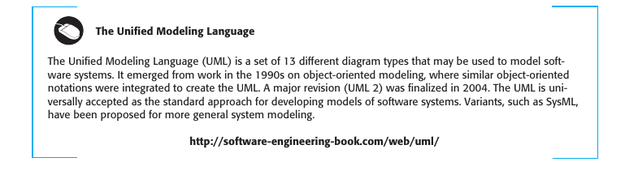

## 5.1 Context Models
Context models are often used to show the external factors and systems that interact with the system you are modeling.

- **Context Diagram** - not sure of its actual UML name
- 
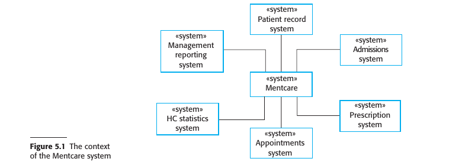

---
- **Use Case Diagram**: Used to represent the functionality of a system from an end-user's point of view. It defines the system's boundary and scope and identifies the primary actors and their interactions with the system.

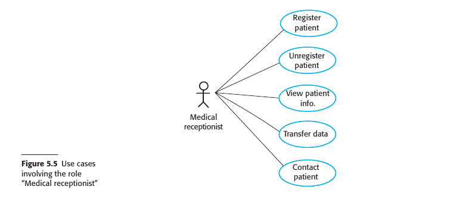

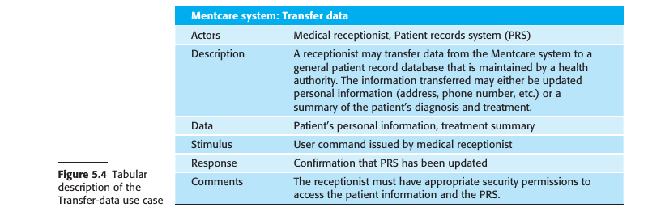

---

## 5.2 Interaction Models
These models capture the dynamic interactions between objects and components.

- **Sequence Diagram**: Used to display the interaction between objects in the chronological order that those interactions occur.

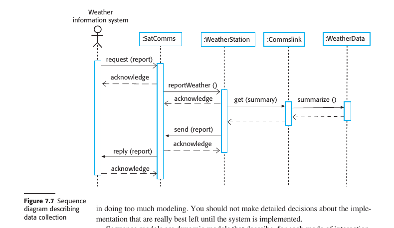

- **Communication Diagram**: Illustrates the interactions between objects or parts in terms of sequenced messages. It provides an overview of the architecture of the system.
- communication diagrams are simply an alternative representation of sequence diagrams.  

---
- **Activity Diagram**: Represents workflows between various system components and activities. It is essentially a flowchart to represent the flow from one activity to another activity.

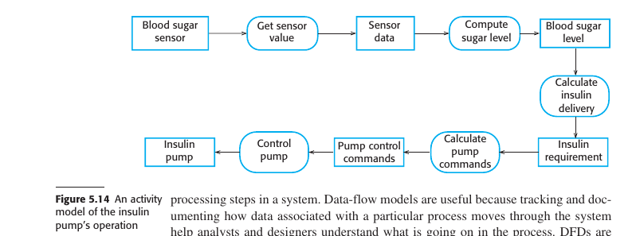

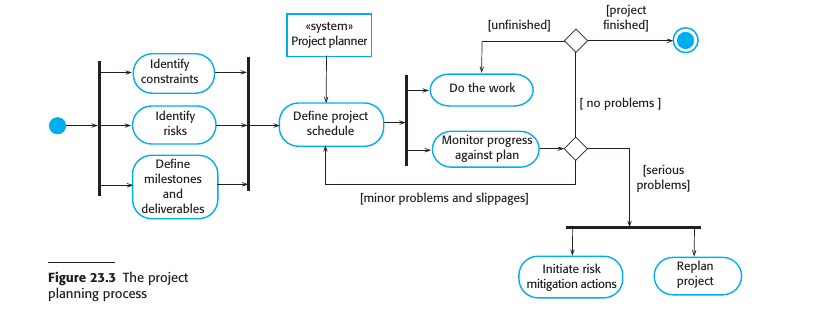

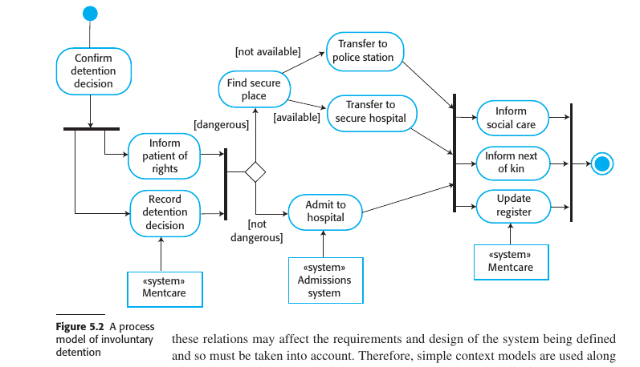

---

## 5.3 Structural Models
Structural models define the static architecture of a system.

- **Class Diagram**: Describes the structure of a system by showing its classes, their attributes, and the relationships among them.

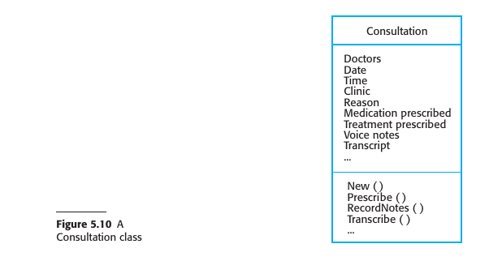

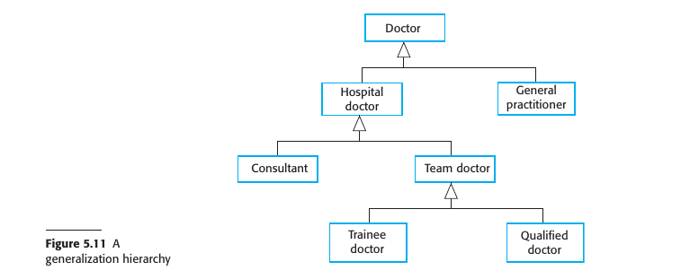

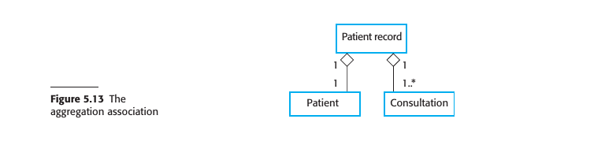

---

## 5.4 Behavioral Models
Behavioral models show the dynamic aspects and the behavior of the system components.

- **State Diagram (State Machine Diagram)**: Describes the states an object or interaction may be in, as well as the transitions between states.

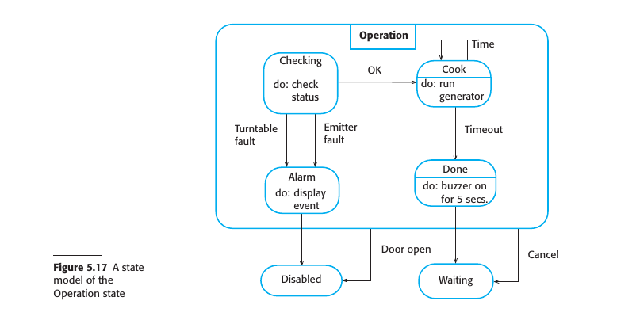

- **Activity Diagram**: (Same as above in Interaction Models) Used for depicting the dynamic aspects of the system.

- **Sequence Diagram**: (Same as above in Interaction Models) Used to display the interaction between objects in the chronological order that those interactions occur.

- **Use Case Diagram**: (Same as above in Context Models) Used to represent the functionality of a system from an end-user's point of view.

---

## 5.5 Model-Driven Architecture
Model-Driven Architecture (MDA) focuses on creating abstract models that can be transformed into executable code. 

- **Class Diagram**: (Same as above in Structural Models) Describes the structure of a system by showing its classes, their attributes, and the relationships among them.

- **State Diagram (State Machine Diagram)**: (Same as above in Behavioral Models) Describes the states an object or interaction may be in, as well as the transitions between states.

- **Sequence Diagram**: (Same as above in Interaction Models) Used to display the interaction between objects in the chronological order that those interactions occur.

used in MDA but no clear name

---
